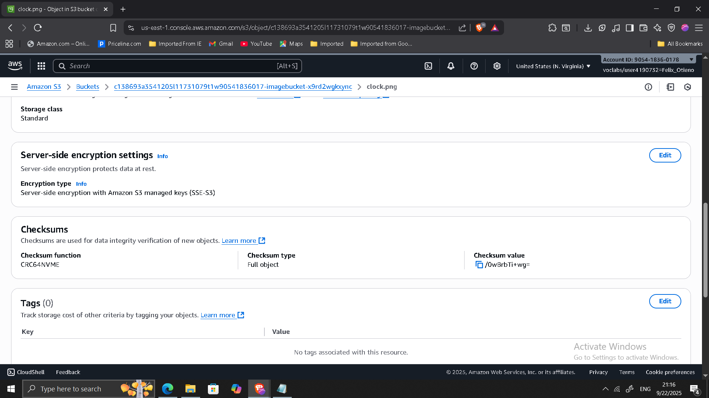
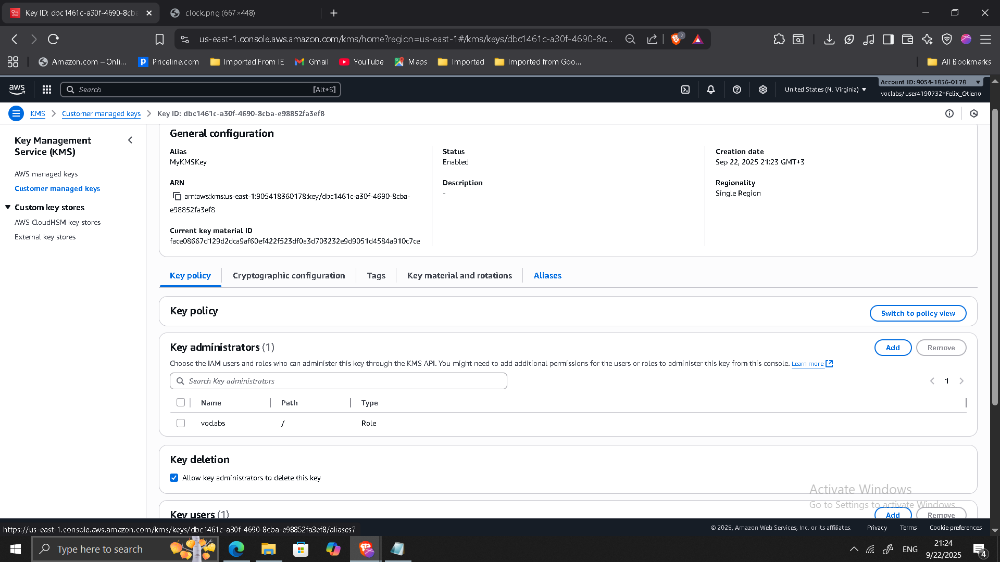
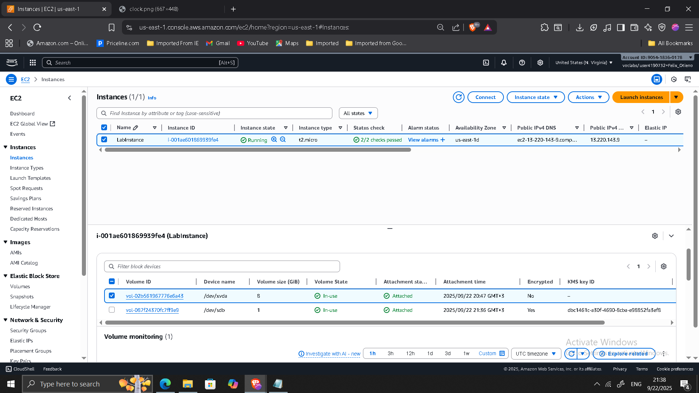

## 📌 Project Overview
I implemented AWS encryption services to protect sensitive data at rest across different storage services. The project demonstrates how to use **Amazon S3**, **AWS Key Management Service (KMS)**, and **Amazon EBS encryption** together to meet compliance and security best practices.  

This involved creating and managing a **customer managed KMS key**, applying it to encrypted EBS volumes, reviewing CloudTrail logs for key usage, and testing the impact of disabling/re-enabling the key.  

---

## 🔹 Key Outcomes
- Implemented **default S3 encryption (SSE-S3)** and verified object access.  
- Created a **customer managed KMS key** with usage permissions.  
- Encrypted and attached an **EBS volume** using the KMS key.  
- Observed the impact of **disabling a KMS key** on encrypted resources.  
- Analyzed **CloudTrail logs** for key usage (CreateGrant, Decrypt, GenerateDataKeyWithoutPlaintext).  
- Enabled **automatic key rotation** for compliance.  

---

## 🔹 Project Steps

### 1. Reviewing Default Encryption for S3 Objects
- Uploaded `clock.png` to S3 bucket.  
- Verified encryption applied automatically with **SSE-S3**.  
- Confirmed public access decrypted object correctly.  

---

### 2. Creating an AWS KMS Key
- Created a **customer managed symmetric key (MyKMSKey)**.  
- Assigned admin and usage permissions.  
- Verified in KMS console.  

---

### 3. Creating and Attaching an Encrypted EBS Volume
- Created a 1 GiB **encrypted EBS volume** using MyKMSKey.  
- Attached to EC2 instance with existing unencrypted root volume.  

---

### 4. Disabling the KMS Key and Observing Effects
- Disabled MyKMSKey in KMS console.  
- Tried re-attaching encrypted volume → operation failed (expected).  

---

### 5. Analyzing AWS KMS Activity with CloudTrail
- Used CloudTrail to review KMS events:  
  - **CreateGrant**  
  - **Decrypt**  
  - **GenerateDataKeyWithoutPlaintext**  

---

### 6. Reviewing Key Rotation
- Enabled **automatic annual key rotation** for MyKMSKey.  
- Verified in console.  

---

## 🔹 Conclusion
This project demonstrates how AWS services protect **data at rest** with encryption. By integrating S3 default encryption, KMS key management, EBS encryption, CloudTrail monitoring, and key rotation, I gained hands-on experience with securing cloud workloads while maintaining compliance and operational visibility.

---

[Back to Projects](/projects/)

