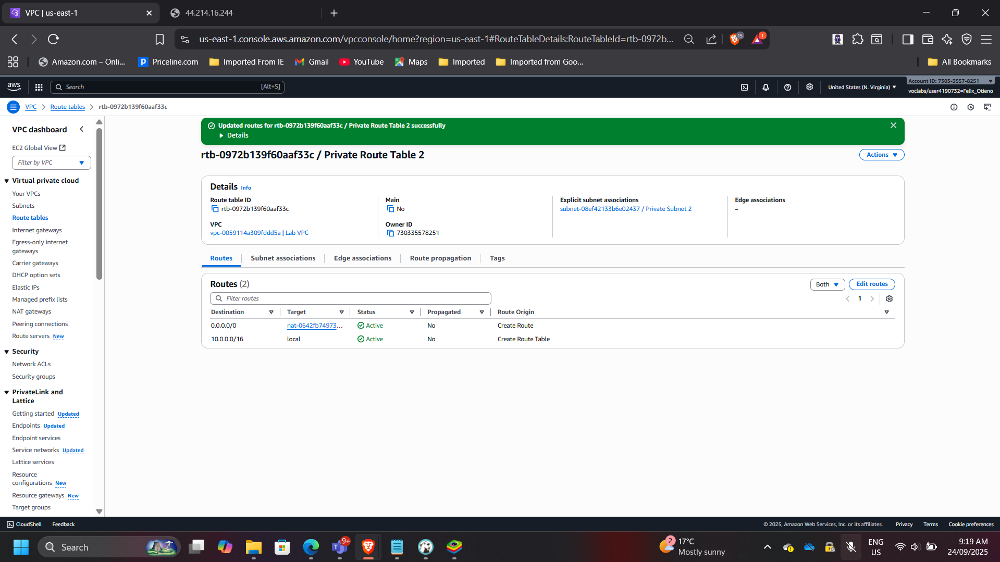
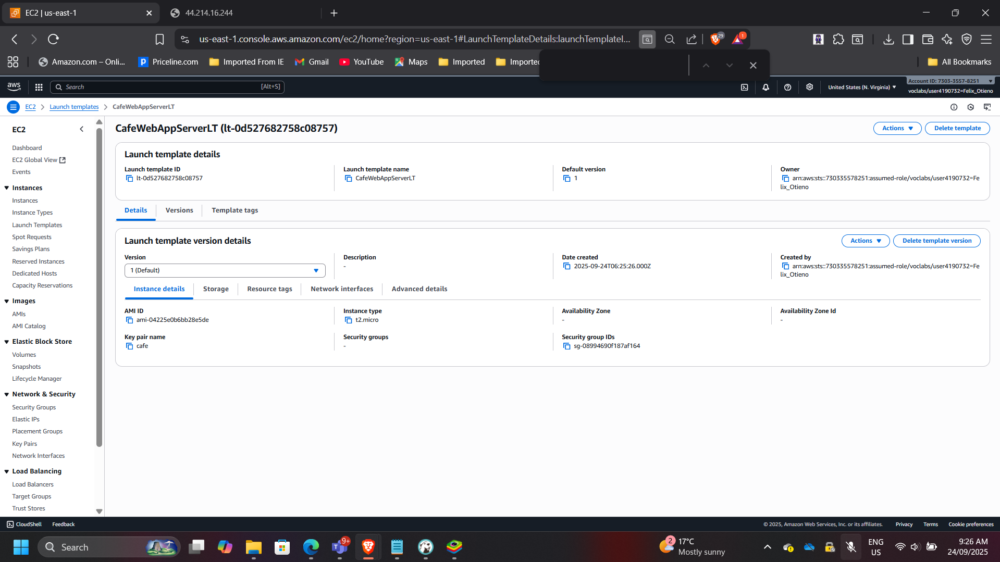
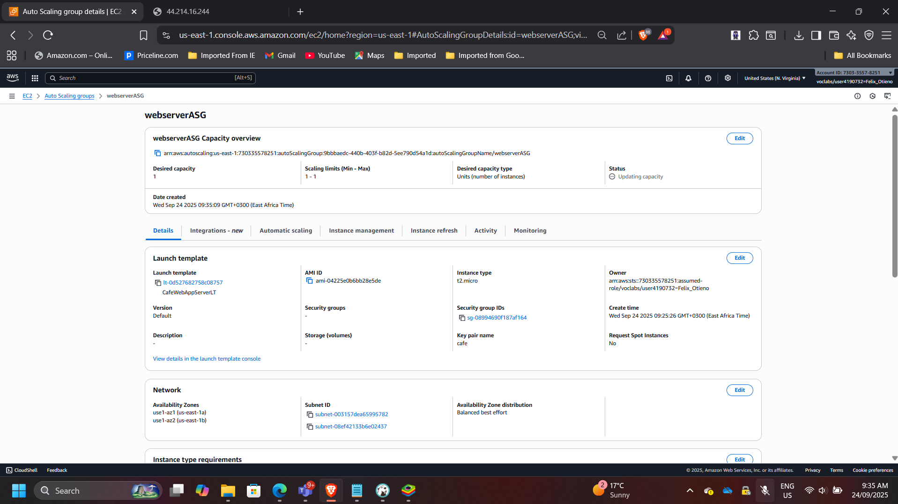
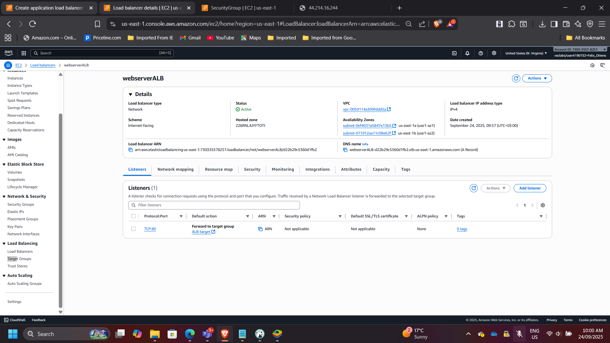
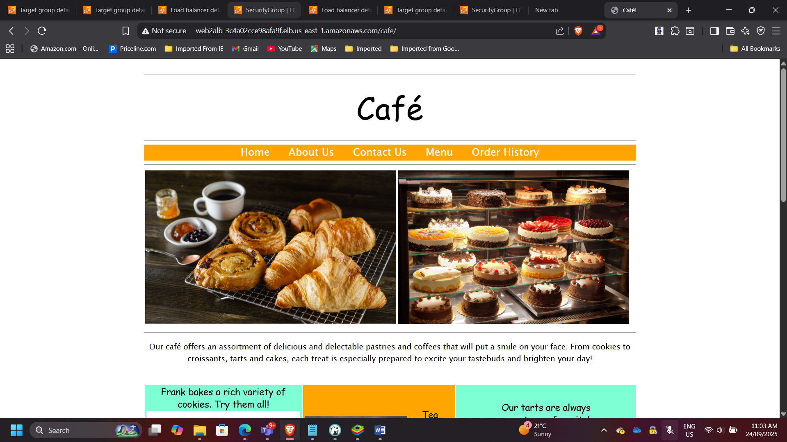
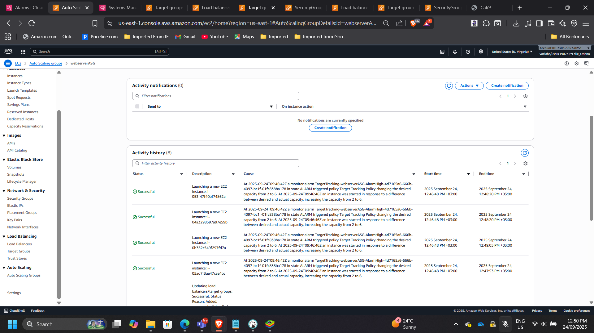

## Project: Scalable and Highly Available Web Application for Café

**Timeline:** September 2025  
**Role:** Cloud Solutions Architect  
**Skills:** AWS VPC, EC2 Auto Scaling, Application Load Balancer (ALB), Launch Templates, NAT Gateway, CloudWatch Alarms, Systems Manager  

---

### Project Summary
Designed and deployed a **scalable, fault-tolerant, and cost-efficient web application architecture** for a café anticipating a surge in traffic after media exposure. The solution leverages **Amazon EC2 Auto Scaling** and an **Application Load Balancer (ALB)** across multiple Availability Zones, ensuring high availability, resilience, and responsiveness under varying workloads.

---

### Objectives
- Inspect and evaluate the existing VPC and application environment.  
- Extend the network architecture across multiple Availability Zones.  
- Create a reusable **Launch Template** for EC2 instances.  
- Deploy an **Auto Scaling Group** with scaling policies based on CPU utilization.  
- Configure an **Application Load Balancer (ALB)** for cross-AZ traffic distribution.  
- Validate fault tolerance through **load testing** and CloudWatch alarms.  

---

### Implementation & Highlights

#### 1. Multi-AZ Network Update
- Configured a **NAT Gateway** in the second Availability Zone.  
- Updated route tables to ensure private subnets in both AZs could securely reach the internet.  

---

#### 2. Created Launch Template
- Standardized EC2 deployments with AMI, instance type, IAM role, security group, and tagging.  
- Template ensured consistent configurations for all Auto Scaling instances.  

---

#### 3. Deployed Auto Scaling Group
- Configured with **desired = 2, min = 2, max = 6 instances**.  
- Scaling policy: add/remove instances when **Average CPU > 25%**.  
- Instances deployed across **Private Subnet 1 and 2** for high availability.  

---

#### 4. Configured Application Load Balancer
- Created an **ALB** in two public subnets.  
- Configured security group to allow HTTP (port 80) access.  
- Linked target group to the Auto Scaling group for dynamic registration.  

---

#### 5. Testing & Validation

**Without Load:**  
- Verified that café web application was accessible via the ALB DNS (`/cafe`).  

**With Load (Auto Scaling):**  
- Simulated CPU stress using **Systems Manager Session Manager**.  
- Observed scale-out activity in EC2 console as Auto Scaling launched additional instances.  

---

### Outcome & Impact
- Delivered a **fault-tolerant, multi-AZ web architecture** for the café.  
- Improved resilience: no single point of failure, traffic distributed evenly.  
- Enabled cost optimization with Auto Scaling—instances added only under demand.  
- Gained practical experience with **AWS Auto Scaling, ALB, CloudWatch alarms, and Systems Manager load simulation**.  

---

[Back to Projects](/projects/)
