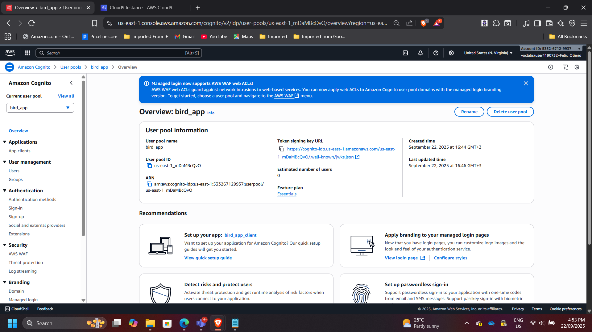
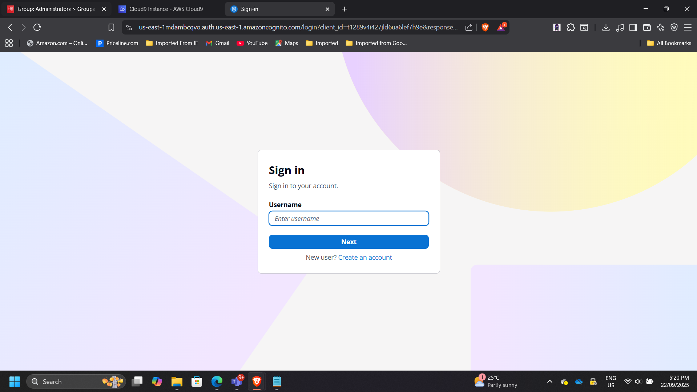
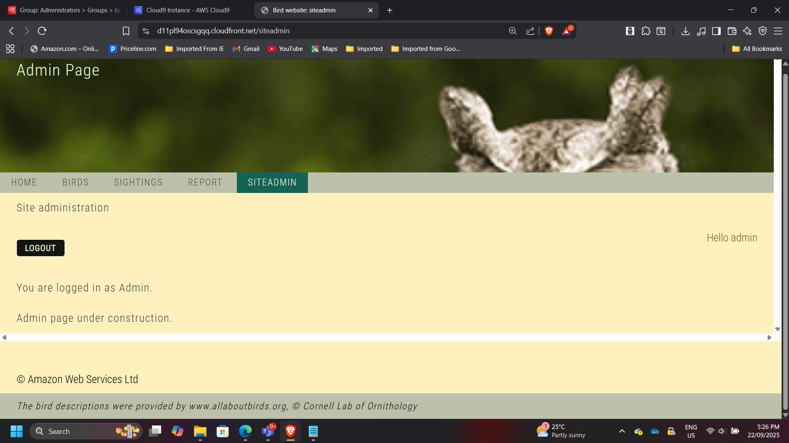
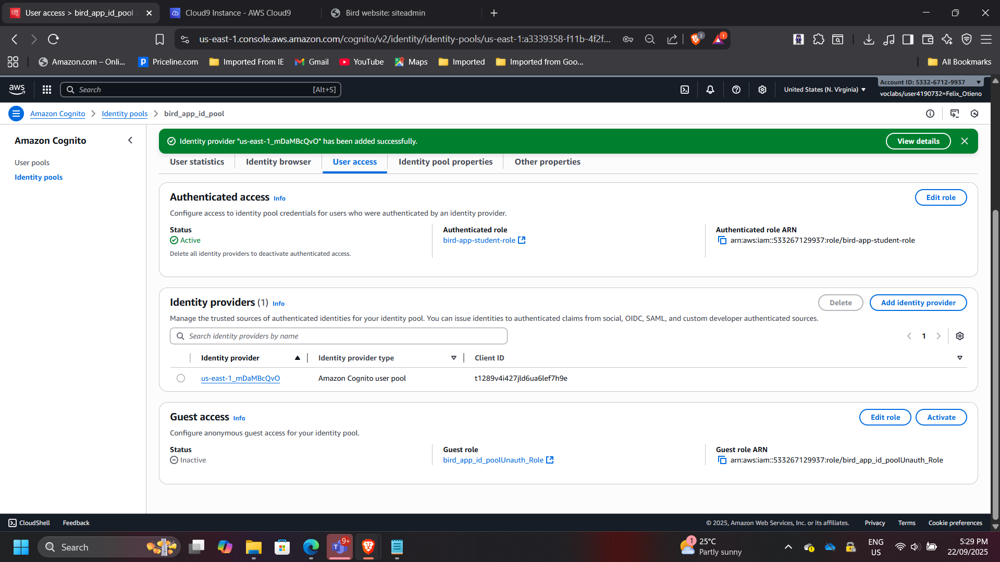
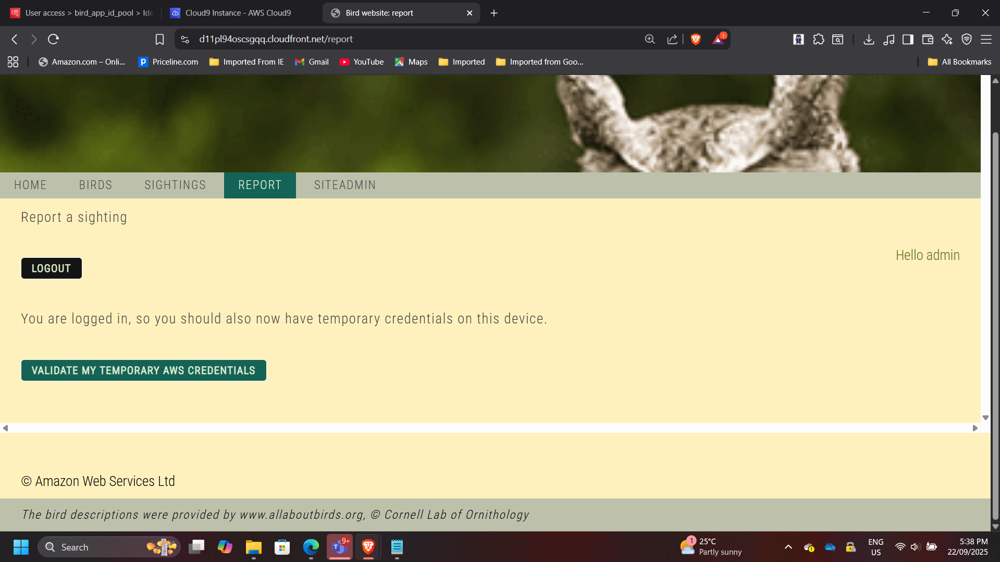

## Project: Secure Web Application with AWS Cognito

**Timeline:** September 2025  
**Role:** Solutions Architect & Software Engineer  
**Skills:** AWS Cognito, S3, CloudFront, DynamoDB, Node.js, Web App Security

### Project Summary
Implemented authentication and role-based access for a web application using AWS Cognito. Authenticated users can securely access protected pages and interact with backend AWS resources. The project demonstrates hands-on experience in cloud-based application security and user management.

---

### Objectives
- Configure AWS Cognito User Pool to manage authentication.  
- Set up users and groups for role-based access.  
- Integrate authentication and authorization into a web application.  
- Deploy application on S3 and CloudFront.  
- Test secure access to protected pages and AWS services.

---

### Implementation & Highlights

#### 1. Configured AWS Cognito User Pool
- Created a User Pool to manage authentication.  
- Added users and assigned roles (testuser, admin).  
- Enabled role-based access control.

---

#### 2. Integrated User Pool with Web Application
- Updated `config.js` and `package.json` to use Cognito settings.  
- Deployed application to S3.  
- Ensured protected pages require authentication.

---

#### 3. Tested User Access
- Verified standard users could access protected content.  
- Verified admin users could access admin-specific pages.

---

#### 4. Configured Cognito Identity Pool
- Linked Identity Pool with User Pool.  
- Assigned authenticated roles to enable temporary AWS credentials.

---

#### 5. Integrated Identity Pool with Application
- Updated authentication code (`auth.js`) to include identity pool.  
- Redeployed application to ensure proper AWS service access.

---

#### 6. Tested Authorization & AWS Service Access
- Validated that authenticated users could query DynamoDB securely.  
- Ensured access permissions matched assigned roles.

---

### Outcome & Impact
- Secured web application with proper authentication and role-based access.  
- Gained practical experience with AWS Cognito, S3, CloudFront, and DynamoDB.  
- Delivered a deployable, cloud-based solution suitable for production environments.

---

[Back to Projects](/projects/)
