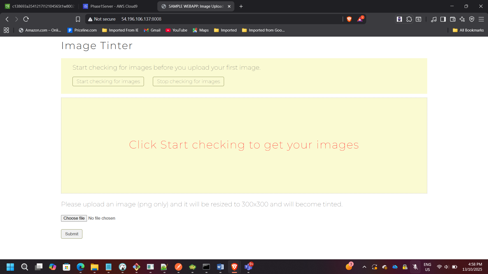
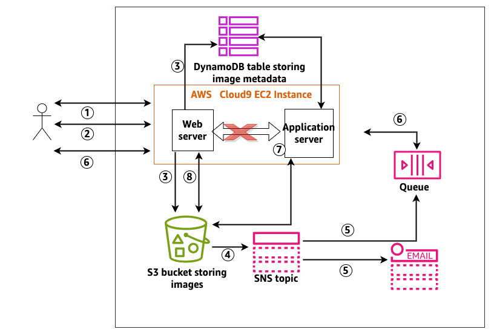
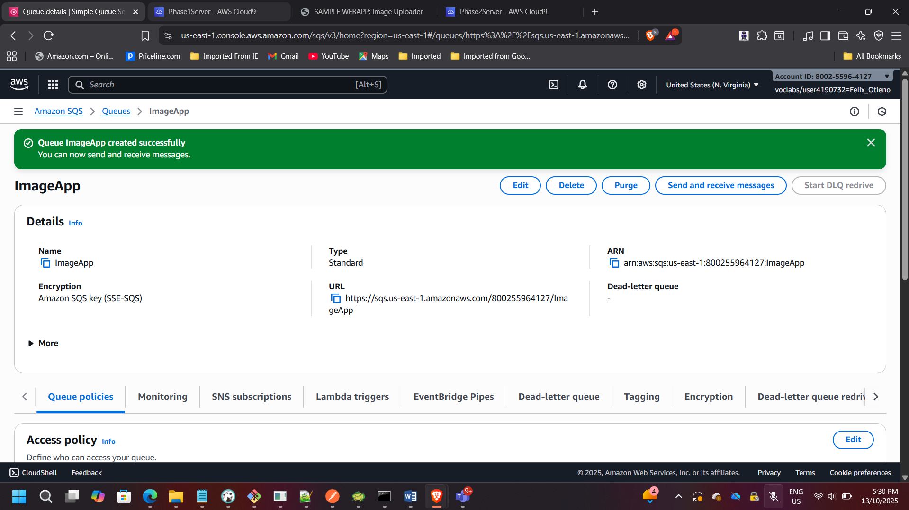
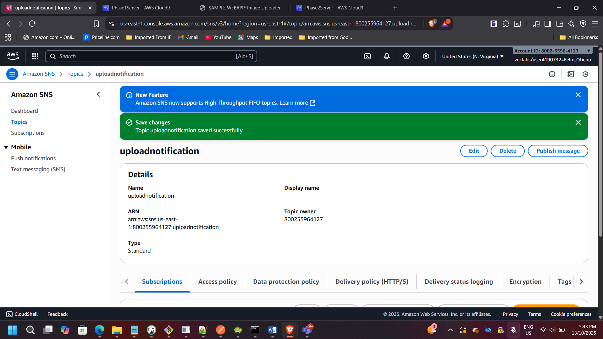
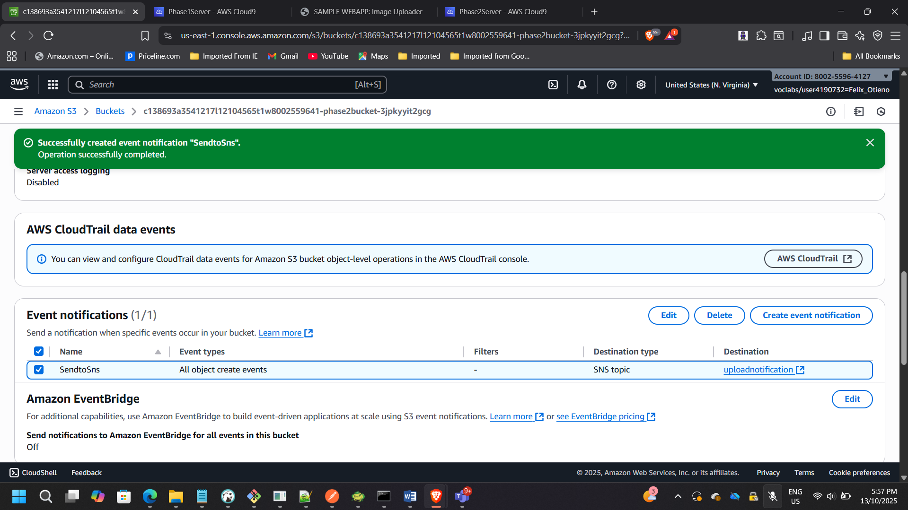
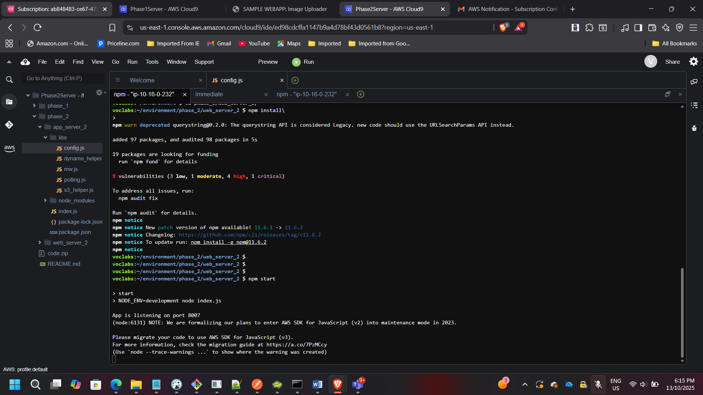

## Project: Building a Decoupled Event-Driven Application Using Amazon SQS & SNS

**Timeline:** September 2025  
**Role:** Solutions Architect (Event-Driven & Distributed Systems Design)  
**Skills:** Amazon SQS, Amazon SNS, Amazon S3 Event Notifications, EC2, Node.js, Asynchronous Processing, Decoupled Architecture, IAM, Fault Tolerance  

---

# Executive Summary

Designed and implemented a decoupled, event-driven image processing architecture using Amazon SQS and Amazon SNS.

The project involved:

- Migrating a tightly coupled application into a loosely coupled architecture
- Implementing asynchronous communication using Amazon SQS
- Broadcasting notifications using Amazon SNS
- Configuring S3 event notifications to trigger processing
- Validating improved scalability, fault tolerance, and system resilience

This solution reflects modern cloud-native architectural patterns where services operate independently and communicate through managed messaging services.

---

# Business Problem

The original application used direct communication between:

- Web server (image upload)
- Application server (image processing)

This tight coupling introduced:

- Blocking dependencies
- Reduced scalability
- Single points of failure
- Limited fault tolerance

The goal was to redesign the system into an **event-driven architecture** where:

- Upload events trigger notifications
- Processing occurs asynchronously
- Components scale independently
- Failures do not cascade across tiers

---

# Phase 1 – Baseline Tightly Coupled Architecture

Initially deployed:

- Web server (port 8008)
- Application server (port 8009)
- Shared S3 bucket for images

📸 **Cloud9 – Application Installation & npm Setup**

📸 **EC2 Security Group Configuration (Ports 8000–8100)**

📸 **Running Image Tinter Application**

In this model:

- Web server directly invoked processing
- System depended on immediate availability of processing tier

---

# Phase 2 – Designing the Decoupled Architecture

## Architectural Components Introduced

- **Amazon SQS** → Message Queue
- **Amazon SNS** → Notification Broadcasting
- **Amazon S3 Event Notifications**
- Email subscription for monitoring

New flow:

1. User uploads image to S3
2. S3 triggers SNS topic
3. SNS publishes to:
   - SQS queue (for processing)
   - Email subscription (notification)
4. Application server polls SQS
5. Image processed asynchronously

---

# Implementing the Decoupled System

---

## Step 1 – Configuring Amazon SQS

Created SQS queue:

- Queue Name: **ImageApp**
- Default settings
- Copied Queue URL

📸 **SQS Queue Details**

This queue buffers upload events and decouples upload from processing.

---

## Step 2 – Configuring Amazon SNS

Created SNS topic:

- Topic Name: **uploadnotification**
- Custom access policy
- Allowed S3 publish permissions

📸 **SNS Topic Details**

SNS acts as the fan-out mechanism for notifications.

---

## Step 3 – Configuring S3 Event Notifications

Configured:

- Event: All object create events
- Destination: SNS topic

📸 **S3 Event Notification Configuration**

Now every image upload generates an event.

---

## Step 4 – SNS Subscriptions

Configured:

- SQS subscription
- Email subscription

📸 **SQS Subscription to SNS**

📸 **Email Subscription Confirmation**

This provides:

- Automated processing
- Operational visibility

---

## Step 5 – Updating Application Configuration

Modified:

- Browser tier config
- Web tier config
- Application server config
- Inserted SQS Queue URL
- Inserted S3 bucket references

Started services:

- Web server → port 8007
- Application server → port 8010

📸 **Cloud9 – Updated Config Files**

📸 **Servers Running on Ports 8007 & 8010**

---

# Validating the Event-Driven Flow

---

## Upload Event

User uploads image → triggers SNS → sends email

📸 **Image Upload in Browser**

📸 **Email Notification – Upload and Processing Events**

---

## Processing Event

Application polls SQS → processes image → sends completion notification

📸 **Processed Image Displayed**

---

# Architectural Improvements Achieved

### Asynchronous Processing
Uploads no longer block processing tier.

### Fault Isolation
If processing server fails:
- Messages remain safely in SQS.
- System resumes when service recovers.

### Horizontal Scalability
Multiple processors can poll from SQS simultaneously.

### Loose Coupling
Web and application tiers operate independently.

### Improved Reliability
Managed AWS messaging services reduce operational overhead.

---

# Enterprise Architecture Impact

This architecture aligns with:

- Event-driven microservices principles
- Distributed systems design
- Cloud-native asynchronous communication
- Resilient application architecture patterns

It demonstrates the ability to:

- Identify coupling issues
- Redesign systems for scalability
- Implement messaging-based communication
- Integrate multiple AWS services coherently

---

## Conclusion

Successfully transformed a tightly coupled image processing application into a decoupled, event-driven architecture using Amazon SQS and Amazon SNS.

The redesign improved:

- Scalability
- Fault tolerance
- Operational resilience
- Asynchronous processing capability

This project demonstrates practical understanding of distributed system design and modern cloud-native messaging patterns.

---

[Back to Projects](/projects/)
