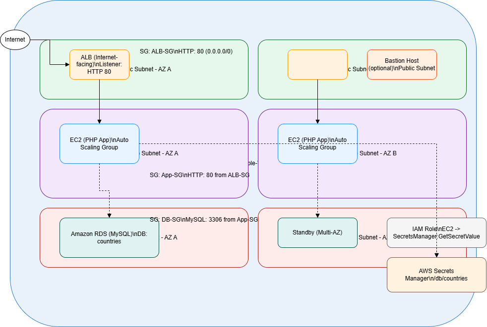
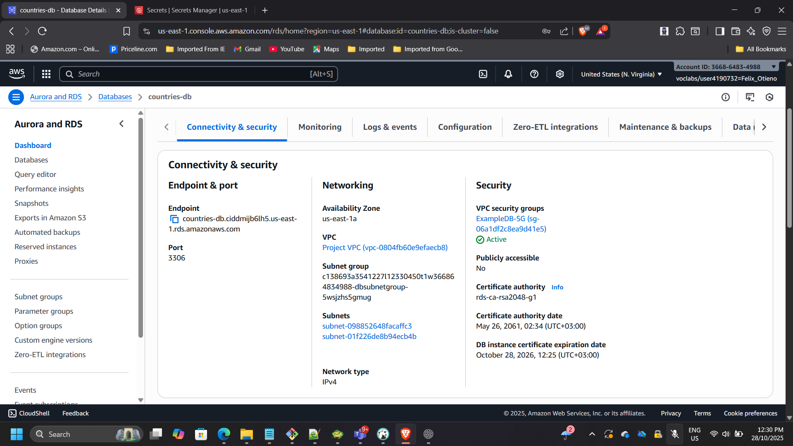
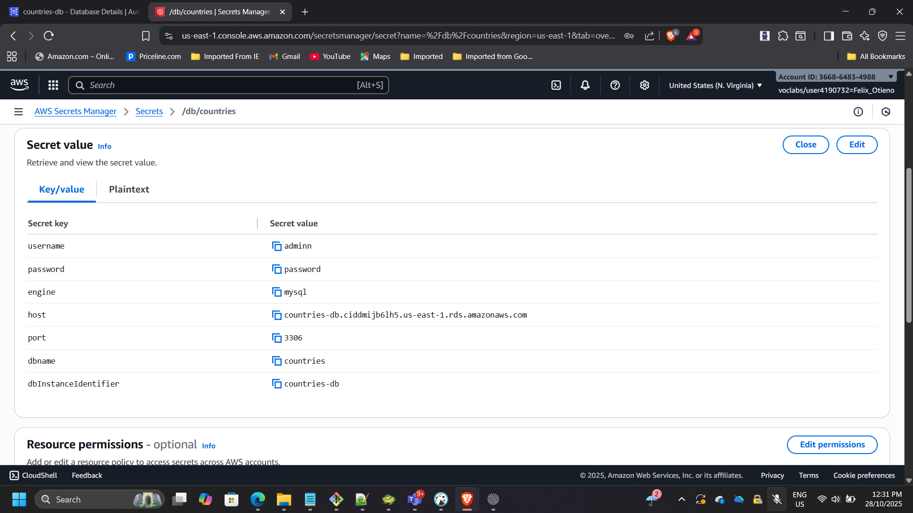
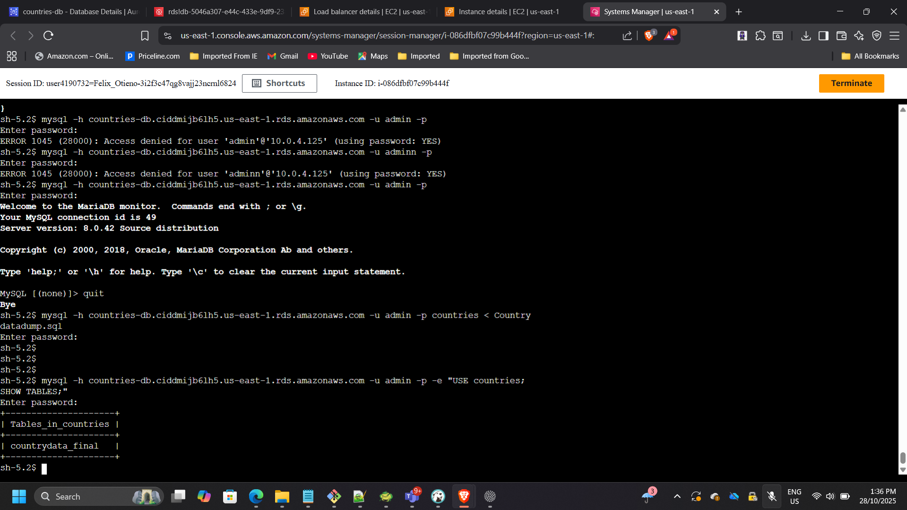
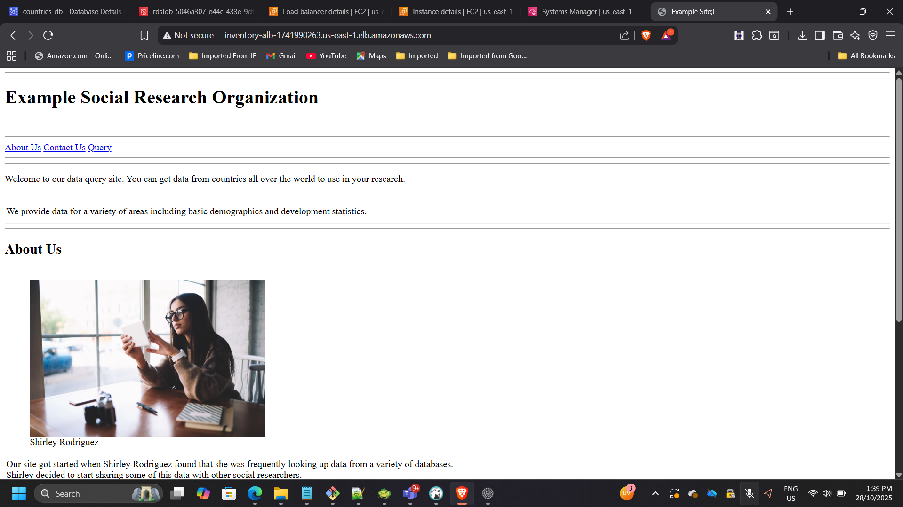

## Project: Enterprise Application Modernization on AWS

**Timeline:** October 2025  
**Role:** Solutions Architect (Architecture Design & Implementation)  
**Skills:** Amazon EC2, Amazon RDS (MySQL), Application Load Balancer, Auto Scaling, AWS Secrets Manager, IAM, VPC Architecture, AWS Systems Manager, AWS Well-Architected Framework  

---

### Executive Summary

Led the modernization of a legacy single-instance web application into a secure, scalable, and highly available multi-tier architecture on AWS. The original deployment lacked elasticity, resilience, and enterprise-grade security controls.

The redesigned architecture introduces:

- Multi-AZ high availability
- Private application and database tiers
- Elastic scaling via Auto Scaling Groups
- Managed relational database using Amazon RDS
- Secure secret management with AWS Secrets Manager
- Role-based access control via IAM
- Elimination of SSH in favor of Systems Manager

The resulting solution aligns with AWS Well-Architected principles and reflects patterns commonly adopted during enterprise cloud transformation initiatives.

---

## Business Context

The original application operated on a single EC2 instance with locally stored credentials and a directly accessible database configuration. This architecture presented several enterprise risks:

- Single point of failure
- Manual scaling limitations
- Tight coupling between application and infrastructure
- Security exposure through static credentials
- Limited disaster recovery capabilities

The objective of the modernization initiative was to redesign the platform to meet enterprise-grade requirements for:

- High availability across Availability Zones
- Secure credential management
- Network isolation and tier segmentation
- Elastic scalability under variable load
- Operational governance aligned with AWS Well-Architected principles

The transformation focused on replacing fragile infrastructure patterns with managed services and automated resilience mechanisms.

---

## Architecture Overview

The solution is structured into distinct tiers with strict network isolation:

- **Presentation Tier**
  - Internet-facing Application Load Balancer deployed across two public subnets

- **Application Tier**
  - Stateless PHP application running on EC2 instances in private subnets
  - Managed by an Auto Scaling Group across multiple Availability Zones

- **Database Tier**
  - Amazon RDS MySQL deployed in private subnets
  - No public exposure, accessible only from the application tier

- **Security & Access**
  - AWS Secrets Manager for database credentials
  - IAM role-based permissions for secret retrieval
  - AWS Systems Manager Session Manager for administrative access (no SSH)

---

## Architecture Decisions & Design Rationale

### 1. Multi-Tier Network Segmentation

The architecture was redesigned into distinct tiers:

- Public subnets for the Application Load Balancer
- Private subnets for application instances
- Isolated private database subnets for Amazon RDS

This enforces strict east-west and north-south traffic control while eliminating direct database exposure to the internet.

---

### 2. Managed Database Adoption (Amazon RDS)

Instead of hosting MySQL on EC2, the solution leverages Amazon RDS to:

- Reduce operational overhead (patching, backups, maintenance)
- Improve reliability through managed service guarantees
- Support scalability and future Multi-AZ expansion
- Strengthen backup and recovery posture

This aligns with enterprise cloud migration best practices favoring managed services over self-managed infrastructure.

---

### 3. Elastic Compute with Auto Scaling

Application servers were deployed using a launch template and Auto Scaling Group across multiple Availability Zones.

Design considerations included:

- Stateless application design
- Health check integration with ALB
- Target tracking scaling policy (50% CPU utilization)

This ensures horizontal scalability and automatic recovery during instance-level failure events.

---

### 4. Secure Credential Management via AWS Secrets Manager

Hardcoded database credentials were eliminated and replaced with AWS Secrets Manager.

Security improvements include:

- Centralized secret storage
- IAM role-based access from EC2
- No credential exposure in application code
- Simplified credential rotation capability

This significantly reduces credential leakage risk and aligns with enterprise security compliance standards.

---

### 5. Administrative Access via Systems Manager

Traditional SSH access was replaced with AWS Systems Manager Session Manager.

Benefits:

- No open inbound SSH ports
- Reduced attack surface
- Centralized access control via IAM
- Improved auditability through AWS logging

This demonstrates security-first operational design.

---

### 6. Cost-Aware Architecture

While improving resilience, cost controls were implemented:

- Right-sized compute instances
- No NAT Gateway (to avoid unnecessary baseline cost)
- Controlled scaling thresholds
- Budget monitoring through AWS Budgets

The architecture balances enterprise resilience with financial governance.

---

## Implementation Highlights

### 1. Deployed Amazon RDS MySQL

- Created RDS instance: `countries-db`
- Placed in private subnets using an existing DB subnet group
- Disabled public access
- Restricted inbound 3306 access to application security group only
- Created database: `countries`

Stored credentials securely in AWS Secrets Manager:

- Secret name: `/db/countries`
- Contains: username, password, engine, host, dbname, port

---

### 2. Configured Application Load Balancer

- Internet-facing ALB across two public subnets
- Listener: HTTP (80)
- Target group health check path: `/index.php`
- Attached ALB target group to the Auto Scaling Group

---

### 3. Launch Template and Auto Scaling Group

Launch template included application files and SQL dump.

User data bootstrap script:

    #!/bin/bash
    yum install -y httpd php php-mysqli
    systemctl enable httpd
    systemctl start httpd

Auto Scaling Group configuration:

- Private subnets across two Availability Zones
- Desired capacity: 2 instances
- Target tracking policy: 50% CPU utilization
- Instances registered behind the ALB target group

---

### 4. Data Migration into RDS

Connected to one application instance using Systems Manager Session Manager.

Retrieved credentials securely:

    aws secretsmanager get-secret-value --secret-id /db/countries --query SecretString --output text

Imported SQL dataset:

    mysql -h <RDS-endpoint> -u admin -p countries < /home/ec2-user/countries.sql

Verified tables:

    mysql -h <RDS-endpoint> -u admin -p -e "USE countries; SHOW TABLES;"

---

### 5. Functional and Resilience Testing

- Accessed the application using the ALB DNS name
- Verified PHP application loads successfully
- Confirmed database queries return expected results
- Simulated CPU load to validate Auto Scaling behavior
- Stopped one instance to confirm traffic failover via ALB health checks
- Confirmed direct access to RDS is denied from outside the application tier

---

## Security & Compliance Controls

- Network isolation: EC2 and RDS in private subnets
- Least privilege: RDS accessible only from app security group
- Credential management: Secrets stored in AWS Secrets Manager (not in code)
- IAM role: EC2 granted only required permissions (e.g., `secretsmanager:GetSecretValue`)
- Administrative access: Systems Manager Session Manager replaces SSH
- Security groups enforce strict tier communication

---

## Cost & Efficiency Considerations

- Right-sized compute instances (t2.micro / t3.micro)
- Avoided NAT Gateway to reduce baseline networking cost
- Stopped non-production resources when idle
- Monitored usage via AWS Budgets

---

## Outcome & Impact

- Transformed a legacy single-instance deployment into a resilient, enterprise-grade AWS architecture.
- Achieved high availability across Availability Zones with load balancing and Auto Scaling.
- Strengthened security posture using private subnets, Secrets Manager, IAM least privilege, and SSM access.
- Improved operational reliability through health checks and automated recovery.
- Delivered a repeatable modernization pattern aligned with AWS Well-Architected principles.

---

[Back to Projects](/projects/)
