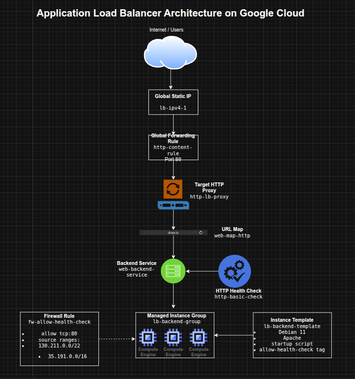

## Configuring an Application Load Balancer on Google Cloud

**Timeline:** December 2025  
**Role:** Cloud Engineer  
**Skills:** Google Cloud Load Balancing, Application Load Balancer, Compute Engine, Managed Instance Groups, Backend Services, URL Maps, Health Checks, Forwarding Rules, Instance Templates

---

### Project Summary

This project focused on configuring a **Layer 7 Application Load Balancer** on Google Cloud to distribute HTTP traffic across Compute Engine web servers. The implementation involved provisioning Apache-based VM instances, creating an instance template and managed instance group, configuring firewall access for health checks, reserving a global static IP, and building the full Application Load Balancer stack using backend services, URL maps, a target HTTP proxy, and a forwarding rule.

The project demonstrated how Google Cloud’s Application Load Balancer can route traffic intelligently at the HTTP layer while using **health-aware backend selection** and globally distributed frontend infrastructure.

---

### Objectives

- Configure the default region and zone for resources  
- Create multiple web server instances  
- Create an Application Load Balancer  
- Configure backend infrastructure for HTTP traffic routing  
- Test load-balanced traffic to backend instances  

---

### Architecture Overview

The architecture consisted of:

- Three standalone **Compute Engine web server instances** used for initial validation
- An **instance template** defining Apache-based backend VMs
- A **managed instance group** (`lb-backend-group`) created from the template
- A firewall rule allowing health checks from Google Cloud health check ranges
- A **global static external IPv4 address**
- An **HTTP health check** for backend validation
- A **backend service** linked to the managed instance group
- A **URL map** routing requests to the backend service
- A **target HTTP proxy** connected to the URL map
- A **global forwarding rule** exposing the Application Load Balancer on port 80

---

### Implementation & Highlights

#### 1. Region and Zone Configuration
- Set the default region and zone for Compute Engine resources
- Established a consistent deployment location for backend resources and testing :contentReference[oaicite:1]{index=1}

---

#### 2. Creating Initial Web Server Instances
- Provisioned three Apache-based Compute Engine instances:
  - `www1`
  - `www2`
  - `www3`
- Used startup scripts to install Apache automatically
- Configured each instance to serve a unique landing page
- Applied a shared network tag and opened HTTP access with a firewall rule
- Verified direct HTTP connectivity to each instance before moving to load balancing :contentReference[oaicite:2]{index=2}

---

#### 3. Building the Backend Template and Managed Instance Group
- Created an instance template named `lb-backend-template`
- Configured backend VMs with:
  - Debian 11
  - Apache
  - startup script customization
  - health-check firewall target tag
- Created a managed instance group named `lb-backend-group` with two backend instances
- Used a MIG to support more scalable and maintainable backend management than standalone instances :contentReference[oaicite:3]{index=3}

---

#### 4. Preparing Health-Aware Access
- Created the `fw-allow-health-check` firewall rule
- Allowed traffic from Google Cloud health-check source ranges:
  - `130.211.0.0/22`
  - `35.191.0.0/16`
- Scoped the rule with the `allow-health-check` tag
- Ensured the load balancer could verify backend health before routing traffic :contentReference[oaicite:4]{index=4}

---

#### 5. Creating the Global Frontend
- Reserved a global static external IPv4 address named `lb-ipv4-1`
- Used a global frontend to support HTTP traffic delivery through Google Front Ends (GFEs)
- Established a stable public entry point for the Application Load Balancer :contentReference[oaicite:5]{index=5}

---

#### 6. Configuring the Application Load Balancer
- Created an HTTP health check (`http-basic-check`)
- Created a backend service (`web-backend-service`)
- Attached the managed instance group as the backend
- Created a URL map (`web-map-http`) pointing to the backend service
- Created a target HTTP proxy (`http-lb-proxy`)
- Created a global forwarding rule (`http-content-rule`) on port 80
- Assembled the full Application Load Balancer request path from frontend to healthy backends :contentReference[oaicite:6]{index=6}

---

#### 7. Testing Traffic Flow
- Verified backend VM health in the Load Balancing console
- Accessed the load balancer’s global IP through a browser
- Confirmed that traffic was served successfully by the backend instances in the managed instance group
- Validated that the load balancer routed traffic only after backends became healthy :contentReference[oaicite:7]{index=7}

---

### Design Decisions

- Used **managed instance groups** instead of manually managed standalone instances for the load-balanced backend tier  
- Used a **global static IP** to create a stable frontend endpoint  
- Used **HTTP health checks** so traffic would be sent only to healthy backends  
- Used **backend services + URL maps + HTTP proxy** to model modern Layer 7 application delivery on Google Cloud  
- Used **instance templates** to make backend infrastructure repeatable and scalable  

---

### Results & Impact

- Successfully configured a **Google Cloud Application Load Balancer**
- Demonstrated practical use of:
  - managed instance groups
  - backend services
  - URL maps
  - target proxies
  - forwarding rules
  - health checks
- Built a strong understanding of the difference between:
  - Layer 4 traffic distribution
  - Layer 7 HTTP-aware application delivery
- Added a foundational project for more advanced traffic engineering and application delivery patterns

---

### Tools & Technologies Used

- **Google Compute Engine** – Backend virtual machines  
- **Managed Instance Groups (MIGs)** – Scalable backend groups  
- **Instance Templates** – Repeatable VM definitions  
- **Google Cloud Application Load Balancer** – L7 traffic distribution  
- **Backend Services** – Health-aware backend routing  
- **URL Maps** – HTTP request routing logic  
- **Target HTTP Proxy** – Request handling layer  
- **Forwarding Rules** – Frontend traffic steering  
- **Health Checks** – Backend validation  

---

### Outcome

This project demonstrates the ability to configure a **Google Cloud Layer 7 Application Load Balancer** for HTTP traffic distribution across managed backend instances. It highlights practical skills in **application delivery, health-aware routing, and scalable backend design**, which are useful for cloud engineering, infrastructure, and traffic management roles.

---

[Back to Cloud Projects](/projects/cloud/)