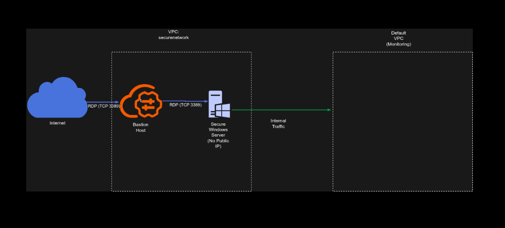

## Secure Bastion Host Architecture for Isolated Windows Workloads on GCP

**Timeline:** December 2025  
**Role:** Cloud Security Engineer  
**Skills:** Google Cloud VPC, Compute Engine, Firewall Rules, Windows Server, RDP, Bastion Host Design, Network Segmentation, IIS

---

### Project Summary

This project focused on designing and implementing a **secure administrative access architecture for Windows workloads on Google Cloud Platform (GCP)**. The objective was to provision a production-style Windows environment in which the secure application server remained isolated from direct external access, while still allowing controlled administrative management through a dedicated bastion host.

The solution used **segmented VPC networking, scoped firewall rules, dual-network interfaces, and a bastion-based RDP access path** to enforce security boundaries while preserving operational access for administration and monitoring.

---

### Objectives

- Create an isolated VPC environment for secure Windows workloads  
- Restrict direct internet access to production servers  
- Implement a bastion host as the only externally reachable RDP entry point  
- Apply firewall rules to tightly scope administrative access  
- Provide internal-only monitoring connectivity through a secondary network interface  
- Deploy and validate a Windows web server workload using IIS  

---

### Architecture Overview

The architecture consisted of:

- A dedicated **VPC network (`securenetwork`)** with a single subnet for the production environment  
- A **Windows bastion host** with:
  - one interface connected to the secure VPC subnet
  - one interface connected to the default VPC
  - an ephemeral public IP for external RDP access  
- A **secure Windows server** with:
  - one interface connected to the secure VPC subnet
  - one interface connected to the default VPC
  - no direct external internet access  
- A firewall rule allowing **TCP 3389 (RDP)** inbound from the internet only to the bastion host using network tags  
- IIS deployed on the internal secure host to validate successful administrative access and workload setup  

---

### Implementation & Highlights

#### 1. Secure Network Foundation
- Created a new VPC network named **`securenetwork`**  
- Provisioned a dedicated subnet in the required region for the isolated production environment  
- Established a segmented network boundary for secure Windows workloads  

---

#### 2. Controlled Administrative Entry Point
- Deployed a **Windows bastion host** to act as the controlled external access point  
- Assigned the bastion host a public external address for internet-based RDP access  
- Restricted ingress using a firewall rule allowing **RDP (TCP 3389)** only to the bastion host through network tags  

---

#### 3. Isolated Secure Workload Host
- Deployed a second Windows server as the **secure production host**  
- Configured the secure host without direct public access  
- Ensured that administrative access could only occur indirectly through the bastion host  

---

#### 4. Dual-NIC Design for Segmentation and Monitoring
- Configured both Windows servers with **two network interfaces**:
  - one attached to the isolated secure VPC
  - one attached to the default VPC for internal monitoring connectivity  
- Supported management and observability requirements without exposing the secure workload to direct internet access  

---

#### 5. Secure Administrative Workflow
- Reset Windows passwords and provisioned administrative access credentials  
- Connected first to the bastion host using RDP from the internet  
- Initiated a second internal RDP session from the bastion host to the secure Windows server  
- Demonstrated the bastion/jump-host pattern for secure Windows administration  

---

#### 6. Workload Validation with IIS
- Installed **Internet Information Server (IIS)** on the secure host  
- Used IIS deployment as validation that the isolated workload could still be configured and managed successfully through the controlled administrative path  

---

### Security Design Decisions

This project implemented several important security principles:

- **No direct public access** to the secure production server  
- **Single controlled ingress path** through the bastion host  
- **Firewall scoping with tags** to limit RDP exposure  
- **Network segmentation** between secure application infrastructure and external access  
- **Separate monitoring connectivity** using an internal-only secondary interface  
- **Administrative isolation** to reduce the attack surface of production workloads  

---

### Results & Impact

- Successfully deployed a **segmented Windows administration architecture** on GCP  
- Enforced **controlled RDP access** through a bastion host rather than exposing production servers directly  
- Demonstrated practical implementation of:
  - secure remote administration  
  - network isolation  
  - firewall-based access control  
  - dual-network design for operations and monitoring  
- Validated the design by installing and managing IIS on the isolated secure server  

---

### Tools & Technologies Used

- **Google Cloud Platform (GCP)**  
- **Compute Engine** – Windows VM provisioning  
- **VPC Networking** – Secure network isolation  
- **Firewall Rules** – Scoped RDP access control  
- **Windows Server** – Administrative workload host  
- **Remote Desktop Protocol (RDP)** – Controlled remote access  
- **Internet Information Server (IIS)** – Workload validation  

---

### Outcome

This project demonstrates the ability to design and implement a **secure administrative access pattern for Windows workloads on Google Cloud**. It highlights practical skills in **bastion host design, network segmentation, firewall scoping, and secure workload management**, which are directly relevant to cloud security engineering and cloud architecture roles.

---

[Back to Cloud Projects](/projects/cloud/)
