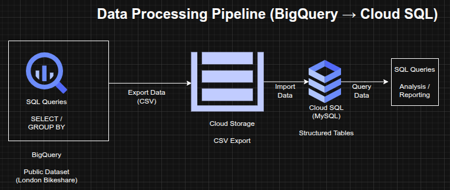

## Data Processing and Analytics Pipeline using BigQuery and Cloud SQL (GCP)

**Timeline:** December 2025  
**Role:** Cloud Engineer / Data Engineer  
**Skills:** BigQuery, Cloud SQL, Cloud Storage, SQL, Data Pipelines, Data Transformation, Query Optimization

---

### Project Summary

This project focused on building a **data processing and analytics pipeline** on Google Cloud Platform using BigQuery and Cloud SQL. The workflow involved querying large public datasets, transforming and exporting structured data, and loading it into a managed relational database for further analysis.

The implementation demonstrated how to move data across multiple cloud services while maintaining structure, enabling both **large-scale analytics and transactional querying**.

---

### Objectives

- Query and analyze large datasets using BigQuery  
- Perform data aggregation using SQL  
- Export processed data into CSV format  
- Store exported data in Cloud Storage  
- Create a Cloud SQL instance and database  
- Import structured data into Cloud SQL tables  
- Perform SQL-based data manipulation and analysis  

---

### Architecture Overview

The architecture consisted of:

- **BigQuery** for large-scale data querying and aggregation  
- **Public dataset (London bikeshare)** used as the data source  
- **Cloud Storage bucket** used as an intermediate staging layer  
- **Cloud SQL (MySQL)** used as a managed relational database  
- SQL queries used to transform, filter, and analyze the data  

---

### Implementation & Highlights

#### 1. Data Exploration with BigQuery
- Queried a public dataset containing millions of bikeshare records  
- Used SQL commands such as:
  - SELECT  
  - WHERE  
  - GROUP BY  
  - COUNT  
  - ORDER BY  
- Extracted insights from large-scale datasets efficiently  

---

#### 2. Data Aggregation and Transformation
- Aggregated trip data based on start and end stations  
- Created structured outputs suitable for downstream processing  
- Prepared datasets for export and reuse  

---

#### 3. Data Export to Cloud Storage
- Exported query results as CSV files  
- Stored the files in a Cloud Storage bucket  
- Used Cloud Storage as an intermediate staging layer in the pipeline  

---

#### 4. Cloud SQL Provisioning
- Created a managed MySQL instance using Cloud SQL  
- Configured database and tables for structured data ingestion  
- Designed schema for imported datasets  

---

#### 5. Data Import into Cloud SQL
- Loaded CSV files into Cloud SQL tables  
- Verified data integrity after import  
- Enabled structured querying on relational datasets  

---

#### 6. Data Manipulation and Analysis
- Executed SQL operations including:
  - DELETE (data cleanup)  
  - INSERT (data creation)  
  - UNION (combining datasets)  
- Performed relational analysis on processed data  

---

### Design Decisions

- Used **BigQuery** for large-scale analytical queries due to its serverless architecture  
- Used **Cloud Storage** as a staging layer for data transfer  
- Used **Cloud SQL** for structured, relational querying  
- Combined analytical and transactional systems for flexibility in data processing  

---

### Results & Impact

- Successfully built a multi-stage **data processing pipeline** on GCP  
- Demonstrated ability to:
  - query large datasets  
  - transform structured data  
  - move data across cloud services  
  - manage relational databases  
- Gained practical experience in **data engineering workflows and SQL-based analytics**  

---

### Tools & Technologies Used

- **BigQuery** – Data warehouse and analytics engine  
- **Cloud Storage** – Data staging layer  
- **Cloud SQL (MySQL)** – Relational database  
- **SQL** – Querying and data manipulation  
- **CSV** – Data transfer format  

---

### Outcome

This project demonstrates the ability to design and implement a **cloud-based data pipeline**, integrating analytics and relational database services. It highlights practical skills in **data transformation, storage, and querying across multiple GCP services**, which are essential for cloud engineering and data engineering roles.

---

[Back to Cloud Projects](/projects/cloud/)