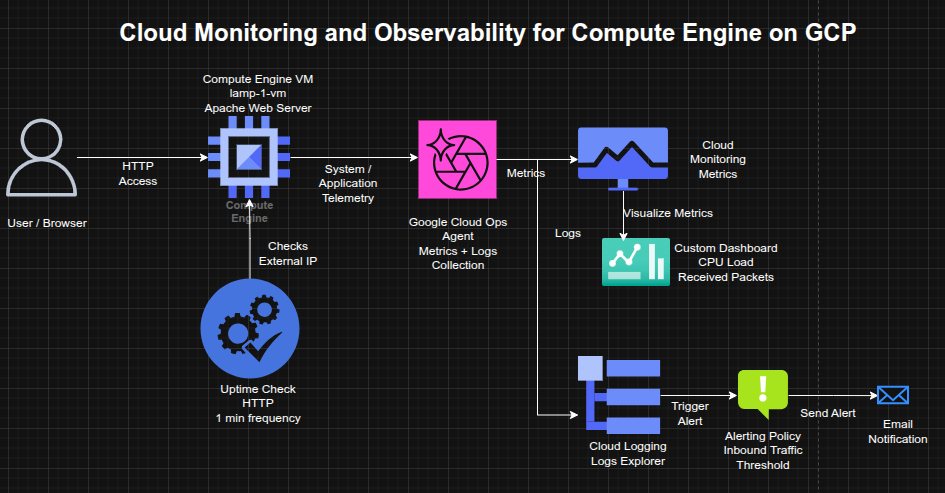

## Cloud Monitoring, Alerting, and Observability for Compute Engine on GCP

**Timeline:** December 2025  
**Role:** Cloud Engineer / Site Reliability Engineer  
**Skills:** Google Cloud Monitoring, Cloud Logging, Uptime Checks, Alerting Policies, Dashboards, Compute Engine, Ops Agent, Observability

---

### Project Summary

This project focused on implementing **observability and operational monitoring** for a Compute Engine virtual machine on Google Cloud Platform. The work involved provisioning a Linux VM, installing Apache, enabling metrics and log collection through the Google Cloud Ops Agent, configuring uptime checks, defining alerting policies, and building a custom monitoring dashboard.

The implementation demonstrated how to move from simple VM deployment to an **observable and operationally monitored workload**, using Google Cloud’s native monitoring and logging services to track health, availability, performance, and incidents. :contentReference[oaicite:1]{index=1}

---

### Objectives

- Deploy a Compute Engine VM running Apache  
- Install the Google Cloud Ops Agent for metrics and logs collection  
- Create an uptime check for external service availability  
- Configure an alerting policy for network traffic thresholds  
- Build a custom dashboard with performance charts  
- Inspect logs to validate VM lifecycle events and service health  

---

### Architecture Overview

The architecture consisted of:

- A **Compute Engine VM** (`lamp-1-vm`) running Debian and Apache  
- The **Google Cloud Ops Agent** installed on the VM for telemetry collection  
- **Cloud Monitoring** collecting VM and agent-based metrics  
- **Cloud Logging** ingesting system and instance logs  
- An **uptime check** validating HTTP reachability over the VM’s external IP  
- An **alerting policy** configured on inbound traffic thresholds  
- A **custom dashboard** displaying CPU load and received packets  

---

### Implementation & Highlights

#### 1. Compute Engine and Web Service Setup
- Created a Compute Engine instance named `lamp-1-vm`
- Configured the VM with HTTP firewall access
- Installed and started **Apache HTTP Server**
- Verified successful service response through the instance’s external IP address  

---

#### 2. Monitoring and Logging Agent Installation
- Installed the **Google Cloud Ops Agent** on the VM
- Enabled collection of:
  - system metrics
  - infrastructure metrics
  - VM and service logs
- Prepared the instance for deeper observability beyond default platform telemetry  

---

#### 3. Uptime Check Configuration
- Created an **HTTP uptime check** targeting the VM’s external IP
- Configured frequent health checks to validate service accessibility
- Used uptime monitoring to simulate availability validation from an external perspective  

---

#### 4. Alerting Policy Setup
- Created an alerting policy based on **network traffic metrics**
- Defined a threshold and retest window
- Attached an email notification channel
- Added alert documentation to support operational response and incident handling  

---

#### 5. Custom Dashboard Creation
- Built a custom dashboard for workload visibility
- Added charts for:
  - **CPU Load**
  - **Received Packets**
- Centralized key VM performance metrics in a reusable observability view  

---

#### 6. Log Exploration and Operational Validation
- Used **Logs Explorer** to inspect instance logs for `lamp-1-vm`
- Observed operational events such as:
  - service activity
  - VM stop/start events
- Correlated infrastructure actions with monitoring and logging outputs  

---

#### 7. Incident and Availability Review
- Restarted the VM to observe:
  - temporary uptime check failures
  - recovery state changes
  - alerting behavior
- Verified that monitoring, logging, and alerting reflected service interruptions and recovery events accurately  

---

### Design Decisions

- Used **Apache on Compute Engine** as a simple monitored workload  
- Installed the **Ops Agent** to extend observability with metrics and logs collection  
- Used **uptime checks** to validate service health from outside the VM  
- Added **alerting** to move from passive monitoring to active operational response  
- Created a **dashboard** to support quick performance visibility and ongoing monitoring workflows  

---

### Results & Impact

- Successfully implemented a basic **observability stack** for a cloud-hosted VM  
- Demonstrated practical use of:
  - metrics collection
  - logging
  - uptime monitoring
  - alerting
  - dashboards
- Strengthened operational understanding of how infrastructure changes surface in monitoring systems  
- Built a foundation for production-style monitoring and incident response on GCP. :contentReference[oaicite:2]{index=2}

---

### Tools & Technologies Used

- **Compute Engine** – VM hosting  
- **Apache HTTP Server** – Web workload  
- **Google Cloud Monitoring** – Metrics and uptime monitoring  
- **Google Cloud Logging** – Log ingestion and exploration  
- **Google Cloud Ops Agent** – Metrics and logging collection  
- **Alerting Policies** – Threshold-based notifications  
- **Custom Dashboards** – Centralized observability views  

---

### Outcome

This project demonstrates the ability to implement **monitoring, logging, and alerting for a cloud-hosted workload** on Google Cloud. It highlights practical skills in **observability, service health validation, incident awareness, and dashboard-driven operations**, which are directly relevant to cloud engineering and site reliability roles.

---

[Back to Cloud Projects](/projects/cloud/)