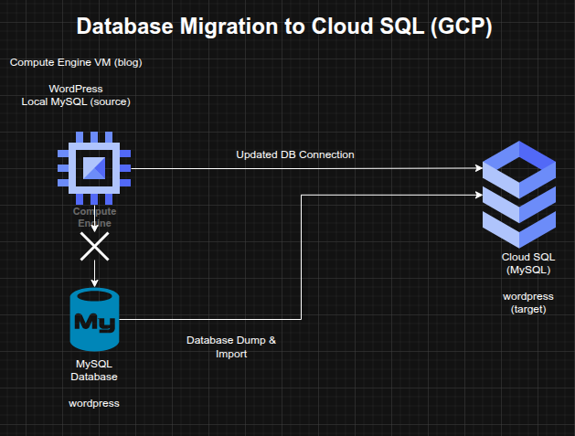

## Database Migration and Application Reconfiguration using Google Cloud SQL

**Timeline:** December 2025  
**Role:** Cloud Engineer / Cloud Architect  
**Skills:** Google Cloud SQL, MySQL, Database Migration, WordPress, Compute Engine, Application Configuration, SQL Import/Export, Cloud Connectivity

---

### Project Summary

This project focused on migrating a **self-hosted MySQL database** backing a WordPress application to **Google Cloud SQL**, then reconfiguring the application to use the managed database service instead of the local database running on the same server.

The implementation demonstrated a common cloud modernization pattern in which database services are separated from application hosts and moved to a managed platform to improve maintainability, scalability, and operational resilience.

---

### Objectives

- Provision a managed MySQL database in Google Cloud SQL  
- Create and configure the target database environment  
- Export the existing WordPress database from the local host  
- Import the database into Cloud SQL  
- Reconfigure the WordPress application to use Cloud SQL  
- Validate successful migration and application functionality  

---

### Architecture Overview

The architecture consisted of:

- A **WordPress application** running on a Compute Engine instance named `blog`  
- A legacy **local MySQL database** originally hosted on the same server  
- A new **Google Cloud SQL MySQL instance** provisioned in the target region  
- A migrated `wordpress` database and corresponding user configuration  
- Updated WordPress database connection settings in `wp-config.php`  
- Authorization and connectivity configuration allowing the blog instance to connect to Cloud SQL  

---

### Implementation & Highlights

#### 1. Cloud SQL Provisioning
- Created a new **Google Cloud SQL** instance to host the migrated WordPress database  
- Selected the required region and zone parameters for the deployment  
- Prepared the managed database platform for application migration  

---

#### 2. Target Database Configuration
- Created and configured the required database inside the Cloud SQL instance  
- Ensured the target environment was suitable for receiving the migrated WordPress data  

---

#### 3. Data Export and Import
- Performed a dump of the existing local MySQL `wordpress` database  
- Imported the exported data into the newly created Cloud SQL instance  
- Migrated the application’s persistent data from the legacy database host to the managed service  

---

#### 4. Connectivity and Authorization
- Configured access so the `blog` Compute Engine instance could connect to the Cloud SQL instance  
- Ensured the application host was authorized to reach the managed database service  

---

#### 5. Application Reconfiguration
- Updated the WordPress configuration file located at `/var/www/html/wordpress/wp-config.php`  
- Replaced the old local database connection settings with the new Cloud SQL connection details  
- Shifted the application away from dependence on the locally hosted MySQL service  

---

#### 6. Validation and Troubleshooting
- Verified that the WordPress blog continued to respond correctly after migration  
- Confirmed that the application was using the Cloud SQL backend successfully  
- Performed troubleshooting to ensure service continuity after the database cutover  

---

### Design Decisions

- Moved the database tier to **Google Cloud SQL** to separate application and database responsibilities  
- Used **database dump/import migration** as a straightforward migration path for an existing MySQL-backed application  
- Updated the application configuration rather than rebuilding the application stack  
- Preserved service continuity by validating the blog after cutover to the managed database backend  

---

### Results & Impact

- Successfully migrated the WordPress database from local MySQL to **Google Cloud SQL**  
- Reconfigured the application to use a managed cloud database service  
- Demonstrated practical skills in:
  - managed database provisioning
  - MySQL export/import migration
  - application configuration updates
  - post-migration validation and troubleshooting  
- Strengthened understanding of database modernization patterns for cloud-hosted applications  

---

### Tools & Technologies Used

- **Google Cloud SQL** – Managed MySQL database platform  
- **MySQL** – Source database engine  
- **Compute Engine** – Application host  
- **WordPress** – Application workload  
- **SQL Dump / Import** – Migration mechanism  
- **Application Configuration** – Database endpoint cutover  

---

### Outcome

This project demonstrates the ability to migrate an application database from a self-managed environment to a **managed cloud database platform** while preserving application functionality. It highlights practical experience in **database modernization, application reconfiguration, and migration validation**, which are highly relevant to cloud engineering and cloud architecture roles.

---

[Back to Cloud Projects](/projects/cloud/)