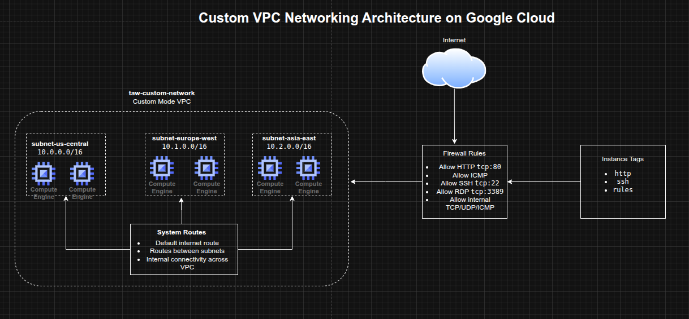

## Designing a Custom VPC Network and Firewall Rules on Google Cloud

**Timeline:** December 2025  
**Role:** Cloud Engineer  
**Skills:** Google Cloud VPC, Subnets, Firewall Rules, Network Tags, Routes, Regions and Zones, Compute Engine Networking

---

### Project Summary

This project focused on building a **custom Virtual Private Cloud (VPC) network** in Google Cloud and configuring the foundational networking controls required for secure connectivity. The implementation involved reviewing the default network model, creating a custom-mode VPC, defining regional subnetworks, and applying targeted firewall rules for HTTP, ICMP, SSH, RDP, and internal communication.

The project demonstrated core Google Cloud networking concepts including **global VPC design, regional subnet segmentation, route behavior, and tag-based firewall targeting**, which form the basis for more advanced cloud architectures.

---

### Objectives

- Review the default Google Cloud network and firewall behavior  
- Create a custom-mode VPC network  
- Define subnetworks across multiple regions  
- Configure firewall rules for web, admin, and internal traffic  
- Use instance tags to scope firewall access  
- Understand route behavior in Google Cloud networking  

---

### Architecture Overview

The architecture consisted of:

- A **custom-mode VPC** named `taw-custom-network`
- Three regional subnetworks:
  - `subnet-us-central`
  - `subnet-europe-west`
  - `subnet-asia-east`
- Automatically created system routes for:
  - internet egress
  - inter-subnet communication
- Firewall rules allowing:
  - HTTP access from the internet
  - ICMP
  - SSH
  - RDP
  - internal TCP/UDP/ICMP communication between subnets
- **instance tags** used to apply rules selectively to workloads

---

### Implementation & Highlights

#### 1. Reviewing the Default Network
- Examined the default VPC network created automatically in a new Google Cloud project
- Reviewed its auto-mode subnet behavior and preconfigured firewall rules
- Compared default networking behavior with the more controlled custom VPC model 

---

#### 2. Designing a Custom VPC
- Created a custom-mode VPC named `taw-custom-network`
- Chose custom mode to control subnet creation manually instead of relying on auto-created regional subnets
- Used the VPC as a globally scoped network foundation for resources across multiple regions 

---

#### 3. Creating Regional Subnets
- Defined three subnetworks in different regions
- Used separate private IP ranges for each subnet:
  - `10.0.0.0/16`
  - `10.1.0.0/16`
  - `10.2.0.0/16`
- Established regional segmentation while keeping all subnets connected through the same global VPC 

---

#### 4. Configuring Firewall Rules
- Created targeted firewall rules for:
  - HTTP (`tcp:80`)
  - ICMP
  - SSH (`tcp:22`)
  - RDP (`tcp:3389`)
  - internal communication across all subnets
- Applied least-privilege thinking by scoping some rules with tags instead of exposing all instances broadly

---

#### 5. Using Network Tags
- Used instance tags such as:
  - `http`
  - `ssh`
  - `rules`
- Applied firewall policies selectively based on instance role
- Reinforced a cleaner and more scalable firewall administration model compared with broad network-wide rules

---

#### 6. Understanding Routes and Connectivity
- Reviewed automatically created routes for internet access and subnet-to-subnet communication
- Connected the role of routes and firewall policies in controlling actual traffic flow
- Built a practical foundation for understanding more advanced network architectures such as shared VPCs and peering

---

### Design Decisions

- Used a **custom-mode VPC** to retain full control over subnetwork layout  
- Distributed subnets across **multiple regions** to reflect Google Cloud’s global VPC model  
- Used **RFC1918 private address ranges** for subnet design  
- Used **firewall rules with tags** to target intended workloads instead of opening access unnecessarily  
- Kept internal communication explicit through a dedicated firewall rule covering the defined subnet ranges  

---

### Results & Impact

- Successfully designed and configured a **custom Google Cloud VPC**
- Demonstrated practical use of:
  - regional subnetting
  - firewall rule creation
  - tag-based access control
  - route awareness
- Strengthened understanding of how Google Cloud networking differs from traditional on-premises and default-cloud networking models
- Built a strong foundation for future projects involving load balancers, GKE, hybrid networking, and multi-tier cloud environments

---

### Tools & Technologies Used

- **Google Cloud VPC** – Global virtual networking  
- **Subnets** – Regional IP segmentation  
- **Firewall Rules** – Traffic control  
- **Network Tags** – Selective rule targeting  
- **Routes** – Connectivity paths within the VPC and to the internet  
- **Compute Engine Networking** – Instance-level attachment and traffic policy context  

---

### Outcome

This project demonstrates the ability to design a **custom Google Cloud network foundation** using VPCs, subnetworks, routes, and firewall controls. It highlights practical skills in **cloud networking, segmentation, and access control**, which are essential for cloud engineering, infrastructure, and security-focused roles.

---

[Back to Cloud Projects](/projects/cloud/)