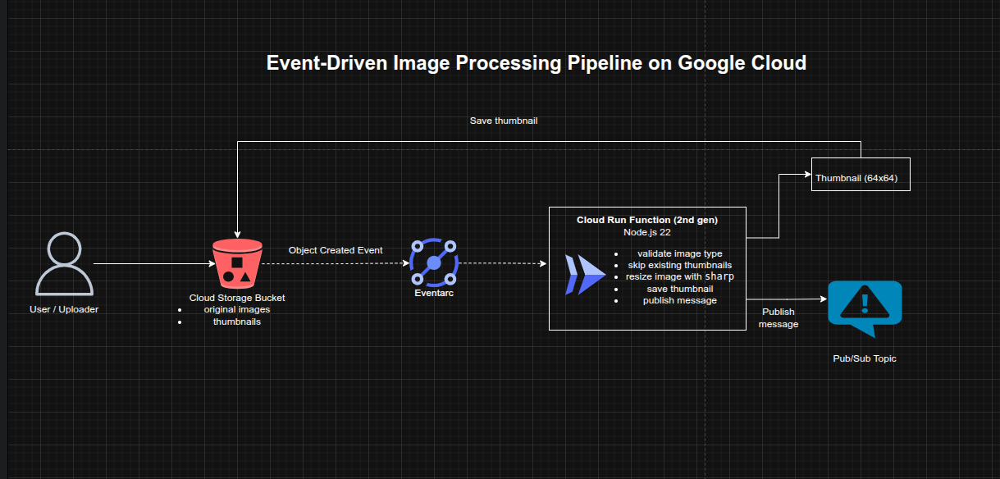

## Event-Driven Image Processing Pipeline with Cloud Run Functions on Google Cloud

**Timeline:** December 2025  
**Role:** Cloud Engineer / Serverless Developer  
**Skills:** Cloud Storage, Cloud Run Functions (2nd Gen), Pub/Sub, Eventarc, Node.js, Image Processing, Serverless Architecture, IAM

---

### Project Summary

This project implemented an **event-driven image processing pipeline** on Google Cloud. When an image is uploaded to a Cloud Storage bucket, a Cloud Run Function is automatically triggered to generate a thumbnail version of the image and store it back in the bucket. The function then publishes a message to a Pub/Sub topic, enabling further downstream processing or notification workflows.

The solution demonstrates how to design a **serverless, event-driven system** that reacts to data changes in real time without requiring manual intervention or persistent infrastructure.

---

### Objectives

- Create a storage bucket for image uploads  
- Trigger processing automatically when new images are added  
- Generate thumbnail images programmatically  
- Publish processing events to a messaging system  
- Apply basic IAM governance by removing unnecessary access  

---

### Architecture Overview

The architecture consisted of:

- A **Cloud Storage bucket** for storing uploaded images  
- A **Cloud Run Function (2nd Gen)** triggered on object creation events  
- Image processing logic using the `sharp` Node.js library  
- Automatic thumbnail generation (64x64)  
- A **Pub/Sub topic** receiving messages after processing  
- Event-driven communication using **Eventarc**  
- IAM configuration ensuring only required users had access  

---

### Implementation & Highlights

#### 1. Storage Layer
- Created a Cloud Storage bucket for image uploads
- Used object creation as the trigger event
- Ensured images are stored centrally for processing and retrieval

---

#### 2. Event-Driven Processing with Cloud Run Functions
- Created a Cloud Run Function (2nd generation)
- Configured trigger:
  - Cloud Storage object creation
- Used Node.js runtime
- Implemented event-driven execution without polling or manual invocation

---

#### 3. Image Transformation Logic
- Used the `sharp` library to resize images
- Generated thumbnails at 64x64 resolution
- Ensured original images were preserved
- Stored processed images back into the same bucket with a new filename suffix

---

#### 4. Messaging Integration with Pub/Sub
- Created a Pub/Sub topic
- Published a message after each successful thumbnail generation
- Enabled asynchronous communication for downstream workflows (e.g., notifications, indexing, analytics) 

---

#### 5. Event Filtering and Idempotency
- Ensured the function ignored already processed thumbnails
- Prevented infinite trigger loops by checking filename patterns
- Applied basic event filtering logic within the function

---

#### 6. Security and Access Control
- Reviewed IAM users in the project
- Removed access for a previous cloud engineer
- Reinforced least-privilege access principles for shared cloud environments

---

### Design Decisions

- Used **Cloud Storage events** to trigger processing instead of polling  
- Used **Cloud Run Functions (2nd Gen)** for scalability and event integration  
- Used **Pub/Sub** to decouple processing from downstream systems  
- Used **sharp** for efficient in-memory image processing  
- Implemented **idempotency checks** to prevent duplicate processing  
- Kept infrastructure serverless to reduce operational overhead  

---

### Results & Impact

- Built a fully functional **event-driven processing pipeline**
- Eliminated need for manual image processing workflows
- Enabled real-time transformation of uploaded content
- Created a scalable architecture that can handle bursts of uploads
- Introduced asynchronous messaging for future extensibility
- Applied security best practices in IAM management

---

### Tools & Technologies Used

- **Cloud Storage** – Object storage and event source  
- **Cloud Run Functions (2nd Gen)** – Serverless compute  
- **Pub/Sub** – Event messaging  
- **Eventarc** – Event routing  
- **Node.js** – Runtime environment  
- **sharp** – Image processing library  
- **IAM** – Access control  

---

### Outcome

This project demonstrates the ability to design and implement a **serverless event-driven architecture** on Google Cloud that processes data automatically in response to real-world events. It highlights practical skills in **event handling, serverless compute, asynchronous messaging, and data transformation**, which are highly relevant to modern cloud-native and platform engineering roles.

---

[Back to Cloud Projects](/projects/cloud/)