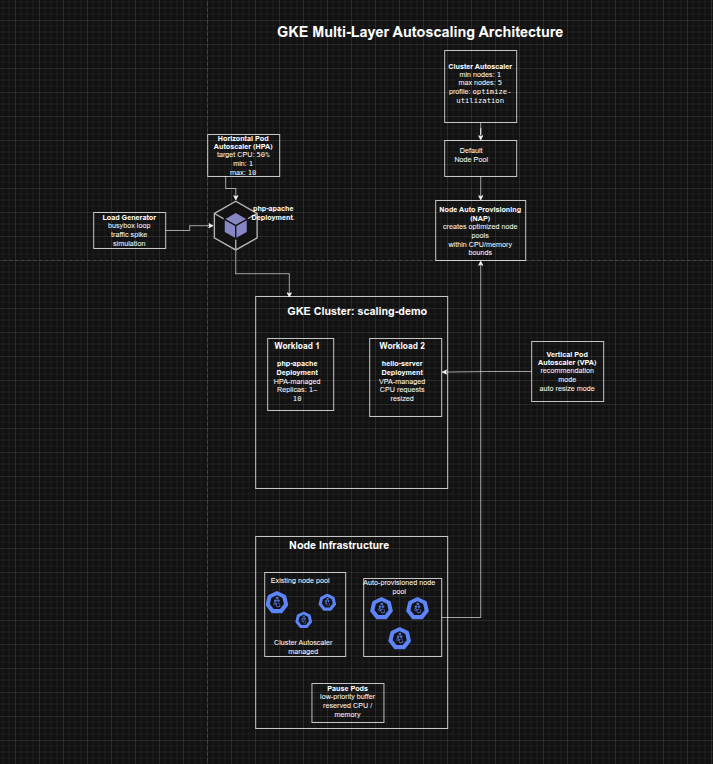

## Combining GKE Autoscaling Strategies for Cost and Availability Optimization

**Timeline:** December 2025  
**Role:** Cloud Engineer / Site Reliability Engineer  
**Skills:** Google Kubernetes Engine (GKE), Horizontal Pod Autoscaling (HPA), Vertical Pod Autoscaling (VPA), Cluster Autoscaler, Node Auto Provisioning (NAP), Pod Disruption Budgets, Kubernetes PriorityClass, Pause Pods, Cost Optimization

---

### Project Summary

This project focused on using multiple autoscaling strategies in Google Kubernetes Engine (GKE) to improve both **cost efficiency** and **application availability**. The implementation combined Horizontal Pod Autoscaling (HPA), Vertical Pod Autoscaling (VPA), Cluster Autoscaler, and Node Auto Provisioning (NAP) to reduce unused resources during low demand, scale efficiently during increased demand, and improve workload responsiveness through overprovisioning with pause pods.

The project demonstrated how autoscaling in Kubernetes is most effective when viewed as a **coordinated system across both pods and nodes**, rather than as isolated mechanisms.

---

### Objectives

- Reduce deployment replica count with Horizontal Pod Autoscaling  
- Reduce CPU requests with Vertical Pod Autoscaling  
- Decrease cluster node count with Cluster Autoscaler  
- Automatically create optimized node pools with Node Auto Provisioning  
- Test autoscaling behavior under increased demand  
- Improve response time during traffic spikes using pause pods  

---

### Architecture Overview

The architecture consisted of:

- A **GKE cluster** (`scaling-demo`) created with Vertical Pod Autoscaling enabled  
- A **php-apache deployment** used to demonstrate Horizontal Pod Autoscaling  
- A **hello-server deployment** used to demonstrate Vertical Pod Autoscaling  
- **Cluster Autoscaler** to reduce or add nodes based on scheduling demand  
- **Node Auto Provisioning** to create right-sized node pools dynamically  
- **Pod Disruption Budgets** for kube-system workloads to make scale-down possible  
- A **load generator pod** used to simulate a spike in traffic  
- **Pause pods** in `kube-system` to reserve capacity and reduce autoscaling lag during bursts  

---

### Implementation & Highlights

#### 1. Provisioning the Test Environment
- Created a three-node GKE cluster with Vertical Pod Autoscaling enabled
- Deployed a CPU-intensive `php-apache` application with defined CPU requests and limits
- Exposed the deployment with a Kubernetes Service for autoscaling tests

---

#### 2. Horizontal Pod Autoscaling (HPA)
- Applied a Horizontal Pod Autoscaler to the `php-apache` deployment
- Configured the autoscaler to maintain between 1 and 10 replicas
- Used a target CPU utilization of 50%
- Observed that under low demand the deployment scaled down toward the minimum replica count, reducing idle resource usage 

---

#### 3. Vertical Pod Autoscaling (VPA)
- Deployed a `hello-server` workload with an intentionally oversized CPU request
- Created a Vertical Pod Autoscaler for the deployment
- Started with `Off` mode to view recommendations, then switched to `Auto`
- Observed VPA reduce the CPU request dramatically from the original value to a smaller recommendation, improving node-level resource efficiency 

---

#### 4. Interpreting HPA and VPA Outcomes
- Confirmed that HPA reduced the number of `php-apache` pods during low traffic
- Verified that VPA resized `hello-server` pods based on observed usage
- Highlighted the practical tradeoff between aggressive automatic resizing and availability risk, especially during rapid spikes 

---

#### 5. Cluster Autoscaler
- Enabled autoscaling for the cluster with min/max node thresholds
- Switched to the `optimize-utilization` profile to encourage more aggressive scale-down
- Created Pod Disruption Budgets for key `kube-system` components so system pods could be rescheduled safely
- Observed the cluster scale down from three nodes to two when utilization dropped sufficiently 

---

#### 6. Node Auto Provisioning (NAP)
- Enabled Node Auto Provisioning with cluster-wide CPU and memory bounds
- Allowed GKE to create new node pools automatically when workload demand required a better machine shape
- Positioned NAP as the vertical infrastructure scaling mechanism complementing the horizontal behavior of Cluster Autoscaler 

---

#### 7. Testing Under Increased Demand
- Ran a load generator against the `php-apache` service to simulate sustained traffic
- Observed HPA scale the deployment up as CPU utilization exceeded the target
- Observed Cluster Autoscaler add nodes to accommodate unschedulable pods
- Observed Node Auto Provisioning create an optimized node pool suited to the workload’s CPU-heavy demand profile 

---

#### 8. Overprovisioning with Pause Pods
- Created a low-priority pause pod deployment in the `kube-system` namespace
- Used a custom `PriorityClass` so pause pods could be preempted by higher-priority application workloads
- Forced the cluster to provision extra capacity in advance
- Improved the cluster’s ability to absorb future traffic spikes more quickly by keeping a schedulable buffer available 

---

### Design Decisions

- Used **HPA** to match replica count to traffic-driven CPU demand  
- Used **VPA** to right-size pod CPU requests based on observed historical usage  
- Used **Cluster Autoscaler** to remove excess nodes during low demand and add nodes under scheduling pressure  
- Used **Node Auto Provisioning** to let GKE choose better-suited node pools automatically instead of relying only on fixed node types  
- Added **Pod Disruption Budgets** so system pods could be consolidated safely during scale-down  
- Used **pause pods** to strike a practical balance between strict cost minimization and scale-up responsiveness  

---

### Results & Impact

- Successfully demonstrated how multiple GKE autoscaling layers can work together
- Reduced unnecessary replica and node usage during low-demand periods
- Improved node-level resource efficiency by resizing oversized pod requests
- Enabled infrastructure to scale up automatically during load spikes
- Improved autoscaling responsiveness by reserving spare capacity with low-priority pause pods
- Built a strong practical understanding of the tradeoffs between:
  - cost efficiency
  - scaling speed
  - availability
  - right-sizing

---

### Tools & Technologies Used

- **Google Kubernetes Engine (GKE)** – Cluster platform  
- **Horizontal Pod Autoscaler (HPA)** – Pod replica scaling  
- **Vertical Pod Autoscaler (VPA)** – Pod request sizing  
- **Cluster Autoscaler** – Node count scaling  
- **Node Auto Provisioning (NAP)** – Automatic node pool creation  
- **Pod Disruption Budgets (PDBs)** – Safe scale-down behavior  
- **PriorityClass / Pause Pods** – Buffer capacity strategy  
- **Cloud Shell** – Cluster management and load testing  

---

### Outcome

This project demonstrates the ability to design and tune **multi-layer autoscaling strategies on GKE** to improve both cost and availability. It highlights practical skills in **pod scaling, node scaling, rightsizing, autoscaling governance, and capacity buffering**, which are highly relevant to cloud engineering, platform engineering, and site reliability roles.

---

[Back to Cloud Projects](/projects/cloud/)