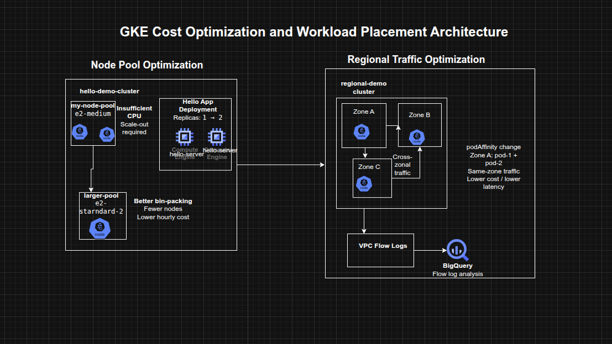

## Cost Optimization for GKE Nodes and Regional Workloads on Google Cloud

**Timeline:** December 2025  
**Role:** Cloud Engineer / Site Reliability Engineer  
**Skills:** Google Kubernetes Engine (GKE), Node Pools, Machine Type Optimization, Regional Clusters, Pod Scheduling, VPC Flow Logs, BigQuery, Cost Optimization, Kubernetes Affinity

---

### Project Summary

This project focused on optimizing the infrastructure cost of Google Kubernetes Engine (GKE) workloads by improving node pool sizing, workload placement, and inter-zonal traffic efficiency. The work involved analyzing the resource profile of a sample application, scaling the workload, migrating it to a more cost-efficient node pool with a better-shaped machine type, and then exploring the network cost implications of running chatty pods across zones in a regional cluster.

The implementation demonstrated how cost optimization in GKE is not limited to choosing cheaper machine types, but also depends on **bin-packing efficiency, regional architecture decisions, and reducing unnecessary cross-zonal traffic**.

---

### Objectives

- Examine node-level resource utilization of a GKE workload  
- Scale an application and observe infrastructure impact  
- Migrate workloads to an optimized machine type in a new node pool  
- Explore regional cluster design tradeoffs  
- Enable and inspect VPC flow logs for pod communication  
- Reduce inter-zonal traffic costs by changing workload placement  

---

### Architecture Overview

The architecture consisted of:

- A **zonal GKE cluster** hosting a Hello application deployment  
- An initial node pool using smaller **e2-medium** machines  
- A second node pool using a larger **e2-standard-2** machine type for improved packing efficiency  
- A **regional GKE cluster** spanning multiple zones  
- Two application pods deployed across different nodes and zones  
- **VPC Flow Logs** enabled for subnet-level traffic visibility  
- A **BigQuery dataset** used to inspect flow log data by source and destination zone  
- Pod scheduling changes using **pod affinity / anti-affinity** to influence zonal placement  

---

### Implementation & Highlights

#### 1. Understanding the Initial Cluster Shape
- Examined the Hello demo cluster running on two `e2-medium` nodes
- Reviewed node-level CPU and memory requests for the Hello application and GKE system components
- Observed that CPU was constrained sooner than memory, indicating inefficient resource fit for the workload :contentReference[oaicite:1]{index=1}

---

#### 2. Scaling the Hello Application
- Increased the Hello application replicas from 1 to 2
- Observed scheduling pressure and insufficient CPU conditions
- Resized the existing node pool to three nodes to accommodate the added workload
- Confirmed that scaling on the original machine type led to underutilized memory and suboptimal node efficiency :contentReference[oaicite:2]{index=2}

---

#### 3. Optimizing Node Pool Machine Type
- Created a new node pool using `e2-standard-2`
- Cordoned and drained the original node pool
- Migrated workloads to the new pool
- Deleted the old node pool after workload migration
- Demonstrated that the same workload that required three `e2-medium` nodes could run on a single larger node more efficiently :contentReference[oaicite:3]{index=3}

---

#### 4. Cost and Bin-Packing Analysis
- Compared the cost and packing behavior of smaller shared-core nodes versus a larger standard node
- Identified that better workload packing reduced waste and slowed cost growth during scale-out
- Reinforced the importance of aligning machine type selection to application resource shape rather than assuming smaller nodes are always cheaper :contentReference[oaicite:4]{index=4}

---

#### 5. Exploring Regional Cluster Tradeoffs
- Reviewed the tradeoffs between zonal, multi-zonal, and regional GKE clusters
- Considered availability, performance, and cost implications across regions and zones
- Positioned regional clusters as a strong availability option, but one that requires more careful traffic placement to avoid unnecessary network cost :contentReference[oaicite:5]{index=5}

---

#### 6. Creating and Testing a Regional Cluster
- Created a new regional cluster
- Deployed two pods designed to run on separate nodes using pod anti-affinity
- Generated traffic between pods using `ping`
- Verified that the pods were initially running in different zones and communicating across zone boundaries :contentReference[oaicite:6]{index=6}

---

#### 7. Enabling Flow Logs and Exporting to BigQuery
- Enabled VPC Flow Logs for the subnet used by the regional cluster
- Exported flow logs through a sink into a BigQuery dataset
- Queried source and destination zones to identify cross-zonal communications between cluster nodes
- Used log analysis to make cost-aware placement decisions based on actual network behavior :contentReference[oaicite:7]{index=7}

---

#### 8. Minimizing Cross-Zonal Traffic Costs
- Changed pod scheduling behavior from anti-affinity to affinity
- Recreated the second pod so it would land on the same node as the first
- Verified lower latency and reduced inter-zonal communication
- Connected the optimization to lower VM-to-VM egress cost for chatty workloads within a regional cluster :contentReference[oaicite:8]{index=8}

---

### Design Decisions

- Used **node pool migration** instead of in-place reshaping to move workloads safely to a more efficient machine type  
- Used a **regional cluster** to study high-availability tradeoffs beyond a single-zone design  
- Enabled **VPC Flow Logs** and exported them to **BigQuery** to validate traffic patterns with data rather than assumptions  
- Used **pod affinity and anti-affinity** to control placement and reduce unnecessary cross-zonal communication  
- Treated cost optimization as a combination of:
  - workload fitting
  - node efficiency
  - cluster topology
  - network behavior  

---

### Results & Impact

- Successfully optimized a GKE workload by moving from a less efficient node pool to a better-shaped machine type
- Demonstrated practical use of:
  - node pool migration
  - workload scheduling controls
  - regional cluster cost analysis
  - flow log inspection
  - BigQuery-based traffic analysis
- Improved understanding of how GKE costs are influenced not only by node pricing, but also by bin-packing efficiency and network traffic patterns
- Built a strong case study for **cost-aware Kubernetes platform operations**

---

### Tools & Technologies Used

- **Google Kubernetes Engine (GKE)** – Container orchestration platform  
- **Compute Engine machine types** – Node pool optimization  
- **Kubernetes Deployments** – Workload scaling  
- **Node Pools** – Infrastructure segmentation by machine type  
- **Pod Affinity / Anti-Affinity** – Workload placement control  
- **VPC Flow Logs** – Network traffic visibility  
- **BigQuery** – Flow log analysis  
- **Cloud Logging** – Traffic export and inspection  

---

### Outcome

This project demonstrates the ability to optimize **GKE infrastructure cost and efficiency** by right-sizing node pools, analyzing scaling behavior, and minimizing unnecessary cross-zonal traffic in a regional cluster. It highlights practical skills in **Kubernetes workload placement, infrastructure efficiency, observability-driven optimization, and cloud cost engineering**, which are highly relevant to cloud engineering, platform engineering, and site reliability roles.

---

[Back to Cloud Projects](/projects/cloud/)