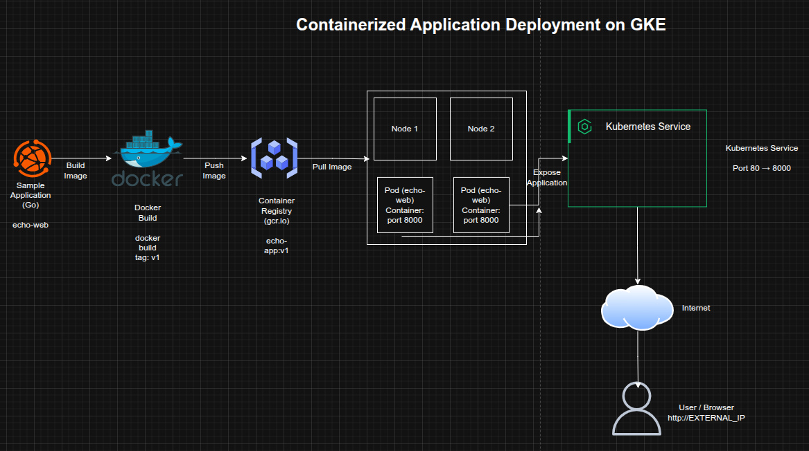

## Containerized Application Deployment on Google Kubernetes Engine (GKE)

**Timeline:** December 2025  
**Role:** Cloud Engineer / Cloud Architect  
**Skills:** Google Kubernetes Engine (GKE), Docker, Google Container Registry, Kubernetes Deployments, Kubernetes Services, Cloud Storage, Containerized Applications

---

### Project Summary

This project focused on deploying a **containerized web application** to **Google Kubernetes Engine (GKE)** as part of a cloud-native application adoption workflow. The objective was to package a sample application into a Docker image, publish it to **Google Container Registry**, provision a Kubernetes cluster, and deploy the workload as a managed service.

The implementation demonstrated the full path from **application packaging** to **cluster-based deployment**, reflecting a modern cloud-native delivery pattern suitable for scalable microservices-oriented environments.

---

### Objectives

- Build a Docker image for a sample web application  
- Tag and publish the image to Google Container Registry  
- Provision a Kubernetes cluster on GKE  
- Deploy the application as a Kubernetes workload  
- Expose the application through a Kubernetes Service  
- Validate successful deployment and external accessibility  

---

### Architecture Overview

The architecture consisted of:

- A sample **Go web application** packaged with a Dockerfile  
- A Docker image built and tagged for **Google Container Registry (`gcr.io`)**  
- A **Google Kubernetes Engine (GKE)** cluster provisioned with two worker nodes  
- A Kubernetes **Deployment** running the application container  
- A Kubernetes **Service** exposing the application externally on port 80  
- Internal application container traffic running on port 8000  

---

### Implementation & Highlights

#### 1. Kubernetes Cluster Provisioning
- Created a Kubernetes cluster named **`echo-cluster`**  
- Provisioned the cluster with **two e2-standard-2 nodes**  
- Established the target environment for containerized application testing  

---

#### 2. Application Packaging with Docker
- Retrieved the sample application archive (`echo-web.tar.gz`) from Cloud Storage  
- Built a Docker image for the provided Go application  
- Applied the required **`v1` tag** for controlled versioning  

---

#### 3. Image Publication to Container Registry
- Tagged the image using the **`gcr.io`** registry naming format  
- Pushed the application image to **Google Container Registry**  
- Prepared the image for cluster-based deployment  

---

#### 4. Workload Deployment to GKE
- Created a Kubernetes Deployment named **`echo-web`**  
- Scheduled the containerized application onto the GKE cluster  
- Validated successful pod creation and workload execution  

---

#### 5. Service Exposure and Port Mapping
- Exposed the application using a Kubernetes Service  
- Mapped external web traffic on **port 80** to the application’s internal **port 8000**  
- Enabled browser-based access to the deployed application  

---

### Design Decisions

- Used **containerization** to package application dependencies consistently  
- Leveraged **Google Container Registry** as a centralized image repository  
- Used **GKE** to provide managed Kubernetes orchestration  
- Applied **service-level port translation** to align internal application behavior with standard web access patterns  
- Structured the deployment to reflect a repeatable cloud-native delivery workflow  

---

### Results & Impact

- Successfully deployed a containerized application to **Google Kubernetes Engine**  
- Demonstrated the ability to move from source application package to live Kubernetes workload  
- Validated key cloud-native concepts including:
  - image build and tagging
  - registry publication
  - Kubernetes deployment management
  - service exposure and port mapping  
- Strengthened practical experience in **container orchestration and application modernization**

---

### Tools & Technologies Used

- **Google Kubernetes Engine (GKE)** – Managed Kubernetes cluster  
- **Docker** – Container image packaging  
- **Google Container Registry (GCR)** – Image repository  
- **Kubernetes Deployment** – Application rollout  
- **Kubernetes Service** – External exposure and traffic routing  
- **Cloud Storage** – Application archive source  
- **Go Application** – Sample containerized workload  

---

### Outcome

This project demonstrates the ability to implement a **cloud-native application deployment workflow** on Google Cloud, from container build through registry publication to managed Kubernetes deployment. It highlights practical skills in **containerization, orchestration, and service exposure**, which are directly relevant to modern cloud engineering and application modernization roles.

---

[Back to Cloud Projects](/projects/cloud/)
