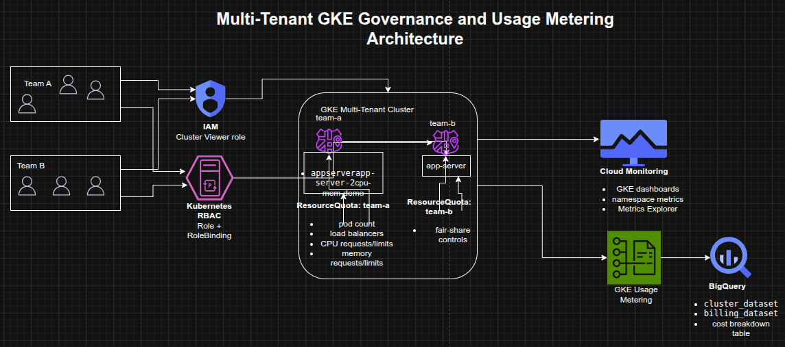

## Managing a Multi-Tenant GKE Cluster with Namespaces, RBAC, and Usage Metering

**Timeline:** December 2025  
**Role:** Cloud Engineer / Site Reliability Engineer  
**Skills:** Google Kubernetes Engine (GKE), Kubernetes Namespaces, RBAC, IAM, Resource Quotas, GKE Monitoring, Metrics Explorer, BigQuery, Looker Studio, Usage Metering, Cost Optimization

---

### Project Summary

This project focused on configuring a **multi-tenant Google Kubernetes Engine (GKE) cluster** to improve resource efficiency, tenant isolation, and cost visibility. The implementation used Kubernetes namespaces to segment workloads by team, applied IAM and Kubernetes RBAC for controlled namespace access, enforced fair-share consumption using object-count and CPU/memory quotas, and used Google Cloud observability tooling to monitor usage and cost allocation by namespace.

The project demonstrated how a shared GKE cluster can be governed effectively without creating separate clusters per team, supporting both **operational isolation** and **cost optimization**.

---

### Objectives

- Create multiple namespaces in a GKE cluster  
- Configure RBAC and IAM for namespace-scoped access  
- Enforce fair resource sharing with Kubernetes resource quotas  
- Monitor namespace usage with GKE dashboards and Metrics Explorer  
- Enable GKE usage metering for more granular resource visibility  
- Build a Looker Studio report to analyze namespace-level cost breakdown  

---

### Architecture Overview

The architecture consisted of:

- A shared **multi-tenant GKE cluster** hosting workloads for multiple teams  
- Separate **team namespaces** (`team-a`, `team-b`) for logical isolation  
- **IAM roles** granting minimal cluster-level access  
- **Kubernetes Roles and RoleBindings** granting namespace-scoped permissions  
- **ResourceQuota objects** enforcing pod-count and CPU/memory limits  
- **Cloud Monitoring dashboards** and **Metrics Explorer** for namespace usage visibility  
- **BigQuery datasets** storing usage metering and billing export data  
- **Looker Studio** visualizations showing cost breakdown by namespace and resource type  

---

### Implementation & Highlights

#### 1. Multi-Tenant Namespace Design
- Connected to the provided GKE cluster
- Reviewed default Kubernetes system namespaces
- Created separate namespaces for:
  - `team-a`
  - `team-b`
- Deployed workloads with the same resource name in different namespaces to demonstrate isolation

---

#### 2. Namespace-Scoped Access Control
- Granted the `Kubernetes Engine Cluster Viewer` IAM role to a service account representing a developer
- Created Kubernetes Roles for namespace-specific permissions
- Bound the service account to the namespace role using a RoleBinding
- Verified that the account could access `team-a` resources while being denied access to `team-b`

---

#### 3. Resource Quotas for Fair Sharing
- Created an initial quota limiting:
  - pod count
  - load balancer service count
- Verified quota enforcement by attempting to exceed the namespace pod limit
- Updated the quota to allow more pods as workload requirements changed

---

#### 4. CPU and Memory Quotas
- Applied a second ResourceQuota object limiting:
  - CPU requests
  - CPU limits
  - memory requests
  - memory limits
- Created a workload with explicit resource requests and limits
- Verified that namespace resource consumption was reflected correctly in quota usage

---

#### 5. Monitoring and Namespace Visibility
- Used the GKE Monitoring dashboard to inspect namespace-level utilization
- Filtered workloads by namespace for tenant-specific visibility
- Used Metrics Explorer to graph container CPU usage aggregated by namespace
- Excluded `kube-system` to focus on tenant workloads

---

#### 6. GKE Usage Metering and Cost Visibility
- Enabled GKE usage metering on the cluster
- Used BigQuery datasets containing:
  - cluster resource usage
  - billing export data
- Generated a cost breakdown table using a scheduled query
- Created a Looker Studio data source and report for:
  - cost by namespace
  - cost by resource type
  - namespace filtering via dropdown controls

---

### Design Decisions

- Used **one shared GKE cluster** instead of separate clusters per team to reduce cluster sprawl and improve cost efficiency  
- Used **namespaces** as the primary isolation boundary for team workloads  
- Combined **IAM + Kubernetes RBAC** so cluster access stayed minimal while permissions remained granular  
- Applied **resource quotas** to prevent a single team from consuming disproportionate cluster resources  
- Used **Monitoring + Metrics Explorer** for operational visibility  
- Used **BigQuery + Looker Studio** to extend from operational monitoring into namespace-level cost analysis  

---

### Results & Impact

- Successfully implemented a **multi-tenant GKE governance model**
- Demonstrated practical use of:
  - namespaces
  - IAM and RBAC
  - pod and resource quotas
  - observability dashboards
  - usage metering
  - namespace-level cost reporting
- Improved understanding of how shared Kubernetes environments can balance:
  - tenant isolation
  - fair resource allocation
  - operational visibility
  - cost optimization

---

### Tools & Technologies Used

- **Google Kubernetes Engine (GKE)** – Shared cluster platform  
- **Kubernetes Namespaces** – Tenant isolation  
- **IAM** – Cluster-level access  
- **Kubernetes RBAC** – Namespace-level authorization  
- **ResourceQuota** – Fair resource governance  
- **Cloud Monitoring** – Dashboards and namespace visibility  
- **Metrics Explorer** – Namespace CPU usage analysis  
- **BigQuery** – Usage metering and billing datasets  
- **Looker Studio** – Cost breakdown reporting  

---

### Outcome

This project demonstrates the ability to design and govern a **multi-tenant Kubernetes environment** on Google Cloud using namespace isolation, RBAC, quotas, monitoring, and usage metering. It highlights practical skills in **cluster governance, resource control, observability, and cost optimization**, which are highly relevant to cloud engineering, platform engineering, and site reliability roles.

---

[Back to Cloud Projects](/projects/cloud/)