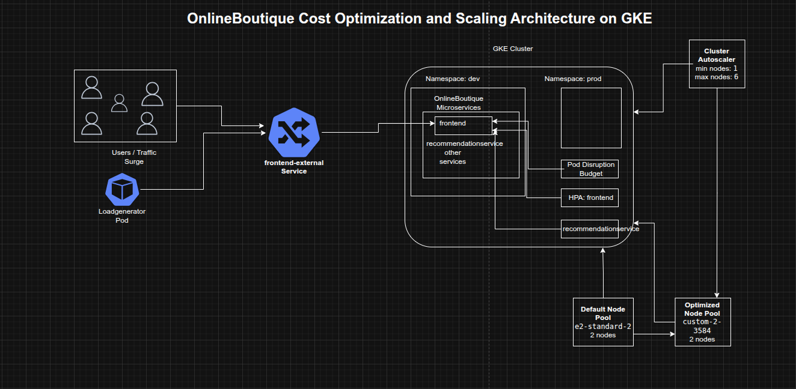

## Optimizing Cost and Scalability for OnlineBoutique on Google Kubernetes Engine

**Timeline:** December 2025  
**Role:** Cloud Engineer / Site Reliability Engineer  
**Skills:** Google Kubernetes Engine (GKE), Kubernetes Namespaces, Node Pools, Custom Machine Types, Pod Disruption Budgets, Horizontal Pod Autoscaling, Cluster Autoscaler, Rolling Updates, Load Testing, Cost Optimization

---

### Project Summary

This project focused on deploying and optimizing the **OnlineBoutique microservices application** on Google Kubernetes Engine (GKE) with an emphasis on **cost efficiency, scalability, and service availability**. The work included provisioning a right-sized GKE cluster, separating resources across development and production namespaces, migrating workloads to a more efficient custom machine type node pool, applying a safe frontend update using a Pod Disruption Budget, and configuring autoscaling to respond automatically to a major traffic surge.

The implementation demonstrated how Kubernetes platform decisions at the cluster, node pool, and workload levels can work together to reduce infrastructure waste while maintaining application resilience during change and growth.

---

### Objectives

- Create a zonal GKE cluster for OnlineBoutique  
- Separate environments using Kubernetes namespaces  
- Deploy the OnlineBoutique application to the development namespace  
- Migrate workloads to a more cost-efficient custom machine type node pool  
- Apply a frontend update without downtime  
- Configure autoscaling for frontend and backend services  
- Enable cluster autoscaling to respond to demand spikes  

---

### Architecture Overview

The architecture consisted of:

- A **zonal GKE cluster** running on the rapid release channel  
- Separate **`dev`** and **`prod`** namespaces for environment segregation  
- The **OnlineBoutique microservices application** deployed into the `dev` namespace  
- An initial default node pool using `e2-standard-2` machines  
- A second optimized node pool using the `custom-2-3584` machine type  
- A **frontend Pod Disruption Budget** to preserve service availability during updates  
- **Horizontal Pod Autoscalers** for `frontend` and `recommendationservice`  
- **Cluster Autoscaler** configured with node count bounds to expand and shrink infrastructure automatically  
- A **loadgenerator pod** simulating a high-concurrency traffic surge against the frontend service  

---

### Implementation & Highlights

#### 1. Cluster Provisioning and Environment Separation
- Created a zonal GKE cluster on the rapid release channel
- Started with a small two-node cluster using `e2-standard-2` machines
- Created separate namespaces for:
  - `dev`
  - `prod`
- Deployed the OnlineBoutique application to the `dev` namespace
- Established an initial environment layout that balanced simplicity with basic separation of concerns

---

#### 2. Node Pool Rightsizing for Cost Optimization
- Reviewed the resource shape of the deployed workloads
- Identified that the current nodes had excess RAM and that smaller resource increments would likely fit workload growth more efficiently
- Created a new node pool using the `custom-2-3584` machine type
- Configured the new pool with two nodes
- Cordoned and drained the default pool to migrate the application safely
- Deleted the default node pool after workloads had moved successfully
- Demonstrated practical node pool optimization by aligning machine shape more closely with application requirements

---

#### 3. Frontend Update with Availability Protection
- Created a Pod Disruption Budget named `onlineboutique-frontend-pdb`
- Configured the frontend deployment with `minAvailable: 1`
- Updated the frontend image to:
  - `gcr.io/qwiklabs-resources/onlineboutique-frontend:v2.1`
- Changed `imagePullPolicy` to `Always`
- Applied the update while preserving service availability
- Demonstrated safer release management for a customer-facing microservice

---

#### 4. Frontend Autoscaling for Traffic Growth
- Applied Horizontal Pod Autoscaling to the `frontend` deployment
- Used:
  - target CPU utilization of 50%
  - minimum replicas of 1
  - defined maximum replica count
- Designed the autoscaling threshold to leave sufficient CPU headroom while pods scaled
- Improved the application’s ability to absorb a marketing-driven traffic surge without relying entirely on manual intervention

---

#### 5. Cluster Autoscaling for Infrastructure Elasticity
- Configured cluster autoscaling with:
  - minimum nodes: 1
  - maximum nodes: 6
- Enabled the cluster to add nodes automatically under scheduling pressure and shrink during lower demand
- Extended optimization beyond pod count to include infrastructure elasticity, helping reduce the cost of overprovisioned capacity

---

#### 6. Traffic Surge Simulation and Bottleneck Identification
- Ran a high-concurrency load test from the `loadgenerator` pod against the external frontend service
- Simulated approximately 8,000 concurrent users
- Observed how the cluster responded to the surge in the GKE Workloads view
- Identified `recommendationservice` as a stressed component under the increased demand
- Used load testing as an operational validation step rather than assuming the original scaling profile was sufficient

---

#### 7. Backend Service Autoscaling
- Applied Horizontal Pod Autoscaling to the `recommendationservice`
- Configured scaling with:
  - target CPU utilization of 50%
  - minimum replicas of 1
  - maximum replicas of 5
- Reduced the likelihood that a single downstream service would become a bottleneck during peak traffic
- Demonstrated that cost optimization must include both the entry-point service and its dependent backend services

---

### Design Decisions

- Used separate **namespaces** for `dev` and `prod` to introduce lightweight environment separation from the start  
- Started with a **small initial cluster** to keep baseline costs low  
- Migrated to a **custom machine type** after observing workload characteristics instead of blindly retaining the default node shape  
- Used a **Pod Disruption Budget** on the frontend to reduce the risk of downtime during update and maintenance actions  
- Combined **HPA** and **Cluster Autoscaler** so both pod count and infrastructure size could respond to demand  
- Used **load testing** to reveal actual weak points in the application path before making scaling decisions  

---

### Results & Impact

- Successfully deployed OnlineBoutique to GKE with namespace-based environment separation
- Reduced infrastructure waste by moving to a more efficient custom machine type node pool
- Performed a frontend update with better availability protection
- Enabled workload-level and cluster-level autoscaling
- Identified and mitigated backend bottlenecks exposed by a large traffic simulation
- Built a practical example of cost-aware Kubernetes operations for a microservices workload

---

### Tools & Technologies Used

- **Google Kubernetes Engine (GKE)** – Cluster platform  
- **Kubernetes Namespaces** – Environment separation  
- **Node Pools** – Infrastructure shaping  
- **Custom Machine Types** – Cost optimization  
- **Pod Disruption Budgets (PDBs)** – Update safety and availability  
- **Horizontal Pod Autoscaler (HPA)** – Workload scaling  
- **Cluster Autoscaler** – Node count scaling  
- **Loadgenerator / Locust-style traffic simulation** – Demand testing  

---

### Outcome

This project demonstrates the ability to optimize a **microservices application on GKE for both cost and scalability** by combining right-sized infrastructure, safer rollout practices, and demand-driven autoscaling. It highlights practical skills in **Kubernetes platform operations, workload tuning, traffic-based scaling, and reliability-aware cost optimization**, which are highly relevant to cloud engineering, platform engineering, and site reliability roles.

---

[Back to Cloud Projects](/projects/cloud/)