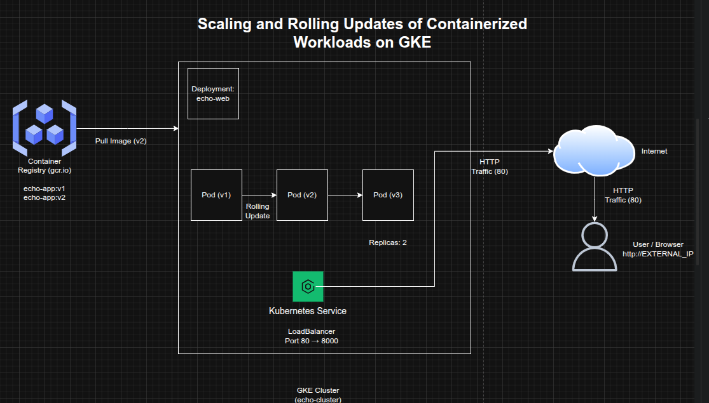

## Scaling and Rolling Updates of Containerized Workloads on GKE

**Timeline:** December 2025  
**Role:** Cloud Engineer / Cloud Architect  
**Skills:** Google Kubernetes Engine (GKE), Docker, Google Container Registry, Kubernetes Deployments, Rolling Updates, Replica Scaling, LoadBalancer Services, Cloud-Native Operations

---

### Project Summary

This project focused on managing the **update and horizontal scaling of a containerized web application** on **Google Kubernetes Engine (GKE)**. The objective was to take ownership of an existing Kubernetes-based test environment, build and publish an updated application image, roll out the new version to the running deployment, scale the workload to multiple replicas, and validate external service availability.

The implementation demonstrated key operational patterns for Kubernetes-based platforms, including **versioned image management, deployment updates, workload scaling, and service continuity**.

---

### Objectives

- Build an updated version of a containerized application  
- Tag and publish the new image to Google Container Registry  
- Update the running Kubernetes deployment from **v1** to **v2**  
- Scale the application horizontally to **2 replicas**  
- Ensure the application remains externally accessible through a LoadBalancer service  
- Validate successful rollout and service response  

---

### Architecture Overview

The architecture consisted of:

- A pre-existing **GKE cluster (`echo-cluster`)**  
- A Kubernetes **Deployment (`echo-web`)** managing the application pods  
- A Docker image built from updated application source (`echo-web-v2.tar.gz`)  
- A **v2-tagged image** pushed to **Google Container Registry (`gcr.io`)**  
- A Kubernetes **LoadBalancer Service** exposing the application externally on port 80  
- Multiple pod replicas to support workload scaling and availability  

---

### Implementation & Highlights

#### 1. Existing Cluster Validation
- Verified the availability of the target GKE cluster named **`echo-cluster`**  
- Confirmed the existing deployment environment before introducing application changes  

---

#### 2. Updated Application Build
- Retrieved the updated application archive (`echo-web-v2.tar.gz`) from Cloud Storage  
- Built a new Docker image for the updated application version  
- Applied the **`v2` tag** to support controlled rollout of the new release  

---

#### 3. Image Publication to Container Registry
- Tagged the updated application image using the **`gcr.io`** naming convention  
- Pushed the image to **Google Container Registry**  
- Prepared the new version for deployment into the running cluster  

---

#### 4. Rolling Application Update
- Updated the existing **`echo-web`** deployment to use the **v2** image  
- Replaced the earlier application version while retaining the deployment structure  
- Used Kubernetes deployment management to support controlled rollout of the updated workload  

---

#### 5. Horizontal Scaling
- Scaled the deployment from a single instance to **2 replicas**  
- Confirmed that both replicas were running successfully  
- Demonstrated the elasticity and operational flexibility of Kubernetes-based workloads  

---

#### 6. Service Validation
- Verified that the application remained exposed externally via a **LoadBalancer service**  
- Confirmed the application responded correctly using the external IP address  
- Validated that the updated version and scaled deployment were functioning as expected  

---

### Design Decisions

- Used **versioned image tagging** to separate application releases clearly  
- Leveraged **Google Container Registry** as the controlled image source for deployment updates  
- Used Kubernetes **Deployments** to manage rollout and version transition  
- Applied **horizontal scaling** to improve resilience and support increased workload capacity  
- Preserved standard web accessibility through **port 80**, while the container continued to listen on **port 8000** internally  

---

### Results & Impact

- Successfully deployed an updated **v2** container image to a live Kubernetes environment  
- Demonstrated the ability to manage **application updates and horizontal scaling** on GKE  
- Validated important Kubernetes operational patterns including:
  - image versioning
  - deployment updates
  - replica scaling
  - service continuity  
- Strengthened practical expertise in **day-2 Kubernetes operations and cloud-native workload management**

---

### Tools & Technologies Used

- **Google Kubernetes Engine (GKE)** – Managed Kubernetes environment  
- **Docker** – Image packaging and versioning  
- **Google Container Registry (GCR)** – Image hosting  
- **Kubernetes Deployment** – Rollout and lifecycle management  
- **Kubernetes Service (LoadBalancer)** – External access  
- **Cloud Storage** – Updated application source archive  
- **Replica Scaling** – Horizontal workload scaling  

---

### Outcome

This project demonstrates the ability to manage **containerized application updates and horizontal scaling** on Google Kubernetes Engine. It highlights practical skills in **Kubernetes operations, controlled rollout of new application versions, replica-based scaling, and external service validation**, which are essential for modern cloud-native engineering and platform operations roles.

---

[Back to Cloud Projects](/projects/cloud/)