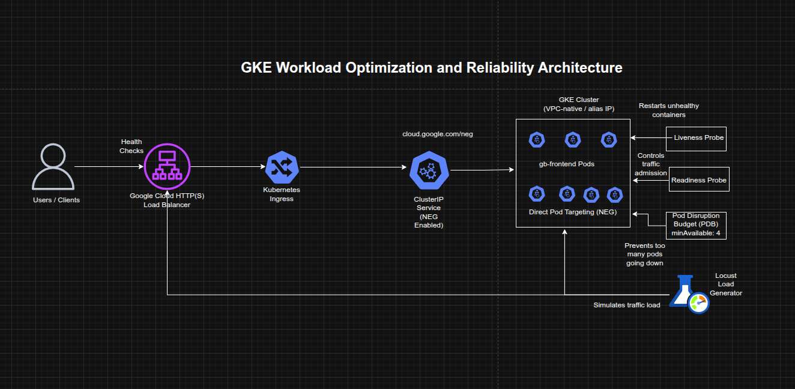

## Optimizing GKE Workloads with Container-Native Load Balancing and Reliability Controls

**Timeline:** December 2025  
**Role:** Cloud Engineer / Site Reliability Engineer  
**Skills:** Google Kubernetes Engine (GKE), Kubernetes Ingress, Network Endpoint Groups (NEGs), Container-Native Load Balancing, Locust, Liveness Probes, Readiness Probes, Pod Disruption Budgets, Availability Engineering

---

### Project Summary

This project focused on improving the **efficiency, resilience, and availability** of workloads running on Google Kubernetes Engine (GKE). The implementation used container-native load balancing through Kubernetes Ingress and NEGs, load-tested the application to understand real usage patterns, configured liveness and readiness probes for safer traffic handling and self-healing, and applied Pod Disruption Budgets to reduce downtime during voluntary disruptions.

The project demonstrated how GKE workload optimization is not only about resource sizing, but also about improving **traffic flow, health-aware routing, and disruption tolerance**.

---

### Objectives

- Create a container-native load balancer through Ingress  
- Load test an application to observe runtime capacity  
- Configure liveness probes for container self-healing  
- Configure readiness probes for safe traffic admission  
- Apply Pod Disruption Budgets to improve availability during voluntary disruptions  

---

### Architecture Overview

The architecture consisted of:

- A **GKE cluster** with VPC-native / alias IP networking enabled  
- A frontend application (`gb-frontend`) initially deployed as a single pod  
- A **ClusterIP service** annotated to enable **Network Endpoint Groups (NEGs)**  
- A **Kubernetes Ingress** that created a Google Cloud HTTP(S) Load Balancer  
- **Container-native load balancing** targeting pods directly through NEGs  
- A **Locust-based load testing setup** with one main service and multiple workers  
- A **liveness probe demo pod** for restart behavior validation  
- A **readiness probe demo pod and LoadBalancer service** for traffic gating validation  
- A replicated `gb-frontend` deployment protected by a **Pod Disruption Budget (PDB)**  

---

### Implementation & Highlights

#### 1. Provisioning the GKE Environment
- Created a three-node GKE cluster with `--enable-ip-alias`
- Deployed the `gb-frontend` web application as an initial single pod
- Prepared the environment for container-native load balancing and workload optimization testing
---

#### 2. Container-Native Load Balancing Through Ingress
- Created a `ClusterIP` service annotated with `cloud.google.com/neg`
- Created an Ingress resource to expose the application
- Triggered provisioning of:
  - a Google Cloud HTTP(S) Load Balancer
  - zonal Network Endpoint Groups (NEGs)
- Verified backend health using the Compute Engine backend service health check
- Enabled direct pod-level traffic targeting, reducing extra network hops compared with node-based routing 

---

#### 3. Load Testing the Application
- Built and stored a custom Locust image in the project container registry
- Deployed Locust main and worker pods to generate traffic
- Simulated moderate and burst traffic scenarios against the frontend service
- Observed CPU and memory behavior of the `gb-frontend` pod under load
- Established a more realistic baseline for future decisions around requests, limits, and autoscaling strategy 

---

#### 4. Liveness Probe Configuration
- Created a demo pod with an exec-based liveness probe
- Used the probe to monitor the existence of a file in the container filesystem
- Simulated failure by removing the file
- Observed Kubernetes detect the unhealthy state and restart the container automatically
- Demonstrated self-healing behavior for failed but still-running containers 

---

#### 5. Readiness Probe Configuration
- Created a demo pod with an exec-based readiness probe and exposed it through a LoadBalancer service
- Verified that the service did not route traffic while the readiness condition was failing
- Created the required file inside the container to satisfy the readiness probe
- Confirmed that the pod became Ready and traffic began flowing successfully
- Demonstrated health-aware traffic admission and safer service exposure 

---

#### 6. Pod Disruption Budget for Application Availability
- Replaced the single frontend pod with a 5-replica deployment
- Drained cluster nodes to observe the impact of voluntary disruption
- Verified that without a PDB, the deployment could temporarily lose all available replicas
- Created a Pod Disruption Budget requiring at least 4 replicas to remain available
- Repeated the drain operation and confirmed that Kubernetes blocked further eviction when doing so would violate the budget
- Demonstrated controlled availability protection during operational maintenance and node disruption events 

---

### Design Decisions

- Used **container-native load balancing** to improve routing efficiency by letting the load balancer target pods directly  
- Used **load testing** before optimization decisions so changes would be informed by observed workload behavior rather than guesswork  
- Configured **liveness probes** to enable automatic restart of unhealthy containers  
- Configured **readiness probes** to ensure traffic would only reach pods that were truly ready to serve  
- Used a **Pod Disruption Budget** to preserve service availability during voluntary cluster operations such as drain and rescheduling  
- Treated optimization as a balance between:
  - routing efficiency
  - application responsiveness
  - health-aware operations
  - resilience during disruption  

---

### Results & Impact

- Successfully implemented **container-native load balancing** for a GKE workload
- Measured application behavior under different traffic levels using Locust
- Demonstrated automated container recovery using liveness probes
- Demonstrated controlled service exposure using readiness probes
- Protected a replicated application from excessive disruption during node drain through a Pod Disruption Budget
- Built practical experience in improving both **efficiency** and **availability** of Kubernetes workloads

---

### Tools & Technologies Used

- **Google Kubernetes Engine (GKE)** – Cluster platform  
- **Kubernetes Ingress** – External traffic entry  
- **Network Endpoint Groups (NEGs)** – Pod-level load balancing targets  
- **Google Cloud HTTP(S) Load Balancer** – External application access  
- **Locust** – Load testing framework  
- **Liveness Probes** – Self-healing controls  
- **Readiness Probes** – Safe traffic routing controls  
- **Pod Disruption Budgets (PDBs)** – Voluntary disruption protection  

---

### Outcome

This project demonstrates the ability to optimize **GKE workload efficiency and reliability** by combining better traffic routing, load testing, health-aware pod management, and disruption controls. It highlights practical skills in **Kubernetes networking, application health management, and availability engineering**, which are highly relevant to cloud engineering, platform engineering, and site reliability roles.

---

[Back to Cloud Projects](/projects/cloud/)