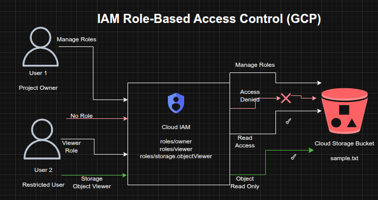

## IAM Access Control Validation and Role-Based Storage Access on GCP

**Timeline:** December 2025  
**Role:** Cloud Security Engineer  
**Skills:** Google Cloud IAM, Role-Based Access Control (RBAC), Cloud Storage, Access Validation, Least Privilege, Permission Troubleshooting

---

### Project Summary

This project focused on validating **role-based access control (RBAC)** on Google Cloud by testing how different IAM roles affect visibility and permissions across project resources. The implementation used two identities to simulate an administrator and a restricted user, then exercised the full lifecycle of **granting, revoking, and scoping access**.

The project demonstrated how Google Cloud IAM can be used to enforce **least-privilege access**, moving from broad project-level permissions to narrowly scoped service-level permissions for Cloud Storage objects.

---

### Objectives

- Examine the behavior of Google Cloud basic project roles  
- Validate the difference between project-level and service-level access  
- Create a Cloud Storage bucket and object for permission testing  
- Revoke broad access from a secondary user  
- Re-grant limited access using a storage-specific IAM role  
- Verify access behavior before and after role changes  

---

### Architecture Overview

The architecture consisted of:

- A **Google Cloud project owner** identity with permission to manage IAM policies  
- A **secondary user** initially assigned the **Project Viewer** role  
- A **Cloud Storage bucket** containing a sample object for access testing  
- IAM policy changes that removed project-level access and replaced it with a narrower **Storage Object Viewer** role  
- Validation of access through both the Google Cloud Console and Cloud Shell  

---

### Implementation & Highlights

#### 1. IAM Role Exploration
- Signed in with two separate identities to compare access behavior  
- Verified that the administrative identity had **Project Owner** permissions  
- Confirmed that the secondary identity had **Project Viewer** permissions and could not manage IAM policy  

---

#### 2. Cloud Storage Resource Setup
- Created a Cloud Storage bucket with a globally unique name  
- Uploaded a sample file (`sample.txt`) to the bucket  
- Used the bucket as the test resource for validating access changes  

---

#### 3. Validation of Project Viewer Access
- Verified that the secondary user could see the Cloud Storage bucket through the Console  
- Confirmed that project-level read access enabled resource visibility without modification privileges  

---

#### 4. Revocation of Broad Project Access
- Removed the **Project Viewer** role from the secondary identity  
- Confirmed that the user lost access to project resources  
- Observed permission-denied behavior after IAM policy propagation completed  

---

#### 5. Reassignment of Least-Privilege Permissions
- Granted the secondary identity the **Storage Object Viewer** role instead of restoring project-wide access  
- Scoped access specifically to Cloud Storage object viewing  
- Demonstrated the shift from broad permissions to targeted service-level authorization  

---

#### 6. Access Verification and Troubleshooting
- Used Cloud Shell to validate object-level access with:

`gsutil ls gs://[BUCKET_NAME]`

- Confirmed that the secondary identity could list the object in the bucket while still lacking broader project visibility  
- Verified the practical effect of least-privilege IAM design  

---

### Design Decisions

- Used **two identities** to simulate real-world administrative and restricted access patterns  
- Tested both **project-level primitive roles** and **service-specific IAM roles**  
- Removed unnecessary broad access before reassigning narrowly scoped permissions  
- Used Cloud Storage as a controlled resource for validating permission boundaries and policy behavior  

---

### Results & Impact

- Successfully demonstrated the difference between **broad project visibility** and **scoped service access**  
- Validated that removing the **Project Viewer** role fully revoked project-level access  
- Confirmed that assigning **Storage Object Viewer** restored only the required level of access  
- Strengthened practical understanding of:
  - IAM policy enforcement  
  - role scoping  
  - permission propagation  
  - least-privilege access design  

---

### Tools & Technologies Used

- **Google Cloud IAM** – Role assignment and access control  
- **Cloud Storage** – Resource used for permission validation  
- **Cloud Console** – IAM and resource visibility testing  
- **Cloud Shell / gsutil** – Command-line access validation  
- **RBAC Principles** – Controlled access design  

---

### Outcome

This project demonstrates the ability to implement and validate **least-privilege access control** on Google Cloud using IAM. It highlights practical skills in **granting and revoking roles, testing permission boundaries, and replacing broad access with narrowly scoped service permissions**, all of which are directly relevant to cloud security engineering and identity governance.

---

[Back to Cloud Projects](/projects/cloud/)