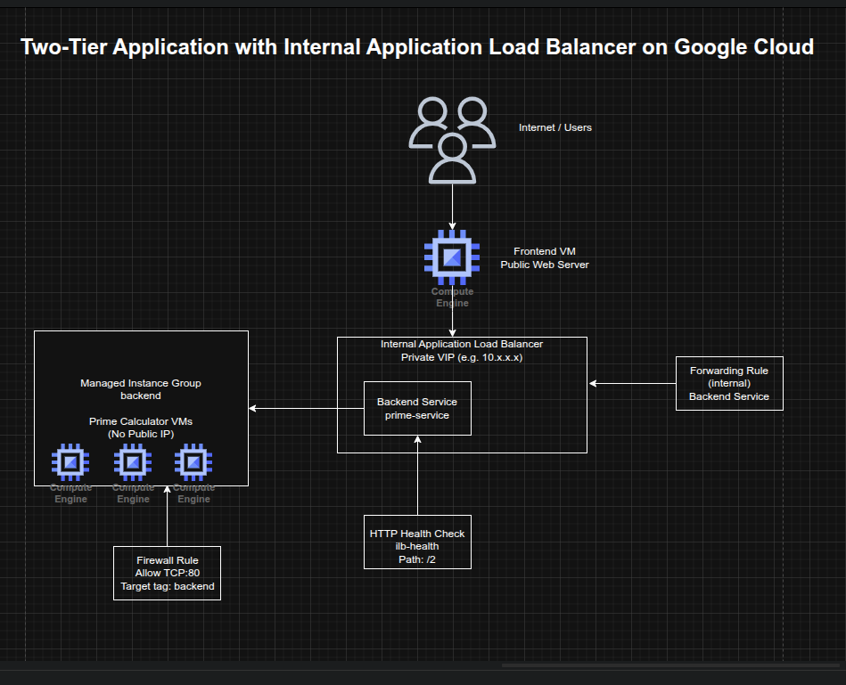

## Building a Two-Tier Application with an Internal Application Load Balancer on Google Cloud

**Timeline:** December 2025  
**Role:** Cloud Engineer  
**Skills:** Google Cloud Internal Application Load Balancer, Compute Engine, Managed Instance Groups, Backend Services, Health Checks, Forwarding Rules, Internal Service Design, Two-Tier Architecture, Startup Scripts

---

### Project Summary

This project focused on building a **two-tier application architecture** on Google Cloud using an **Internal Application Load Balancer** to expose a private backend service to internal consumers only. The implementation included a managed instance group of backend virtual machines running a lightweight Python prime-number service, an internal load balancer with health checks and backend service configuration, and a public-facing frontend VM that called the internal service to render results for users.

The project demonstrated how to separate **public-facing presentation logic** from **private internal business logic**, improving security and service resilience by keeping backend instances off the public internet while still making them accessible through a stable internal virtual IP.

---

### Objectives

- Create a backend managed instance group for an internal service  
- Configure firewall rules for internal HTTP access and health checks  
- Create an internal Application Load Balancer  
- Test the internal load balancer from another internal VM  
- Create a public-facing frontend that depends on the internal service  

---

### Architecture Overview

The architecture consisted of:

- A **managed instance group** of backend VMs running a Python-based prime-number calculation service  
- A startup-script-driven **instance template** named `primecalc`  
- A firewall rule allowing internal traffic on TCP port 80 to backend instances  
- An **HTTP health check** for backend validation  
- A **regional backend service** using the internal load balancing scheme  
- A **regional forwarding rule** exposing the internal service on a private IP  
- A temporary **test VM** used to validate the internal service privately  
- A public-facing **frontend VM** running a Python web application that queried the internal load balancer and displayed prime-number results  

---

### Implementation & Highlights

#### 1. Preparing the Environment
- Set the default region and zone for Compute Engine resources
- Created and activated a Python virtual environment in Cloud Shell
- Enabled Gemini Code Assist in the Cloud Shell IDE to support explanation of startup scripts and development workflow 

---

#### 2. Creating the Backend Service Template
- Authored a startup script (`backend.sh`) that created and launched a lightweight Python HTTP server
- Implemented backend logic to determine whether a number was prime and return `True` or `False`
- Created an instance template named `primecalc`
- Configured backend instances with:
  - no external IP address
  - backend network tag
  - `e2-medium` machine type
- Ensured the internal service remained private by preventing public internet exposure 

---

#### 3. Building the Backend Managed Instance Group
- Created a firewall rule allowing TCP port 80 to backend-tagged instances
- Created a managed instance group named `backend`
- Started with three backend instances
- Used a managed instance group to provide a resilient and repeatable backend service layer 

---

#### 4. Configuring the Internal Application Load Balancer
- Created an HTTP health check named `ilb-health`
- Created a regional backend service named `prime-service` using the **internal** load-balancing scheme
- Added the managed instance group as the backend
- Created a forwarding rule named `prime-lb` with a private IP address
- Established a stable internal entry point for the prime-number service that routed only to healthy backend VMs 

---

#### 5. Testing the Private Service
- Created a temporary internal VM named `testinstance`
- Connected to it using SSH
- Queried the internal load balancer with sample values:
  - `2`
  - `4`
  - `5`
- Verified correct responses from the service:
  - `True`
  - `False`
  - `True`
- Confirmed that the private service was working correctly and accessible only from within the VPC 

---

#### 6. Creating the Public Frontend
- Authored a startup script (`frontend.sh`) that created and launched a Python web application
- Configured the frontend application to call the internal load balancer’s private IP
- Rendered a matrix showing prime and non-prime numbers in the browser
- Created a frontend VM with a public IP and frontend network tag
- Added a firewall rule allowing internet access to the frontend on TCP port 80
- Demonstrated how a public-facing web tier can safely depend on a private internal service tier without exposing backend instances directly

---

### Design Decisions

- Used a **managed instance group** for the backend to improve repeatability and resilience  
- Used an **internal Application Load Balancer** instead of exposing backend VMs directly  
- Removed public IP addresses from backend instances to reduce exposure and align with a private-service design  
- Used a **health check + backend service + forwarding rule** model to ensure only healthy internal backends received traffic  
- Kept the **frontend public** while isolating the business logic in a private backend tier  
- Used **startup scripts** to keep both tiers lightweight, reproducible, and easy to deploy  

---

### Results & Impact

- Successfully built a **two-tier application architecture** on Google Cloud
- Demonstrated practical use of:
  - internal application load balancing
  - managed instance groups
  - private backend services
  - public frontend to private backend communication
  - health-aware backend routing
- Reinforced a secure application delivery pattern where backend services remain private while still supporting public user workflows
- Added a strong architectural example of internal service exposure without public backend access

---

### Tools & Technologies Used

- **Google Compute Engine** – Backend and frontend virtual machines  
- **Managed Instance Groups (MIGs)** – Resilient backend tier  
- **Internal Application Load Balancer** – Private service exposure  
- **Backend Services** – Health-aware traffic distribution  
- **Forwarding Rules** – Private frontend IP for the internal service  
- **Health Checks** – Backend validation  
- **Python HTTP Server** – Lightweight backend and frontend logic  
- **Firewall Rules** – Controlled network exposure  

---

### Outcome

This project demonstrates the ability to design and implement a **secure two-tier internal application architecture** on Google Cloud using a public frontend and a private backend service behind an **Internal Application Load Balancer**. It highlights practical skills in **internal service design, health-aware traffic routing, managed backend infrastructure, and private application delivery**, which are useful for cloud engineering, infrastructure, and platform roles.

---

[Back to Cloud Projects](/projects/cloud/)