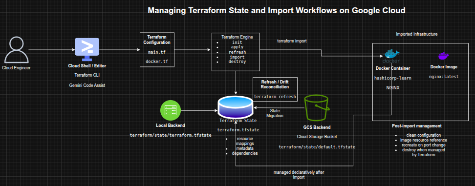

## Managing Terraform State and Import Workflows on Google Cloud

**Timeline:** December 2025  
**Role:** Cloud Engineer / Infrastructure Engineer  
**Skills:** Terraform, Terraform State, Backends, Google Cloud Storage, State Refresh, Terraform Import, Docker Provider, Infrastructure as Code (IaC), Drift Management

---

### Project Summary

This project focused on managing **Terraform state** across local and remote backends and using **Terraform import** to bring existing infrastructure under Infrastructure as Code management. The work involved configuring a local backend, migrating state to a Google Cloud Storage backend, refreshing state to detect infrastructure drift, and importing an existing Docker container and image into Terraform before updating and managing them declaratively.

The implementation demonstrated how Terraform state underpins reliable infrastructure lifecycle management, especially in collaborative environments where remote state, locking, and import workflows are essential for maintaining consistency and control. 

---

### Objectives

- Configure a local Terraform backend  
- Configure a Google Cloud Storage backend for remote state  
- Migrate Terraform state between backends  
- Refresh Terraform state to reconcile real infrastructure changes  
- Import existing infrastructure into Terraform state  
- Create Terraform configuration for imported resources  
- Manage imported infrastructure declaratively with Terraform  

---

### Architecture Overview

The architecture consisted of:

- A **Terraform root configuration** executed from Cloud Shell  
- A **local backend** storing state in a filesystem path  
- A **Google Cloud Storage backend** storing remote Terraform state  
- A **Cloud Storage bucket** used both as managed infrastructure and as a remote backend target  
- A **Docker provider configuration** used to import and manage an existing NGINX container  
- A **Docker image resource** added to Terraform after import  
- A **Terraform state file** acting as the mapping layer between configuration and real infrastructure  

---

### Implementation & Highlights

#### 1. Understanding Terraform State
- Reviewed the role of Terraform state in:
  - mapping configuration to real infrastructure
  - storing metadata and dependencies
  - improving performance for larger environments
- Examined how state supports synchronization, locking, and workspaces in team environments 

---

#### 2. Configuring a Local Backend
- Created a Terraform configuration to provision a Cloud Storage bucket
- Added a `local` backend definition with a custom state file path
- Initialized Terraform and applied the configuration
- Verified that Terraform stored the state file locally in the configured directory 

---

#### 3. Migrating to a Google Cloud Storage Backend
- Replaced the local backend with a `gcs` backend
- Configured the backend to store state in a Cloud Storage bucket using a defined prefix
- Reinitialized Terraform with `-migrate-state`
- Confirmed that the state file was successfully moved into the bucket 

---

#### 4. Refreshing State to Detect Drift
- Introduced an external change by adding labels directly to the storage bucket in Google Cloud
- Ran `terraform refresh` to reconcile Terraform’s state with the real-world resource
- Verified the updated labels in the Terraform state output
- Demonstrated how Terraform detects and records configuration drift without directly changing infrastructure 

---

#### 5. Reverting Backend for Cleanup
- Migrated state back to the local backend
- Updated the bucket resource with `force_destroy = true`
- Applied the change and destroyed the managed infrastructure cleanly
- Reinforced the operational importance of backend planning and safe cleanup flows 

---

#### 6. Importing Existing Infrastructure into Terraform
- Created an NGINX Docker container manually with the Docker CLI
- Initialized a Terraform workspace for import
- Imported the running container into Terraform state using `terraform import`
- Verified the imported resource using `terraform show`
- Demonstrated the process of attaching unmanaged infrastructure to Terraform state 
---

#### 7. Creating Configuration for Imported Resources
- Generated configuration from Terraform state output
- Cleaned the imported Docker resource definition by removing unnecessary and read-only attributes
- Reduced the configuration to the required arguments:
  - image
  - name
  - ports
- Verified the cleaned configuration with `terraform plan` and `terraform apply` 
---

#### 8. Managing Imported Images and Containers
- Added a `docker_image` resource for `nginx:latest`
- Updated the imported container to reference the Terraform-managed image resource
- Applied the changes and confirmed that the configuration and state were aligned
- Demonstrated how imported infrastructure can be normalized into cleaner Terraform design patterns 

---

#### 9. Updating and Replacing Imported Infrastructure
- Modified the Docker container’s external port from `8080` to `8081`
- Applied the change and observed Terraform destroy and recreate the container
- Verified the new container ID and updated runtime configuration
- Demonstrated lifecycle management of previously unmanaged resources using Terraform 

---

#### 10. Final Cleanup and Lessons
- Destroyed the Terraform-managed Docker container and image
- Reviewed the limitations and cautions around import workflows
- Reinforced the importance of:
  - backing up state before import
  - understanding unmanaged dependencies
  - validating imported configuration carefully 

---

### Design Decisions

- Used a **local backend first** to demonstrate explicit local state configuration  
- Migrated to a **GCS backend** to show remote state management suitable for team workflows  
- Used **state refresh** to capture external drift rather than assuming configuration was authoritative  
- Used **terraform import** to demonstrate adoption of pre-existing infrastructure  
- Normalized imported resources into cleaner Terraform configuration instead of keeping verbose generated state output  
- Added a **managed image resource** to improve readability and maintainability of the imported container configuration  

---

### Results & Impact

- Successfully configured and migrated Terraform state across **local and remote backends**
- Demonstrated practical use of:
  - backend configuration
  - state migration
  - refresh for drift reconciliation
  - import of existing infrastructure
  - lifecycle management of imported resources
- Strengthened understanding of how Terraform state supports collaboration, consistency, and controlled change management
- Built practical experience in one of the most important and often misunderstood areas of Infrastructure as Code operations

---

### Tools & Technologies Used

- **Terraform** – Infrastructure as Code engine  
- **Terraform State** – Infrastructure mapping and metadata store  
- **Google Cloud Storage** – Remote state backend  
- **Cloud Shell / Editor** – Execution and editing environment  
- **Docker** – Imported runtime environment  
- **NGINX** – Example application container  
- **Terraform Docker Provider** – Imported resource management  

---

### Outcome

This project demonstrates the ability to manage **Terraform state, backend strategy, drift reconciliation, and infrastructure import workflows** across Google Cloud and Docker-based resources. It highlights practical skills in **state management, remote backends, lifecycle control, and bringing unmanaged infrastructure under declarative control**, which are highly relevant to cloud engineering, DevOps, and platform engineering roles.

---

[Back to Cloud Projects](/projects/cloud/)