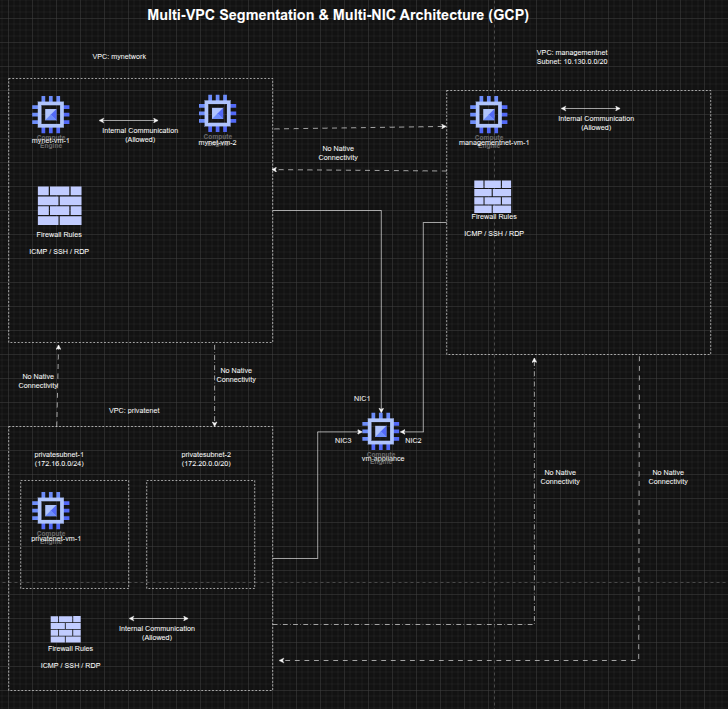

## Multi-VPC Network Segmentation and Multi-NIC Appliance Design on GCP

**Timeline:** December 2025  
**Role:** Cloud Network Engineer / Cloud Architect  
**Skills:** Google Cloud VPC, Subnets, Firewall Rules, Compute Engine, Multi-NIC VM Design, Routing, Internal DNS, Network Segmentation

---

### Project Summary

This project focused on designing and validating a **segmented multi-VPC network architecture** on Google Cloud Platform (GCP). The implementation used multiple custom-mode VPC networks, dedicated subnets, targeted firewall rules, and Compute Engine virtual machines to demonstrate how network isolation affects connectivity across environments.

The project also extended the design by deploying a **multi-network-interface appliance VM** connected to multiple VPCs, showing how a single instance can participate in separate network domains while still being governed by routing behavior and interface-specific connectivity rules. This lab covered custom VPC creation, firewall configuration, connectivity testing, and multi-NIC routing behavior. :contentReference[oaicite:0]{index=0}

---

### Objectives

- Create custom-mode VPC networks and subnets  
- Configure firewall rules for SSH, RDP, and ICMP access  
- Deploy Compute Engine instances into separate VPC environments  
- Validate external and internal connectivity behavior across VPCs  
- Design and deploy a VM with multiple network interfaces  
- Analyze routing behavior and interface-level reachability  

---

### Architecture Overview

The architecture consisted of:

- An existing **mynetwork** VPC with two pre-created VM instances  
- A newly created **managementnet** custom VPC with:
  - `managementsubnet-1` (`10.130.0.0/20`)  
  - firewall rules allowing **ICMP, SSH, and RDP**  
- A newly created **privatenet** custom VPC with:
  - `privatesubnet-1` (`172.16.0.0/24`)  
  - `privatesubnet-2` (`172.20.0.0/20`)  
  - firewall rules allowing **ICMP, SSH, and RDP**  
- VM instances deployed in the separate VPCs:
  - `managementnet-vm-1`
  - `privatenet-vm-1`
  - existing `mynet-vm-1`
  - existing `mynet-vm-2`
- A multi-NIC appliance VM named **`vm-appliance`** attached to:
  - `privatesubnet-1`
  - `managementsubnet-1`
  - `mynetwork`  
- Connectivity and routing tests validating public reachability, private network isolation, and multi-interface routing behavior. :contentReference[oaicite:1]{index=1}

---

### Implementation & Highlights

#### 1. Custom VPC Network Creation
- Created two custom-mode VPC networks:
  - **`managementnet`**
  - **`privatenet`**
- Provisioned dedicated subnets in different regions and CIDR ranges
- Used custom-mode networking to explicitly control subnet creation instead of relying on automatically provisioned regional subnets. :contentReference[oaicite:2]{index=2}

---

#### 2. Firewall Rule Design
- Configured ingress firewall rules for both VPCs
- Allowed:
  - **ICMP**
  - **TCP 22 (SSH)**
  - **TCP 3389 (RDP)**
- Applied rules to support administration and connectivity testing across the segmented environments. :contentReference[oaicite:3]{index=3}

---

#### 3. VM Deployment Across Isolated Networks
- Created Compute Engine instances in the new VPCs:
  - `managementnet-vm-1`
  - `privatenet-vm-1`
- Compared them with the pre-existing instances in `mynetwork`
- Established a multi-network test environment spanning separate VPC boundaries and subnets. :contentReference[oaicite:4]{index=4}

---

#### 4. Connectivity Validation Across VPCs
- Tested **external IP reachability** from one instance to others
- Confirmed that public connectivity depended on firewall rules rather than shared VPC membership
- Tested **internal IP connectivity**
- Verified that internal communication worked only between instances in the same VPC network and failed across isolated VPCs by default. :contentReference[oaicite:5]{index=5}

---

#### 5. Multi-NIC Appliance Design
- Created a VM named **`vm-appliance`** with three network interfaces
- Connected the appliance directly to:
  - `privatenet`
  - `managementnet`
  - `mynetwork`
- Demonstrated how a single VM can span multiple isolated network domains when attached through multiple NICs. :contentReference[oaicite:6]{index=6}

---

#### 6. Route and Interface Analysis
- Inspected interface configuration inside the appliance VM
- Verified the presence of multiple interfaces and subnet-specific internal IP addresses
- Examined routing behavior and confirmed:
  - directly connected subnets were reachable through their corresponding interfaces
  - the default route was associated with the **primary interface**
- Observed that traffic to destinations outside directly connected subnets followed the default route, leading to expected connectivity limitations. :contentReference[oaicite:7]{index=7}

---

#### 7. Internal DNS and Reachability Testing
- Validated that instance name resolution worked within VPC scope using internal DNS
- Confirmed that hostname-based reachability mapped to the primary interface of the destination VM
- Used ping-based testing to illustrate successful and failed paths based on subnet routes and interface placement. :contentReference[oaicite:8]{index=8}

---

### Design Decisions

- Used **custom-mode VPCs** to maintain explicit control over subnet allocation and network boundaries  
- Applied **network-level segmentation** to demonstrate that private communication is isolated by VPC unless additional interconnect mechanisms are configured  
- Used a **multi-NIC appliance pattern** to simulate a bridging or inspection-style instance spanning multiple network domains  
- Preserved non-overlapping CIDR ranges to support multiple interfaces on the same VM without subnet conflicts  
- Analyzed route selection to understand how **primary-interface default routing** affects multi-homed workloads. :contentReference[oaicite:9]{index=9}

---

### Results & Impact

- Successfully designed and deployed a **segmented multi-VPC environment** on GCP  
- Demonstrated the distinction between:
  - public reachability through firewall-permitted external IPs
  - private reachability constrained by VPC boundaries  
- Validated the practical behavior of **multi-interface appliances** in cloud networks  
- Strengthened understanding of:
  - VPC isolation
  - subnet design
  - firewall policy behavior
  - internal DNS
  - route selection for multi-homed instances. :contentReference[oaicite:10]{index=10}

---

### Tools & Technologies Used

- **Google Cloud VPC** – Isolated virtual network design  
- **Custom Subnets** – Controlled IP range allocation  
- **Firewall Rules** – ICMP, SSH, and RDP access control  
- **Compute Engine** – VM deployment and testing  
- **Multi-NIC VM Design** – Cross-network attachment pattern  
- **Internal DNS** – Name-based resolution inside VPCs  
- **Linux Networking Tools** – Route and interface inspection  

---

### Outcome

This project demonstrates the ability to design and validate **segmented cloud network architectures** on Google Cloud, including multi-VPC communication boundaries and multi-interface appliance patterns. It highlights practical skills in **network isolation, routing analysis, firewall configuration, and multi-homed VM design**, which are directly relevant to cloud networking, security engineering, and cloud architecture roles.

---

[Back to Cloud Projects](/projects/cloud/)