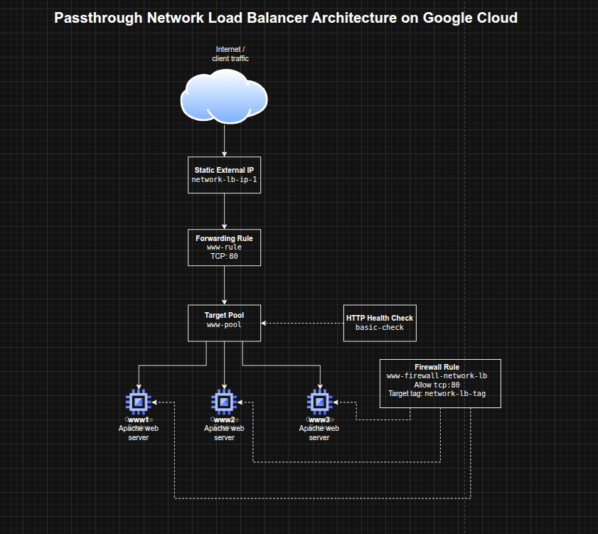

## Configuring a Passthrough Network Load Balancer on Google Cloud

**Timeline:** December 2025  
**Role:** Cloud Engineer  
**Skills:** Google Cloud Load Balancing, Compute Engine, Network Load Balancer, Target Pools, Forwarding Rules, Health Checks, Static IP Addresses, Firewall Rules

---

### Project Summary

This project focused on configuring a **passthrough external Network Load Balancer** on Google Cloud to distribute Layer 4 traffic across multiple Compute Engine web server instances. The implementation involved provisioning a small fleet of Apache-based web servers, exposing them through a firewall rule, assigning a static regional IP address, configuring a health check, creating a target pool, and binding traffic to the backend pool through a forwarding rule.

The project demonstrated the fundamentals of **L4 load balancing on Google Cloud**, including how traffic is distributed to healthy backend instances without inspecting HTTP content, making it well suited for simple network-level traffic distribution scenarios.

---

### Objectives

- Configure the default region and zone for resources  
- Create multiple web server VM instances  
- Expose the instances to HTTP traffic with a firewall rule  
- Create a static external IP for a load balancer  
- Configure a health check for backend validation  
- Build a target pool of backend web servers  
- Create a forwarding rule to distribute traffic across instances  

---

### Architecture Overview

The architecture consisted of:

- Three **Compute Engine VM instances** (`www1`, `www2`, `www3`) running Apache
- A shared **network tag** applied to backend instances for firewall targeting
- A firewall rule allowing inbound HTTP traffic on TCP port 80
- A **regional static external IP address** for the load balancer
- A **legacy HTTP health check** used to validate backend health
- A **target pool** containing the three backend instances
- A **forwarding rule** listening on TCP port 80 and routing traffic to the target pool

---

### Implementation & Highlights

#### 1. Setting Region and Zone Defaults
- Configured the default Compute Engine region and zone for the lab environment
- Established a consistent placement model for the load balancer resources and VM instances 

---

#### 2. Creating Backend Web Servers
- Provisioned three Compute Engine instances:
  - `www1`
  - `www2`
  - `www3`
- Used startup scripts to install Apache automatically
- Wrote a unique landing page on each VM to make traffic distribution visible during testing
- Applied a common instance tag to simplify firewall targeting

---

#### 3. Opening HTTP Access with Firewall Rules
- Created a firewall rule allowing inbound TCP port 80
- Scoped the rule to instances with the shared network tag
- Verified that each VM responded successfully over HTTP using its external IP address 

---

#### 4. Creating the Load Balancer Frontend
- Reserved a static regional external IP address for the load balancer
- Created an HTTP health check resource to monitor backend availability
- Prepared the frontend entry point and backend validation mechanism required by the passthrough network load balancer 

---

#### 5. Building the Backend Pool
- Created a target pool for the load balancing service
- Associated the health check with the target pool
- Added all three Apache web server instances to the pool
- Established the backend group that would receive traffic from the forwarding rule

---

#### 6. Configuring Traffic Distribution
- Created a forwarding rule on TCP port 80
- Bound the forwarding rule to the static IP and target pool
- Verified that traffic sent to the load balancer IP was distributed across the backend instances
- Observed alternating responses from the three servers during repeated curl requests 

---

### Design Decisions

- Used **multiple small web servers** to demonstrate load distribution clearly  
- Used **startup scripts** for lightweight, repeatable server provisioning  
- Applied a **network tag** to backend instances to keep the firewall rule targeted and reusable  
- Used a **static IP** to provide a stable frontend entry point  
- Used a **health check + target pool** model to ensure traffic was only sent to healthy instances  
- Chose a **passthrough L4 load balancer** to focus on network-level balancing rather than HTTP-aware request inspection  

---

### Results & Impact

- Successfully configured an external passthrough Network Load Balancer on Google Cloud
- Demonstrated practical use of:
  - backend VM groups
  - health checks
  - target pools
  - forwarding rules
  - static frontend IPs
- Verified that the load balancer distributed traffic across multiple instances rather than relying on a single server
- Built a strong foundational understanding of Google Cloud traffic distribution patterns that supports later work with more advanced load balancing architectures

---

### Tools & Technologies Used

- **Google Compute Engine** – Backend virtual machines  
- **Apache HTTP Server** – Sample web workload  
- **Google Cloud Network Load Balancer** – L4 traffic distribution  
- **Target Pools** – Backend grouping  
- **Forwarding Rules** – Traffic steering  
- **HTTP Health Checks** – Backend health validation  
- **Firewall Rules** – Controlled network exposure  
- **Static External IP Address** – Stable frontend endpoint  

---

### Outcome

This project demonstrates the ability to configure a **Google Cloud passthrough Network Load Balancer** for resilient traffic distribution across multiple backend VMs. It highlights practical skills in **Compute Engine networking, health-aware backend design, and Layer 4 load balancing**, which are useful for cloud engineering, infrastructure, and network-focused roles.

---

[Back to Cloud Projects](/projects/cloud/)