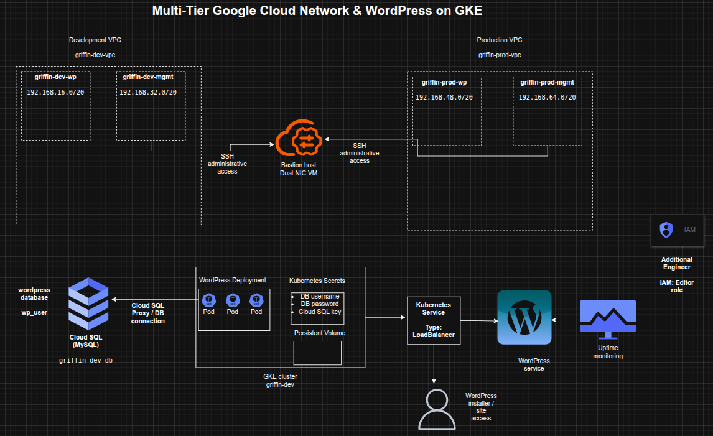

## Designing a Multi-Tier Google Cloud Network and Kubernetes WordPress Environment

**Timeline:** December 2025  
**Role:** Cloud Engineer / Site Reliability Engineer  
**Skills:** Google Cloud VPC, Subnets, Multi-NIC Bastion Host, Cloud SQL, GKE, Kubernetes, WordPress, Secrets Management, Uptime Monitoring, IAM

---

### Project Summary

This project focused on designing and implementing a **multi-tier Google Cloud environment** for a WordPress workload, combining networking, database provisioning, Kubernetes deployment, monitoring, and access management. The work involved manually creating separate development and production VPCs, deploying a bastion host connected to both environments, provisioning a Cloud SQL instance for WordPress, creating a GKE cluster in the development network, and deploying WordPress with persistent storage and secure database connectivity.

The implementation demonstrated how to build a **segmented cloud environment** that supports application deployment, operational access, and service monitoring while following structured naming, subnetting, and access control practices. :contentReference[oaicite:1]{index=1}

---

### Objectives

- Create separate development and production VPC networks manually  
- Configure subnets for application and management traffic  
- Deploy a dual-homed bastion host connected to both VPCs  
- Provision a MySQL Cloud SQL instance for WordPress  
- Prepare database credentials and Kubernetes secrets  
- Create a GKE cluster in the development application subnet  
- Deploy WordPress on Kubernetes with external access  
- Enable uptime monitoring for the development site  
- Grant project access to an additional engineer  

---

### Architecture Overview

The architecture consisted of:

- A **development VPC** (`griffin-dev-vpc`) with:
  - `griffin-dev-wp`
  - `griffin-dev-mgmt`
- A **production VPC** (`griffin-prod-vpc`) with:
  - `griffin-prod-wp`
  - `griffin-prod-mgmt`
- A **bastion host** with **two network interfaces**, one connected to each management subnet  
- A **Cloud SQL for MySQL instance** (`griffin-dev-db`) hosting the WordPress database  
- A **GKE cluster** (`griffin-dev`) deployed in the development WordPress subnet  
- A **WordPress Kubernetes deployment and service** exposed externally by LoadBalancer  
- **Kubernetes secrets** used for database credentials and Cloud SQL proxy authentication  
- An **uptime check** monitoring application availability  
- **IAM project access** granted to an additional engineer  

---

### Implementation & Highlights

#### 1. Development VPC Design
- Created a manual VPC named `griffin-dev-vpc`
- Added the following subnets:
  - `griffin-dev-wp` – `192.168.16.0/20`
  - `griffin-dev-mgmt` – `192.168.32.0/20`
- Separated application and management traffic within the development environment :contentReference[oaicite:2]{index=2}

---

#### 2. Production VPC Design
- Created a manual VPC named `griffin-prod-vpc`
- Added the following subnets:
  - `griffin-prod-wp` – `192.168.48.0/20`
  - `griffin-prod-mgmt` – `192.168.64.0/20`
- Established a separate production-ready network structure with subnet-level segmentation :contentReference[oaicite:3]{index=3}

---

#### 3. Bastion Host Architecture
- Deployed a bastion host with **two NICs**
- Connected one interface to `griffin-dev-mgmt`
- Connected the second interface to `griffin-prod-mgmt`
- Ensured SSH administrative access through a centralized management entry point :contentReference[oaicite:4]{index=4}

---

#### 4. Cloud SQL Provisioning for WordPress
- Created a MySQL Cloud SQL instance named `griffin-dev-db`
- Initialized the WordPress database environment with:
  - database creation
  - application user creation
  - privilege grants
- Prepared backend database services for the application tier :contentReference[oaicite:5]{index=5}

---

#### 5. GKE Cluster Deployment
- Created a **2-node GKE cluster** named `griffin-dev`
- Deployed the cluster into the `griffin-dev-wp` subnet
- Allocated Kubernetes infrastructure specifically within the development application network zone :contentReference[oaicite:6]{index=6}

---

#### 6. Kubernetes Environment Preparation
- Copied the supplied Kubernetes manifests from Cloud Storage
- Configured Kubernetes secrets for:
  - database username
  - database password
- Generated and stored a service account key for the Cloud SQL proxy sidecar
- Prepared persistent storage requirements for WordPress working files
- Established secure and functional application prerequisites before deployment :contentReference[oaicite:7]{index=7}

---

#### 7. WordPress Deployment on GKE
- Updated the deployment manifest with the Cloud SQL instance connection name
- Created the WordPress deployment using the supplied Kubernetes configuration
- Exposed the application using a Kubernetes Service with external LoadBalancer access
- Verified successful reachability through the WordPress installer page :contentReference[oaicite:8]{index=8}

---

#### 8. Monitoring Enablement
- Created an uptime check for the WordPress development site
- Added external availability monitoring for the deployed application
- Extended the environment from deployment-only to monitored operational readiness :contentReference[oaicite:9]{index=9}

---

#### 9. IAM Access Delegation
- Granted the **Editor** role on the project to an additional engineer
- Ensured the environment could be shared and managed collaboratively
- Incorporated basic team-access enablement into the delivery scope :contentReference[oaicite:10]{index=10}

---

### Design Decisions

- Used **separate development and production VPCs** to enforce environment isolation  
- Split each VPC into **application** and **management** subnets for cleaner traffic segmentation  
- Used a **dual-homed bastion** to centralize administrative access across environments  
- Chose **Cloud SQL** as a managed relational backend for WordPress  
- Used **GKE** to host WordPress in a containerized, scalable platform  
- Stored database credentials and proxy credentials in **Kubernetes secrets**  
- Added **uptime monitoring** to validate external application availability  
- Included **IAM delegation** to reflect team-based cloud operations  

---

### Results & Impact

- Successfully built a **segmented multi-tier Google Cloud environment**  
- Demonstrated practical use of:
  - manual VPC design
  - subnet planning
  - multi-NIC bastion architecture
  - Cloud SQL provisioning
  - GKE application hosting
  - Kubernetes secrets
  - uptime monitoring
  - IAM project access control
- Strengthened understanding of how infrastructure, platform, database, and operational layers work together in a cloud-hosted application stack  
- Built a realistic foundation for **cloud-native application hosting and environment administration**  

---

### Tools & Technologies Used

- **Google Cloud VPC** – Network segmentation  
- **Subnets** – Application and management isolation  
- **Compute Engine** – Bastion host deployment  
- **Cloud SQL for MySQL** – Managed database backend  
- **Google Kubernetes Engine (GKE)** – Container orchestration platform  
- **Kubernetes** – Application deployment and secret management  
- **WordPress** – Web application workload  
- **Cloud Monitoring Uptime Checks** – External availability monitoring  
- **IAM** – Project access control  

---

### Outcome

This project demonstrates the ability to design and implement a **multi-tier cloud environment** on Google Cloud that supports networking, secure administration, managed database services, Kubernetes-based application deployment, monitoring, and collaborative access control. It highlights practical skills in **cloud network architecture, workload deployment, secrets handling, and operational readiness**, making it highly relevant to cloud engineering, DevOps, and site reliability roles.

---

[Back to Cloud Projects](/projects/cloud/)