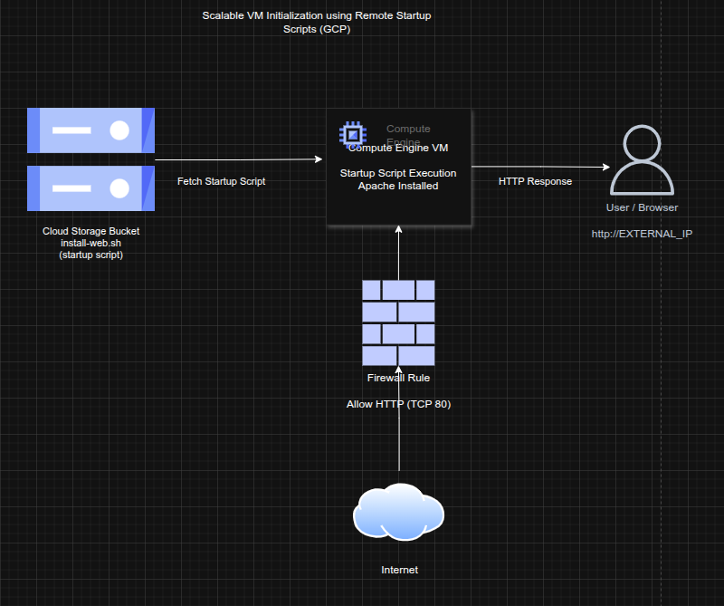

## Scalable VM Initialization using Remote Startup Scripts on GCP

**Timeline:** December 2025  
**Role:** Cloud Engineer / Infrastructure Engineer  
**Skills:** Google Cloud Storage, Compute Engine, Startup Scripts, IAM, Firewall Rules, Linux, Apache

---

### Project Summary

This project focused on designing a **scalable and maintainable virtual machine initialization pattern** on Google Cloud Platform (GCP) using **remote startup scripts stored in Cloud Storage**.

Instead of embedding startup scripts directly into instance metadata, the solution centralized configuration logic in a storage bucket. This approach improves **reusability, maintainability, and consistency** across multiple compute instances.

---

### Objectives

- Centralize VM startup scripts in Cloud Storage  
- Automate instance initialization using remote scripts  
- Ensure secure access between VM and storage resources  
- Enable HTTP access to validate successful deployment  
- Implement firewall rules to expose web service  

---

### Architecture Overview

The architecture consists of:

- A **Cloud Storage bucket** storing the startup script  
- A **Compute Engine VM** configured to execute the script at boot  
- A **startup script reference** pointing to the storage location  
- A **firewall rule** allowing HTTP traffic (TCP 80)  
- A publicly accessible endpoint serving web content  

---

### Implementation & Highlights

#### 1. Centralized Script Storage
- Created a Cloud Storage bucket  
- Stored the startup script remotely (`install-web.sh`)  
- Enabled centralized management of initialization logic  

---

#### 2. Automated VM Provisioning
- Created a Linux Compute Engine instance  
- Configured instance metadata to reference the remote script  
- Enabled automatic execution of the script during VM startup  

---

#### 3. Secure Access Configuration
- Ensured the VM had permission to access the storage bucket  
- Verified proper interaction between Compute Engine and Cloud Storage  

---

#### 4. Network Exposure via Firewall
- Created a firewall rule allowing **TCP port 80 (HTTP)**  
- Enabled external access to the web server  

---

#### 5. Deployment Validation
- Verified Apache installation via browser  
- Accessed the application using the VM’s external IP  
- Confirmed successful automated configuration  

---

### Design Decisions

- **Decoupled configuration from infrastructure** by storing scripts externally  
- Enabled **reusability across multiple VM deployments**  
- Reduced dependency on manual configuration steps  
- Improved **operational scalability** for managing compute workloads  

---

### Results & Impact

- Achieved **fully automated VM provisioning and configuration**  
- Demonstrated scalable initialization pattern for cloud environments  
- Reduced operational overhead through centralized script management  
- Enabled consistent and repeatable infrastructure deployments  

---

### Tools & Technologies Used

- **Google Cloud Storage** – Remote script storage  
- **Compute Engine** – Virtual machine provisioning  
- **Startup Scripts** – Automated initialization  
- **IAM & Permissions** – Secure resource access  
- **Firewall Rules** – HTTP access control  
- **Linux & Apache** – Web server deployment  

---

### Outcome

This project demonstrates the ability to design **scalable and automated infrastructure provisioning workflows** using Google Cloud services. It highlights practical expertise in **startup script automation, centralized configuration management, and cloud-native deployment patterns**, which are essential for modern cloud engineering and platform operations.

---

[Back to Cloud Projects](/projects/cloud/)
