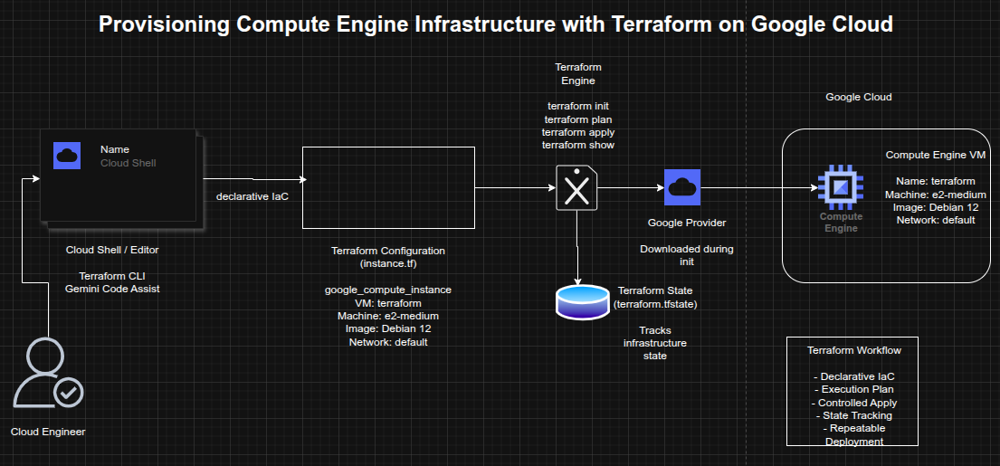

## Provisioning Compute Engine Infrastructure with Terraform on Google Cloud

**Timeline:** December 2025  
**Role:** Cloud Engineer / Infrastructure Engineer  
**Skills:** Terraform, Google Cloud, Compute Engine, Infrastructure as Code (IaC), Terraform Plan, Terraform Apply, Terraform State, Gemini Code Assist

---

### Project Summary

This project focused on using **Terraform to provision infrastructure on Google Cloud**, demonstrating the foundational workflow of Infrastructure as Code (IaC). The work involved verifying Terraform in Cloud Shell, enabling Gemini Code Assist, generating a Terraform configuration for a Compute Engine virtual machine, initializing the Terraform working directory, validating the execution plan, and applying the configuration to create the VM.

The implementation demonstrated how infrastructure can be defined declaratively, reviewed before deployment, and managed through Terraform state, providing a repeatable and versionable approach to provisioning cloud resources. :contentReference[oaicite:1]{index=1}

---

### Objectives

- Verify Terraform availability in Google Cloud Shell  
- Enable Gemini Code Assist for Terraform development  
- Create a Terraform configuration for a Compute Engine VM  
- Initialize the Terraform working directory  
- Generate and review an execution plan  
- Apply the Terraform configuration to provision infrastructure  
- Inspect Terraform state after deployment  

---

### Architecture Overview

The architecture consisted of:

- **Cloud Shell** as the execution environment for Terraform  
- **Gemini Code Assist** to generate Terraform configuration  
- A **Terraform configuration file** (`instance.tf`) defining infrastructure declaratively  
- The **Google provider plugin** downloaded during initialization  
- A **Compute Engine VM instance** named `terraform`  
- The **Terraform state file** (`terraform.tfstate`) used to track managed resources  

---

### Implementation & Highlights

#### 1. Terraform Verification
- Verified that Terraform was available in Cloud Shell
- Confirmed access to the standard Terraform workflow commands, including:
  - `init`
  - `validate`
  - `plan`
  - `apply`
  - `destroy`
- Established the working environment for Infrastructure as Code on Google Cloud :contentReference[oaicite:2]{index=2}

---

#### 2. Gemini Code Assist Enablement
- Enabled the Gemini for Google Cloud API
- Opened the Cloud Shell Editor and configured Gemini Code Assist
- Used Gemini Code Assist to accelerate Terraform authoring within the IDE :contentReference[oaicite:3]{index=3}

---

#### 3. Terraform Configuration Creation
- Created an `instance.tf` file to define infrastructure
- Generated a Terraform resource for a **Google Compute Engine VM**
- Configured the VM with:
  - name: `terraform`
  - machine type: `e2-medium`
  - Debian 12 boot disk
  - default VPC network
- Used a declarative resource definition to describe the desired infrastructure state :contentReference[oaicite:4]{index=4}

---

#### 4. Provider Initialization
- Ran `terraform init` to initialize the working directory
- Downloaded and installed the required **Google provider plugin**
- Prepared the environment for plan and apply operations :contentReference[oaicite:5]{index=5}

---

#### 5. Execution Planning
- Ran `terraform plan` to generate the execution plan
- Reviewed the proposed infrastructure changes before deployment
- Confirmed that Terraform would create a single Compute Engine instance
- Demonstrated safe pre-deployment validation using Terraform’s planning model :contentReference[oaicite:6]{index=6}

---

#### 6. Infrastructure Provisioning
- Ran `terraform apply` to create the VM instance
- Approved the execution plan interactively
- Provisioned the Compute Engine instance successfully in Google Cloud
- Verified that the infrastructure defined in code was created as expected :contentReference[oaicite:7]{index=7}

---

#### 7. State Inspection
- Reviewed the resulting Terraform state using `terraform show`
- Confirmed that Terraform captured the deployed resource attributes
- Demonstrated how Terraform state tracks managed infrastructure and supports ongoing lifecycle management :contentReference[oaicite:8]{index=8}

---

### Design Decisions

- Used **Terraform** to model infrastructure declaratively rather than provisioning manually  
- Used **Cloud Shell** as a lightweight execution environment without local setup overhead  
- Used **Gemini Code Assist** to accelerate code generation and reduce initial authoring effort  
- Kept the project focused on a single VM to emphasize Terraform workflow fundamentals  
- Relied on **Terraform plan and state** to reinforce safe, predictable infrastructure changes  

---

### Results & Impact

- Successfully provisioned a **Compute Engine VM using Terraform**
- Demonstrated practical use of:
  - Infrastructure as Code
  - execution planning
  - provider initialization
  - controlled infrastructure deployment
  - Terraform state inspection
- Strengthened understanding of how Terraform supports repeatable and auditable cloud provisioning
- Built a strong foundation for expanding into larger IaC projects involving networking, databases, and multi-resource environments  

---

### Tools & Technologies Used

- **Terraform** – Infrastructure as Code engine  
- **Google Cloud** – Cloud platform  
- **Compute Engine** – Virtual machine provisioning  
- **Cloud Shell** – Managed command-line environment  
- **Gemini Code Assist** – AI-assisted Terraform authoring  
- **Terraform Google Provider** – Provider plugin for Google Cloud resources  

---

### Outcome

This project demonstrates the ability to use **Terraform to provision and manage cloud infrastructure declaratively** on Google Cloud. It highlights practical skills in **Infrastructure as Code, execution planning, provider initialization, and state-based resource management**, forming a strong foundation for more advanced cloud automation and platform engineering work.

---

[Back to Cloud Projects](/projects/cloud/)