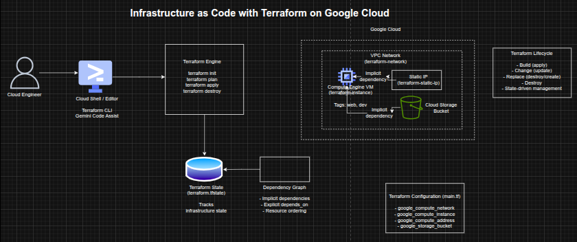

## Infrastructure as Code with Terraform on Google Cloud

**Timeline:** December 2025  
**Role:** Cloud Engineer / Infrastructure Engineer  
**Skills:** Terraform, Google Cloud, Compute Engine, VPC, Infrastructure as Code (IaC), Resource Dependencies, Terraform State, Provisioners

---

### Project Summary

This project focused on implementing **Infrastructure as Code (IaC)** using Terraform to provision, modify, and destroy infrastructure on Google Cloud. The work involved creating a VPC network, provisioning a virtual machine, assigning a static IP, defining resource dependencies, and using provisioners for post-deployment automation.

The implementation demonstrated how Terraform enables **repeatable, version-controlled infrastructure deployment**, including safe change management, dependency resolution, and lifecycle control.

---

### Objectives

- Build infrastructure using Terraform configuration files  
- Modify infrastructure using incremental changes  
- Destroy infrastructure using Terraform lifecycle commands  
- Create implicit and explicit resource dependencies  
- Assign static IP addresses to compute instances  
- Use provisioners for post-deployment automation  
- Understand Terraform state and execution planning  

---

### Architecture Overview

The architecture consisted of:

- **Cloud Shell / Editor** as the Terraform execution environment  
- A **Terraform configuration file (`main.tf`)** defining multiple resources  
- The **Terraform engine** executing lifecycle commands (`init`, `plan`, `apply`, `destroy`)  
- A **Google Cloud VPC network** provisioned via Terraform  
- A **Compute Engine VM instance** deployed into the VPC  
- A **static IP address** attached to the VM  
- A **Cloud Storage bucket** used to demonstrate explicit dependencies  
- A **Terraform state file (`terraform.tfstate`)** tracking infrastructure state  
- A **provisioner (local-exec)** performing post-deployment automation  

---

### Implementation & Highlights

#### 1. Terraform Configuration and Initialization
- Created a `main.tf` configuration file defining infrastructure resources  
- Configured the Google provider and project settings  
- Initialized Terraform using `terraform init`  

---

#### 2. Infrastructure Provisioning
- Created a **VPC network** using Terraform  
- Applied the configuration using `terraform apply`  
- Verified provisioning in Google Cloud  

---

#### 3. Compute Engine Deployment
- Added a **Compute Engine VM instance**  
- Connected it to the VPC network  
- Enabled external connectivity  

---

#### 4. Infrastructure Updates
- Added tags (`web`, `dev`) to the VM  
- Modified boot disk image  
- Observed:
  - in-place updates (`~`)  
  - resource replacement (`-/+`)  

---

#### 5. Resource Dependencies
- Created a **static IP resource**  
- Attached it to the VM using interpolation  
- Implemented:
  - implicit dependencies  
  - explicit dependencies (`depends_on`)  

---

#### 6. Provisioners
- Added a **local-exec provisioner**  
- Captured VM IP address into a file  
- Demonstrated post-deployment automation  

---

#### 7. Infrastructure Destruction
- Used `terraform destroy` to remove resources  
- Verified dependency-aware destruction order  

---

### Design Decisions

- Used **Terraform** for declarative infrastructure provisioning  
- Structured configuration to demonstrate lifecycle and dependencies  
- Leveraged **interpolation and depends_on** for dependency control  
- Used **provisioners** for automation  
- Maintained **state tracking** for consistency and repeatability  

---

### Results & Impact

- Successfully provisioned and managed infrastructure using Terraform  
- Demonstrated:
  - lifecycle management  
  - dependency resolution  
  - safe infrastructure changes  
- Built a strong foundation for advanced IaC implementations  
- Reinforced best practices for cloud automation and DevOps workflows  

---

### Tools & Technologies Used

- **Terraform** – Infrastructure as Code  
- **Google Cloud** – Cloud platform  
- **Compute Engine** – VM provisioning  
- **VPC Network** – Networking  
- **Cloud Storage** – Dependency demonstration  
- **Cloud Shell** – Execution environment  

---

### Outcome

This project demonstrates the ability to manage **infrastructure lifecycle using Terraform**, including provisioning, modification, dependency management, and destruction. It highlights practical skills in **Infrastructure as Code, automation, and cloud resource orchestration**, forming a strong foundation for advanced DevOps and platform engineering roles.

---

[Back to Cloud Projects](/projects/cloud/)