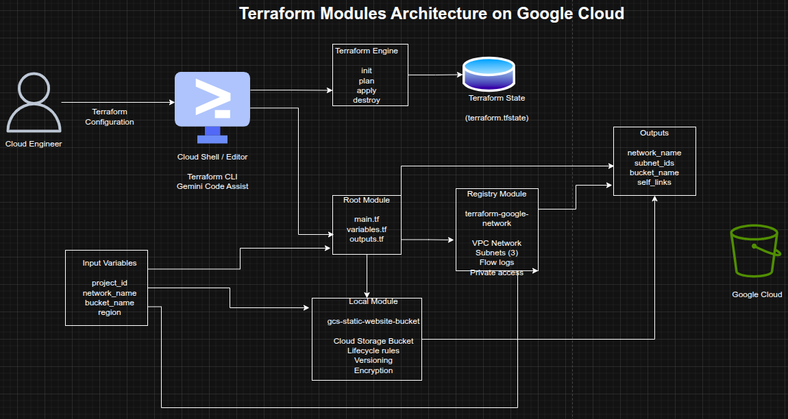

## Using and Building Terraform Modules on Google Cloud

**Timeline:** December 2025  
**Role:** Cloud Engineer / Infrastructure Engineer  
**Skills:** Terraform, Terraform Modules, Google Cloud, VPC, Cloud Storage, Infrastructure as Code (IaC), Module Inputs and Outputs, Reusable Infrastructure

---

### Project Summary

This project focused on using **Terraform modules to improve infrastructure organization, reusability, and consistency** on Google Cloud. The work involved first consuming a published module from the Terraform Registry to provision a VPC network with multiple subnets, and then designing a custom local module to provision a Cloud Storage bucket configured for static website hosting.

The implementation demonstrated how Terraform modules help structure Infrastructure as Code into reusable, encapsulated components, making complex environments easier to maintain, standardize, and scale across teams and projects. :contentReference[oaicite:1]{index=1}

---

### Objectives

- Use a Terraform module from the Registry  
- Configure module input variables  
- Consume module output values  
- Build a reusable local Terraform module  
- Provision Cloud Storage resources through a custom module  
- Structure Terraform code for modularity and reuse  
- Apply Terraform module best practices for maintainability  

---

### Architecture Overview

The architecture consisted of:

- A **root Terraform configuration** orchestrating module usage  
- A **Registry VPC module** used to provision:
  - a custom VPC network
  - multiple subnets
  - subnet-level configuration such as private access and flow logs
- A **local Terraform module** (`gcs-static-website-bucket`) used to provision:
  - a Cloud Storage bucket
  - lifecycle rules
  - versioning
  - retention and encryption options
- **variables.tf** and **outputs.tf** files used to define module inputs and outputs
- Uploaded HTML objects hosted in the bucket for static website access  

---

### Implementation & Highlights

#### 1. Using a Registry Module
- Cloned the Google Terraform Network module example project
- Used the published `terraform-google-modules/network/google` module
- Configured a custom VPC with three subnets
- Enabled subnet-level options such as:
  - private Google access
  - flow logs
  - logging configuration
- Provisioned infrastructure using `terraform init` and `terraform apply` :contentReference[oaicite:2]{index=2}

---

#### 2. Defining Root Input Variables
- Configured root variables for:
  - `project_id`
  - `network_name`
- Replaced hardcoded values with variables for flexibility and reuse
- Updated subnet regions and module arguments to align with the lab environment :contentReference[oaicite:3]{index=3}

---

#### 3. Consuming Module Outputs
- Exposed and reviewed module outputs including:
  - network name
  - network self-link
  - subnet names
  - subnet CIDR ranges
  - subnet regions
  - flow log settings
- Used outputs to make provisioned infrastructure easier to reference and validate :contentReference[oaicite:4]{index=4}

---

#### 4. Cleaning Up Managed Infrastructure
- Destroyed the module-provisioned VPC resources using `terraform destroy`
- Removed the downloaded example module directory
- Reinforced safe lifecycle management for Terraform-based infrastructure :contentReference[oaicite:5]{index=5}

---

#### 5. Building a Local Terraform Module
- Created a reusable local module directory:
  - `modules/gcs-static-website-bucket`
- Added module files:
  - `website.tf`
  - `variables.tf`
  - `outputs.tf`
  - `README.md`
  - `LICENSE`
- Structured the module according to Terraform module best practices for maintainability and sharing :contentReference[oaicite:6]{index=6}

---

#### 6. Implementing the Storage Bucket Module
- Defined a Cloud Storage bucket resource inside the local module
- Added support for:
  - versioning
  - labels
  - force destroy
  - retention policies
  - encryption
  - lifecycle rules
- Designed the module to be reusable and configurable through inputs rather than hardcoded values :contentReference[oaicite:7]{index=7}

---

#### 7. Exposing Module Outputs
- Added outputs for the created bucket resource
- Returned module-created infrastructure to the root module through outputs
- Reinforced Terraform’s modular composition pattern for passing resource attributes between layers :contentReference[oaicite:8]{index=8}

---

#### 8. Calling the Local Module from the Root Module
- Referenced the local module from the root configuration using:
  - `source = "./modules/gcs-static-website-bucket"`
- Passed input variables such as:
  - bucket name
  - project ID
  - location
  - lifecycle rules
- Initialized and applied the configuration to provision the bucket :contentReference[oaicite:9]{index=9}

---

#### 9. Uploading Static Website Content
- Downloaded sample HTML files
- Uploaded them to the provisioned storage bucket
- Accessed the hosted files using the bucket URL
- Demonstrated how the custom Terraform module could support static website hosting use cases :contentReference[oaicite:10]{index=10}

---

#### 10. Final Cleanup
- Destroyed the bucket and related Terraform-managed resources
- Completed the full lifecycle from module consumption and creation through cleanup :contentReference[oaicite:11]{index=11}

---

### Design Decisions

- Used a **published Registry module** to accelerate VPC deployment and apply community-tested patterns  
- Used a **local custom module** to demonstrate reusable internal infrastructure design  
- Defined **input variables** to keep configurations flexible and reusable  
- Used **outputs** to expose provisioned resources cleanly between modules  
- Added **README** and **LICENSE** files to align with module-sharing best practices  
- Included **lifecycle rules, retention, and encryption hooks** to make the bucket module extensible for real-world use  

---

### Results & Impact

- Successfully consumed a **Terraform Registry module** for VPC provisioning  
- Successfully built and used a **custom local Terraform module** for Cloud Storage  
- Demonstrated practical use of:
  - module reuse
  - encapsulation
  - variables
  - outputs
  - modular code structure
- Strengthened understanding of how Terraform modules improve scalability, consistency, and maintainability in Infrastructure as Code projects  
- Built a strong foundation for designing reusable internal Terraform modules for team and enterprise use  

---

### Tools & Technologies Used

- **Terraform** – Infrastructure as Code engine  
- **Terraform Registry** – Published module source  
- **Google Cloud VPC** – Network provisioning  
- **Cloud Storage** – Static website bucket hosting  
- **Terraform Modules** – Reusable infrastructure abstraction  
- **Cloud Shell / Editor** – Terraform execution and editing environment  

---

### Outcome

This project demonstrates the ability to both **consume and build Terraform modules** on Google Cloud. It highlights practical skills in **modular Infrastructure as Code design, reusable cloud provisioning, variable-driven configuration, and output-based composition**, which are highly relevant to cloud engineering, DevOps, and platform engineering roles.

---

[Back to Cloud Projects](/projects/cloud/)