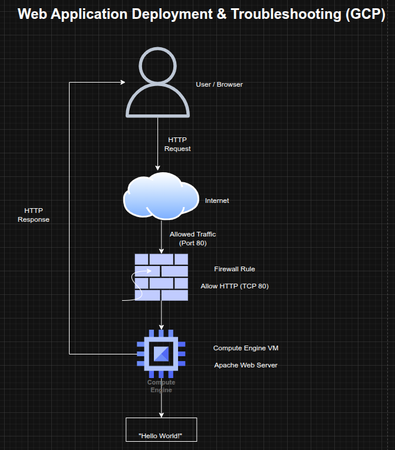

## Web Application Deployment and Troubleshooting on Compute Engine (GCP)

**Timeline:** December 2025  
**Role:** Cloud Engineer  
**Skills:** Google Compute Engine, Linux, Apache, Firewall Rules, Networking, Troubleshooting, Public Access Configuration

---

### Project Summary

This project focused on deploying a **public-facing web application** on Google Cloud using Compute Engine and ensuring it was accessible to users over the internet. The task involved provisioning a Linux virtual machine, configuring firewall rules for external access, installing and running an Apache web server, and troubleshooting connectivity issues to ensure the service was reachable.

The implementation demonstrated fundamental cloud operations skills, including **infrastructure provisioning, network configuration, service deployment, and troubleshooting production access issues**.

---

### Objectives

- Provision a Linux VM instance on Compute Engine  
- Configure firewall rules to allow public HTTP access  
- Install and run an Apache web server  
- Expose the application via the VM’s external IP  
- Troubleshoot connectivity and access issues  
- Validate successful deployment  

---

### Architecture Overview

The architecture consisted of:

- A **Compute Engine VM** hosting the web server  
- A **public external IP address** assigned to the instance  
- A **firewall rule allowing HTTP traffic (TCP 80)**  
- An Apache web server serving content to external users  
- A client accessing the application through a browser  

---

### Implementation & Highlights

#### 1. VM Provisioning
- Created a Linux-based Compute Engine instance  
- Selected appropriate zone and configuration for deployment  
- Prepared the instance to host a web application  

---

#### 2. Network and Firewall Configuration
- Enabled public access by applying firewall rules  
- Allowed inbound traffic on **TCP port 80 (HTTP)**  
- Ensured the instance was reachable from external networks  

---

#### 3. Web Server Deployment
- Installed **Apache HTTP Server** on the VM  
- Started and enabled the web server service  
- Configured a basic web page as a placeholder application  

---

#### 4. External Access Validation
- Accessed the application via the VM’s external IP address  
- Confirmed successful HTTP response from the server  

---

#### 5. Troubleshooting and Issue Resolution
- Investigated potential connectivity issues such as:
  - missing firewall rules  
  - incorrect instance tags  
  - incorrect protocol usage (HTTP vs HTTPS)  
- Resolved issues preventing external access to the application  
- Verified successful connectivity after fixes  

---

### Design Decisions

- Used **Compute Engine** for flexible infrastructure provisioning  
- Applied **firewall rules** to explicitly control public access  
- Used **Apache** as a lightweight web server for rapid deployment  
- Focused on **troubleshooting and validation** to ensure production readiness  

---

### Results & Impact

- Successfully deployed a publicly accessible web server on GCP  
- Demonstrated the ability to configure infrastructure for internet-facing applications  
- Identified and resolved common cloud deployment issues  
- Strengthened troubleshooting skills for real-world cloud environments  

---

### Tools & Technologies Used

- **Google Compute Engine** – VM hosting  
- **Linux** – Operating system  
- **Apache HTTP Server** – Web server  
- **Firewall Rules** – Network access control  
- **Public IP Networking** – External access  

---

### Outcome

This project demonstrates the ability to deploy and troubleshoot a **public-facing web application on cloud infrastructure**, ensuring proper configuration of compute, networking, and services. It highlights practical skills in **cloud operations, network troubleshooting, and service validation**, which are critical for cloud engineering and site reliability roles.

---

[Back to Cloud Projects](/projects/cloud/)