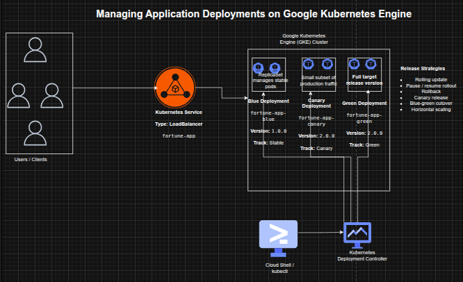

## Managing Application Deployments on Google Kubernetes Engine

**Timeline:** December 2025  
**Role:** Cloud Engineer / Site Reliability Engineer  
**Skills:** Google Kubernetes Engine (GKE), Kubernetes, kubectl, Deployments, ReplicaSets, Services, Rolling Updates, Canary Deployments, Blue-Green Deployments, DevOps

---

### Project Summary

This project focused on implementing **production-grade deployment strategies** for a containerized application on Google Kubernetes Engine (GKE). The work involved deploying a versioned application, exposing it via a Kubernetes Service, scaling workloads, and managing application updates using rolling updates, rollback, canary releases, and blue-green deployment patterns.

The implementation demonstrated how Kubernetes can be used not only for orchestration, but also as a **release management platform**, enabling safe, controlled, and low-risk application deployments in cloud-native environments.

---

### Objectives

- Deploy a containerized application on GKE using Kubernetes manifests  
- Use `kubectl` to inspect and manage Kubernetes resources  
- Scale application replicas dynamically  
- Perform rolling updates to a new application version  
- Pause and resume deployment rollouts  
- Roll back to a previous stable version  
- Implement a canary deployment for partial traffic testing  
- Implement a blue-green deployment for full traffic switching  

---

### Architecture Overview

The architecture consisted of:

- A **Google Kubernetes Engine (GKE) cluster** hosting application workloads  
- A **Kubernetes Deployment** managing application replicas  
- A **ReplicaSet** ensuring desired pod availability  
- Multiple application versions:
  - **Blue (stable)** – version 1.0.0  
  - **Canary** – partial rollout of version 2.0.0  
  - **Green** – full deployment of version 2.0.0  
- A **LoadBalancer Service** exposing the application externally  
- Traffic routing controlled via **labels and selectors**  

---

### Implementation & Highlights

#### 1. GKE Cluster and Environment Setup
- Created a **3-node GKE cluster** using `gcloud`
- Configured Cloud Shell and `kubectl` for cluster interaction  
- Loaded deployment and service manifests for the application  

---

#### 2. Initial Application Deployment
- Deployed `fortune-app` version **1.0.0** using a Kubernetes Deployment  
- Configured **3 replicas** for high availability  
- Verified Deployment, ReplicaSet, and Pods  
- Exposed the application via a **LoadBalancer Service**  
- Validated application response using the `/version` endpoint  

---

#### 3. Scaling Application Workloads
- Scaled replicas from **3 → 5 → 3** using `kubectl scale`  
- Verified pod scaling behavior dynamically  
- Demonstrated horizontal scalability using Kubernetes Deployments  

---

#### 4. Rolling Update Deployment
- Updated application image from **v1.0.0 → v2.0.0**  
- Triggered a **rolling update** with zero downtime  
- Observed:
  - gradual replacement of pods  
  - creation of a new ReplicaSet  
- Reviewed rollout history for deployment tracking  

---

#### 5. Controlled Rollout (Pause & Resume)
- Paused deployment rollout mid-update  
- Observed mixed application versions running simultaneously  
- Resumed rollout to complete update  
- Demonstrated operational control over live deployments  

---

#### 6. Rollback to Stable Version
- Performed rollback using `kubectl rollout undo`  
- Reverted application back to version **1.0.0**  
- Verified successful rollback through service responses  
- Demonstrated safe recovery from faulty deployments  

---

#### 7. Canary Deployment Implementation
- Created a **canary deployment** for version 2.0.0  
- Used shared service selectors to distribute traffic  
- Verified:
  - majority of traffic served by stable version  
  - small subset served by canary version  
- Demonstrated controlled production testing  

---

#### 8. Blue-Green Deployment Strategy
- Created separate **blue (v1.0.0)** and **green (v2.0.0)** deployments  
- Updated service selector to switch traffic between versions  
- Verified:
  - instant traffic cutover  
  - immediate rollback capability  
- Demonstrated zero-downtime full release strategy  

---

### Design Decisions

- Used **Kubernetes Deployments** for declarative application management  
- Leveraged **ReplicaSets** for automatic scaling and availability  
- Used **Services with label selectors** to control traffic routing  
- Applied multiple deployment strategies to simulate real-world release scenarios  
- Chose **GKE** for managed Kubernetes infrastructure and scalability  

---

### Results & Impact

- Successfully implemented multiple **production deployment strategies** on GKE  
- Demonstrated practical use of:
  - rolling updates  
  - rollback mechanisms  
  - canary testing  
  - blue-green deployments  
- Improved understanding of:
  - release safety  
  - deployment control  
  - traffic management  
- Built a strong foundation for **cloud-native DevOps and SRE practices**  

---

### Tools & Technologies Used

- **Google Kubernetes Engine (GKE)** – Managed Kubernetes platform  
- **Kubernetes** – Container orchestration  
- **kubectl** – Cluster management CLI  
- **Deployments & ReplicaSets** – Workload management  
- **Services (LoadBalancer)** – External access and traffic routing  
- **Containerized Application (fortune-app)** – Sample workload  

---

### Outcome

This project demonstrates the ability to implement **advanced Kubernetes deployment strategies** in a cloud environment. It highlights practical skills in **release engineering, workload scaling, traffic management, and failure recovery**, which are critical for cloud engineering, DevOps, and site reliability roles.

---

[Back to Cloud Projects](/projects/cloud/)