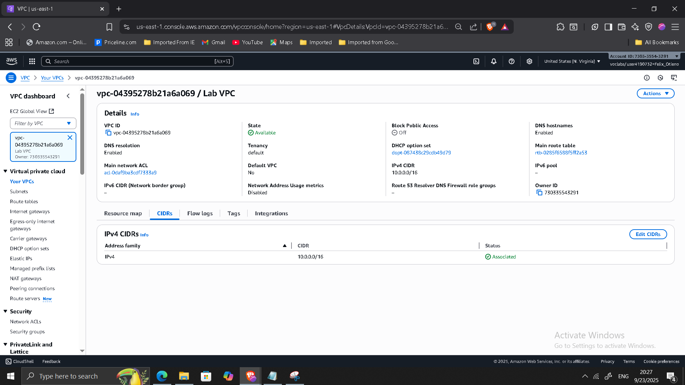
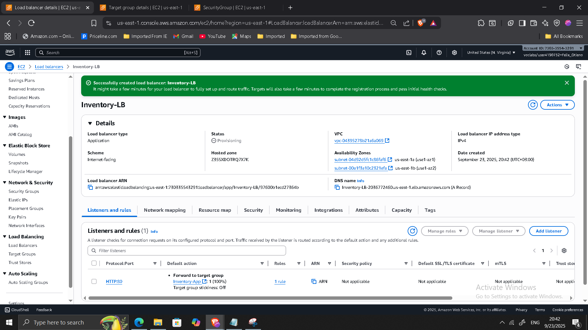
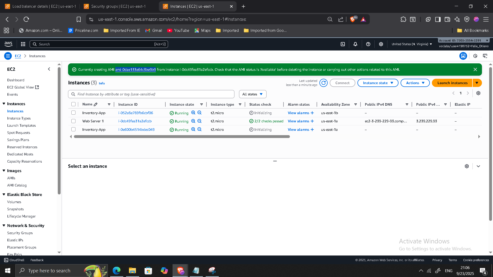
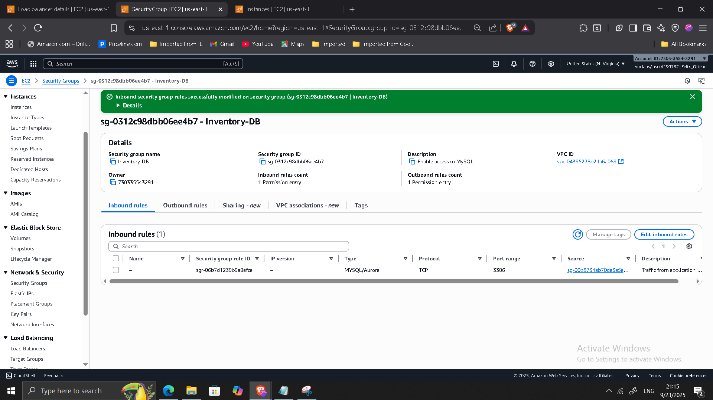
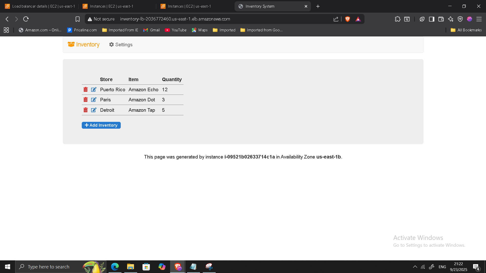
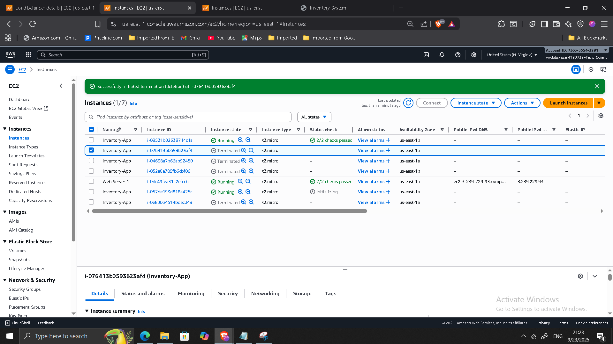

## Project: Highly Available Web Application on AWS

**Timeline:** September 2025  
**Role:** Cloud Solutions Architect  
**Skills:** AWS VPC, Subnets, EC2, Auto Scaling, Application Load Balancer, Security Groups, RDS, NAT Gateway, High Availability Design

---

### Project Summary
Designed and implemented a highly available and fault-tolerant web application architecture on AWS. The project focused on eliminating single points of failure, distributing workloads across multiple Availability Zones, and enabling automatic recovery during demand spikes or infrastructure failures.  

This hands-on implementation demonstrates cloud-native architectural principles to ensure resiliency, scalability, and production-grade service continuity.

---

### Objectives
- Design a multi-AZ architecture to ensure fault tolerance.  
- Deploy an Application Load Balancer (ALB) for traffic distribution.  
- Implement an Auto Scaling Group (ASG) to dynamically adjust capacity.  
- Harden security with least-privilege security group rules.  
- Test recovery from failures and validate high availability.  

---

### Implementation & Highlights

#### 1. VPC & Networking Design
- Reviewed VPC setup with subnets, route tables, IGW, and NACLs.  
- Confirmed multi-AZ public/private subnet design for resiliency.  

---

#### 2. Application Load Balancer Deployment
- Provisioned an ALB across two public subnets.  
- Configured listener rules and health checks for web app targets.  
- Created a dedicated security group allowing HTTP/HTTPS traffic.  

---

#### 3. Auto Scaling Group & Launch Template
- Created an AMI of the web server for standardized deployments.  
- Defined a launch template (EC2 + user data for app setup).  
- Configured ASG across two private subnets with desired capacity = 2, scaling between 2–6 instances.  
- Attached ASG to ALB target group.  

---

#### 4. Security Hardening
- Restricted app security group to accept HTTP traffic only from ALB.  
- Restricted database security group to accept MySQL traffic only from the application tier.  
- Ensured principle of least privilege across all layers.  

---

#### 5. Testing & Validation
- Verified web app availability through ALB DNS name (requests served from multiple AZs).  
- Simulated instance failure: ASG replaced terminated instance automatically.  
- Observed traffic failover and uninterrupted availability.  

---

#### 6. Optional Enhancements
- Enabled RDS Multi-AZ deployment for database resilience.  
- Configured second NAT Gateway in another AZ for redundancy in private subnets.  

---

### Outcome & Impact
- Delivered a fault-tolerant, production-ready architecture.  
- Ensured zero single points of failure across compute, network, and database tiers.  
- Gained practical expertise with Auto Scaling, ALB, and resilient networking on AWS.  
- Strengthened ability to design and implement cloud architectures aligned with AWS Well-Architected Framework.  

---

[Back to Projects](/projects/cloud/)
