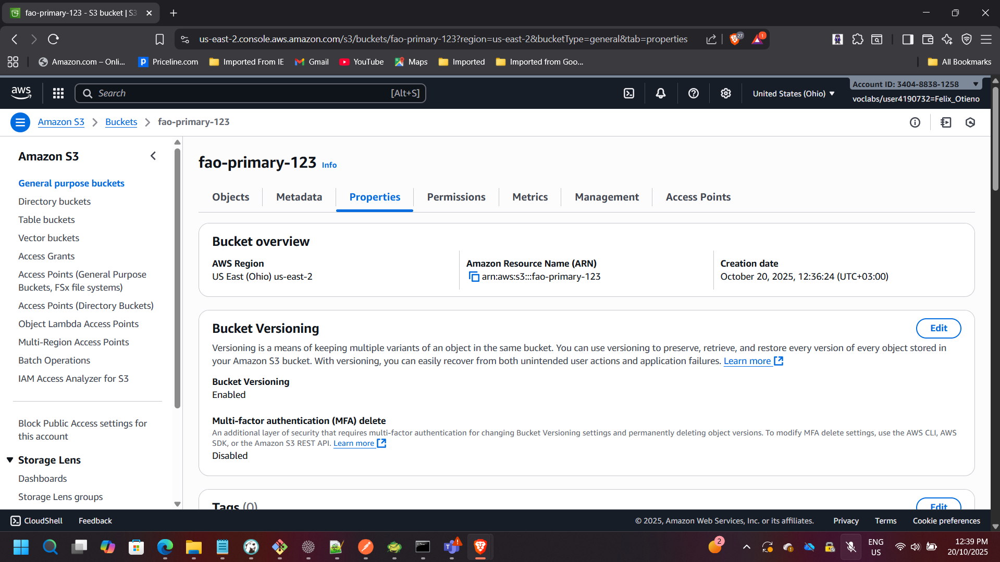
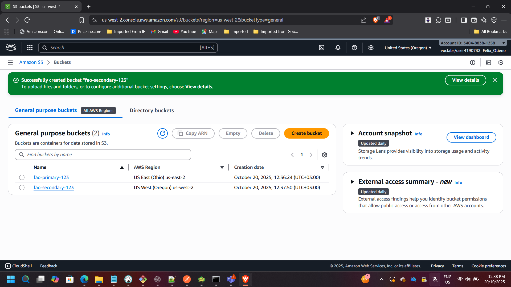
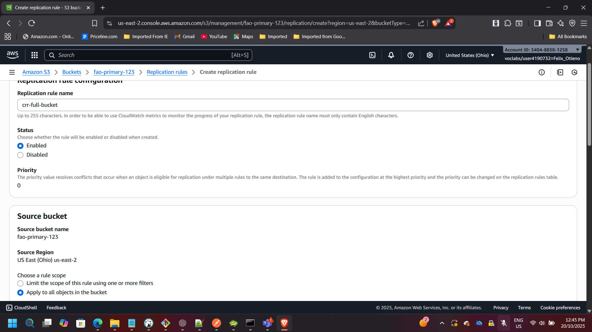
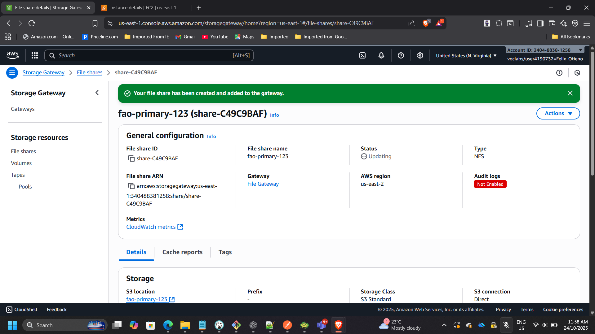
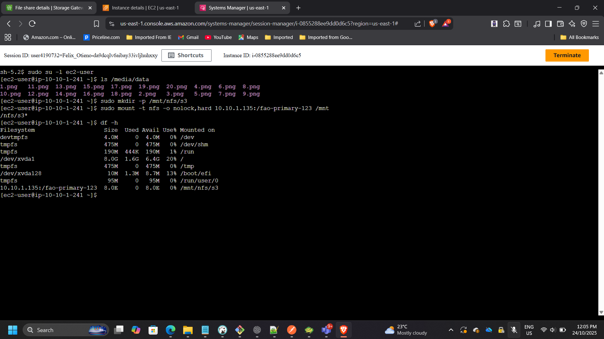
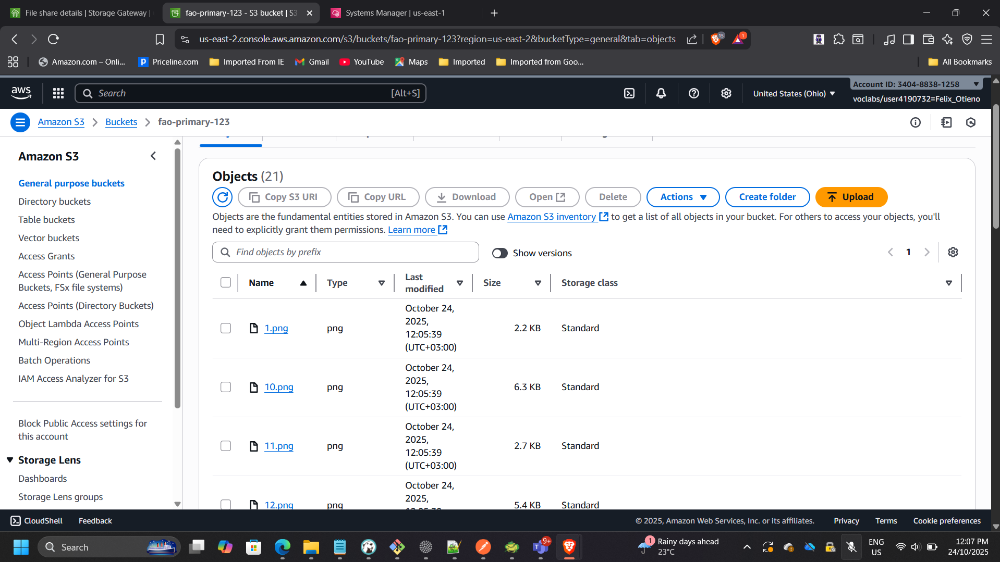

## Project: Hybrid Storage and Data Migration with AWS Storage Gateway (S3 File Gateway)

**Timeline:** October 2025  
**Role:** Solutions Architect & Cloud Engineer  
**Skills:** AWS Storage Gateway, Amazon S3, Cross-Region Replication (CRR), IAM, NFS, EC2, Lifecycle Policies

---

### Project Summary
Designed and implemented a hybrid cloud storage workflow using AWS Storage Gateway (S3 File Gateway) to simulate on-premises file storage and migrate data into Amazon S3 using an NFS file share. Enabled Cross-Region Replication (CRR) between us-east-2 (Ohio) and us-west-2 (Oregon) to provide disaster recovery and multi-region redundancy. Implemented S3 lifecycle policies to support storage management and cost optimization.

---

### Objectives
- Deploy and activate an S3 File Gateway on Amazon EC2.
- Create primary and secondary S3 buckets in separate Regions.
- Enable S3 Cross-Region Replication (CRR).
- Mount the NFS file share on a Linux instance.
- Migrate on-premises data into Amazon S3.
- Validate end-to-end replication and hybrid data flow.

---

## Implementation & Highlights

### 1. Reviewed the Architecture
- Simulated an on-premises Linux environment.
- Deployed an S3 File Gateway appliance.
- Established NFS connectivity between Linux server and S3.
- Designed replication between Ohio (primary) and Oregon (DR region).

---

### 2. Created Primary and Secondary S3 Buckets

**Primary (Source) Bucket**
- Region: us-east-2 (Ohio)
- Versioning enabled

**Secondary (Destination) Bucket**
- Region: us-west-2 (Oregon)
- Versioning enabled

---

### 3. Enabled Cross-Region Replication (CRR)

- Created replication rule: `crr-full-bucket`
- Applied rule to all objects
- Selected Oregon bucket as destination
- Assigned IAM replication role
- Uploaded test file and confirmed replication

---

### 4. Configured S3 File Gateway and Created an NFS File Share

- Gateway Type: Amazon S3 File Gateway  
- Host Platform: Amazon EC2  
- Instance Type: t2.xlarge  
- Cache Storage: 150 GiB  
- VPC/Subnet: On-Prem-VPC / On-Prem-Subnet  
- Security Groups: FileGatewayAccess, OnPremSshAccess  

Activated the gateway and confirmed status changed to **Running**.

Created an NFS file share:
- Linked to primary (Ohio) bucket
- Storage class: S3 Standard
- IAM role configured

Example NFS mount command:

    sudo mount -t nfs -o nolock,hard 10.10.1.135:/fao-primary-123 /mnt/nfs/s3

---

### 5. Mounted the File Share and Migrated Data

Verified source data:

    ls /media/data

Created mount directory:

    sudo mkdir -p /mnt/nfs/s3

Mounted NFS share:

    sudo mount -t nfs -o nolock,hard 10.10.1.33:/lab-nfs-bucket /mnt/nfs/s3

Verified mount:

    df -h

Copied image files:

    cp -v /media/data/*.png /mnt/nfs/s3

---

### 6. Verified Data Migration and Replication

- Confirmed 20 image files present in source (Ohio) bucket.
- Verified automatic replication in destination (Oregon) bucket.
- Validated hybrid path: Linux → NFS → S3 (Ohio) → CRR → S3 (Oregon)

---

## Outcome & Impact

- Successfully implemented a hybrid storage integration model.
- Demonstrated enterprise-style migration from on-prem file server to AWS.
- Implemented multi-region disaster recovery via CRR.
- Validated secure, scalable, and resilient data architecture.

---

[Back to Projects](/projects/)
