## Project: CI/CD-Driven Infrastructure Automation with AWS CloudFormation

**Timeline:** September 2025  
**Role:** Solutions Architect (Infrastructure Automation & Platform Engineering)  
**Skills:** AWS CloudFormation, AWS CodeCommit, AWS CodePipeline, Git, Multi-Region Deployment, VPC Architecture, EC2, S3 Static Hosting  

---

## Executive Summary

Designed and implemented a Git-driven Infrastructure-as-Code (IaC) deployment pipeline using AWS CloudFormation, CodeCommit, and CodePipeline.

The solution enables:

- Version-controlled infrastructure templates
- Automated stack creation and updates
- Modular networking and application layers
- Static and dynamic website deployment
- Multi-region infrastructure replication

This architecture reflects enterprise DevOps and platform engineering practices where infrastructure updates are governed through CI/CD rather than manual configuration.

---

# Architecture Overview

The solution consists of:

- **Source Control:** AWS CodeCommit repository
- **CI/CD Engine:** AWS CodePipeline
- **Infrastructure Definition:** AWS CloudFormation templates
- **Static Website Layer:** Amazon S3
- **Network Layer:** Custom VPC & public subnet
- **Application Layer:** EC2 (Apache, MariaDB, PHP)
- **Multi-Region Deployment:** us-east-1 & us-west-2

---

# Phase 1 – Creating Infrastructure from Scratch (S3 Website)

Created `S3.yaml` CloudFormation template defining:

- Amazon S3 bucket
- Static website configuration
- Outputs (website URL)
- DeletionPolicy: Retain

Deployed using AWS CLI in Cloud9.

📸 **Cloud9 IDE – S3.yaml Template**
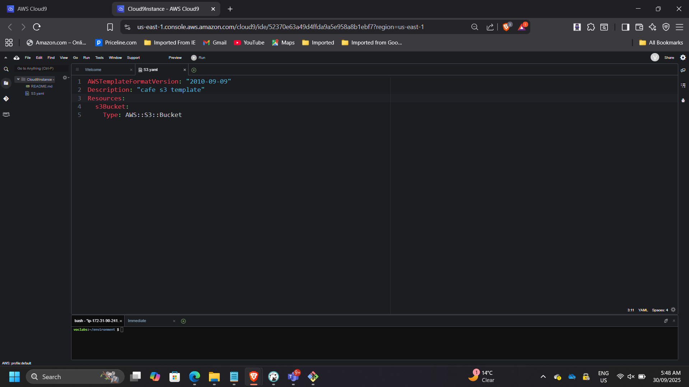

📸 **CLI Stack Creation Output**
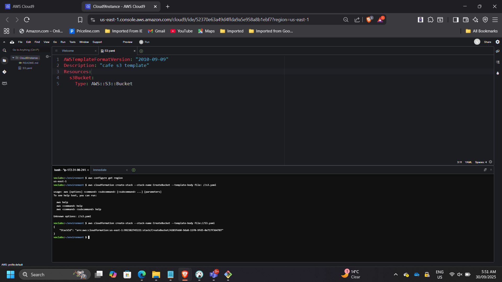

📸 **CloudFormation – CREATE_COMPLETE**
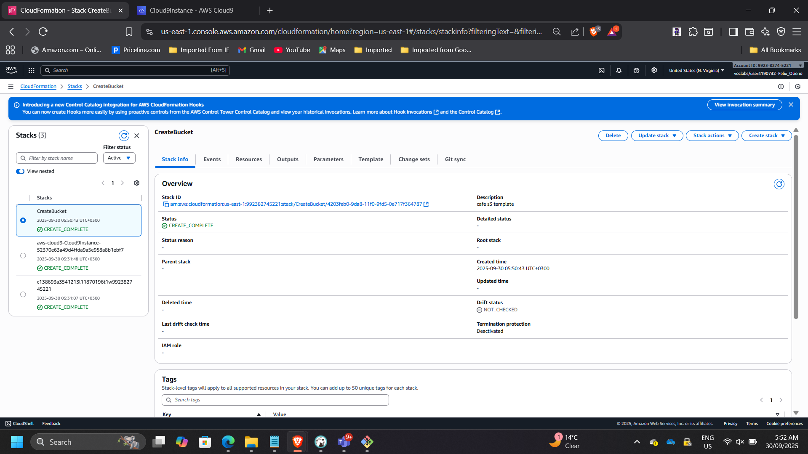

📸 **S3 Static Website Running**

This phase demonstrates foundational Infrastructure-as-Code implementation.

---

# Phase 2 – Introducing Version Control with CodeCommit

Cloned `CFTemplatesRepo` into Cloud9 and established Git workflow:

- git clone
- git add
- git commit
- git push

📸 **CodeCommit Repository Overview**
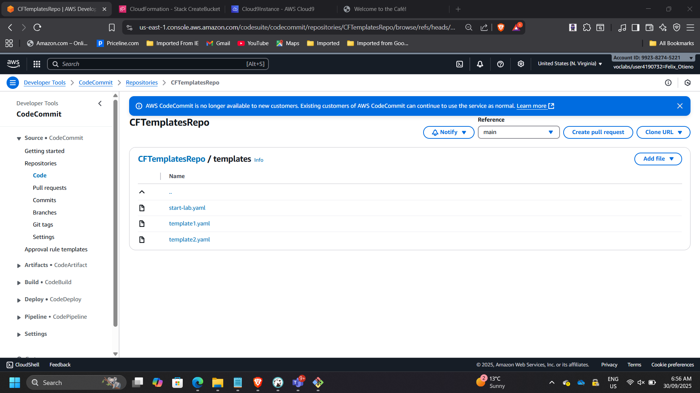

📸 **Git Commit & Push in Cloud9**
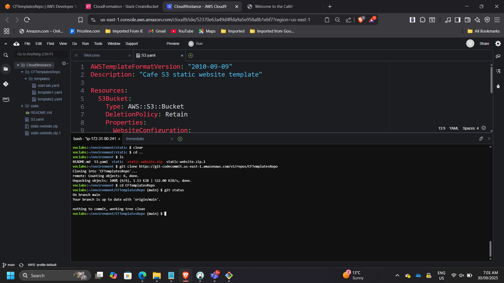

This introduced:

- Infrastructure versioning
- Auditability
- Change tracking

---

# Phase 3 – CI/CD-Driven Network Layer Deployment

Created `cafe-network.yaml` defining:

- VPC
- Public Subnet
- Route Tables
- Internet Gateway

Committed to CodeCommit.

CodePipeline automatically:

- Detected commit
- Triggered pipeline
- Deployed CloudFormation stack

📸 **CodePipeline Execution Graph**
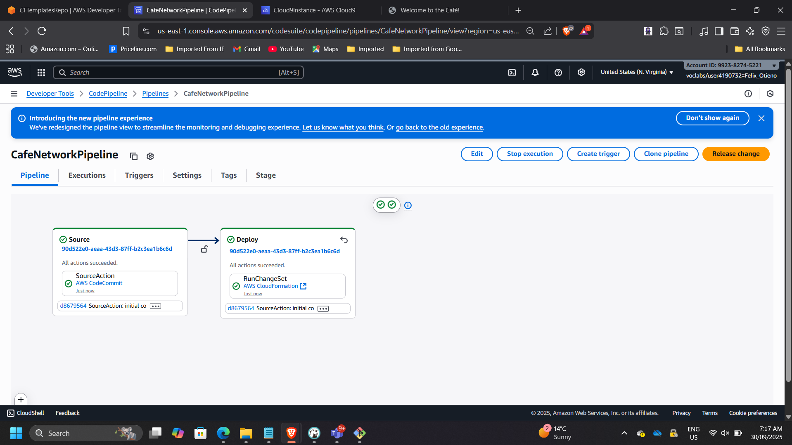

📸 **CloudFormation Stack – CREATE_COMPLETE**
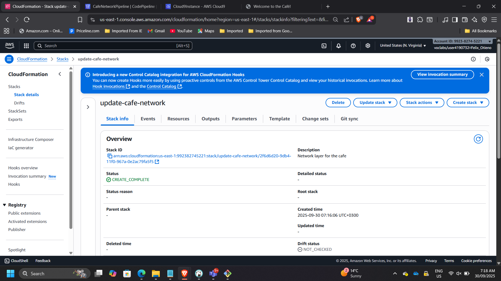

📸 **VPC Console – Cafe VPC**
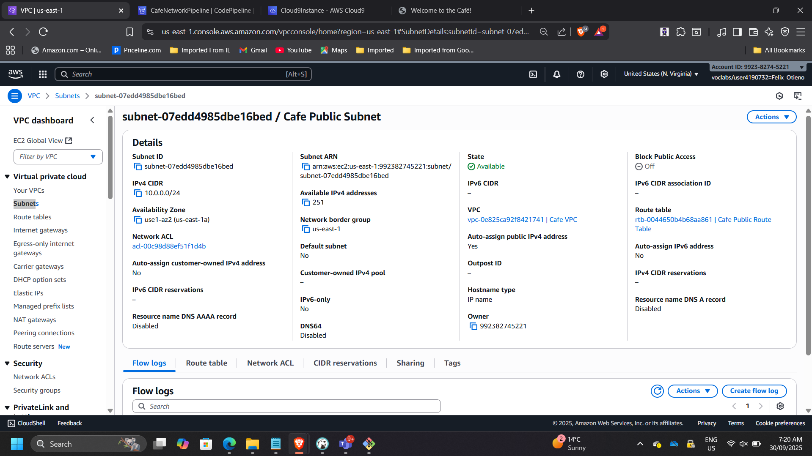

This demonstrates automated environment provisioning.

---

# Phase 4 – Controlled Infrastructure Update

Enhanced network template to export:

- VPC ID
- Subnet ID

Pushed update to repository.

Pipeline triggered stack UPDATE.

📸 **CloudFormation Change Complete**

📸 **Outputs Showing Exported Values**

This validates controlled infrastructure evolution through CI/CD.

---

# Phase 5 – Application Layer Automation

Created `cafe-app.yaml` defining:

- EC2 instance
- Security Group
- UserData installing:
  - Apache
  - MariaDB
  - PHP
- Dynamic café website

Committed to CodeCommit.

Pipeline `CafeAppPipeline` deployed automatically.

📸 **CodePipeline – Application Deployment**
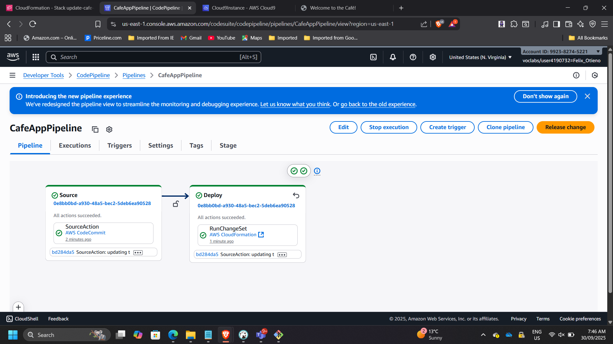

📸 **EC2 Instance Running**

📸 **Dynamic Café Website**
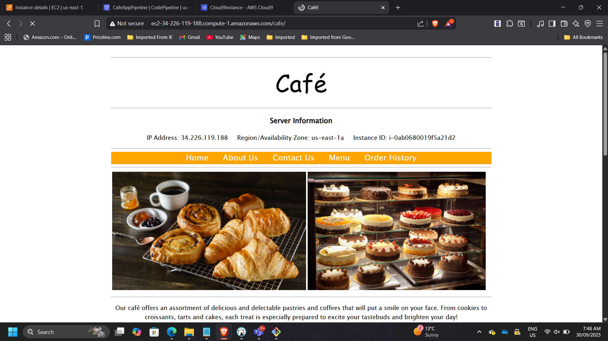

This phase demonstrates automated full-stack provisioning.

---

# Phase 6 – Multi-Region Infrastructure Replication

Duplicated network and application stacks into **us-west-2 (Oregon)**.

Steps:

- CloudFormation CLI deployment
- New key pair creation
- Application stack launch
- Instance type adjustment

📸 **CLI Stack Creation – us-west-2**
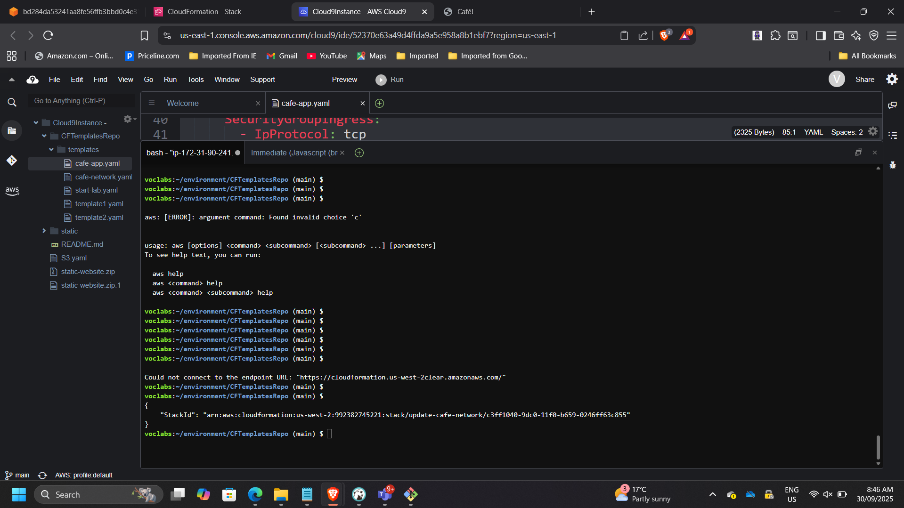

📸 **VPC Console – Oregon Region**

📸 **EC2 in Oregon Running**

📸 **Website Running in Oregon**
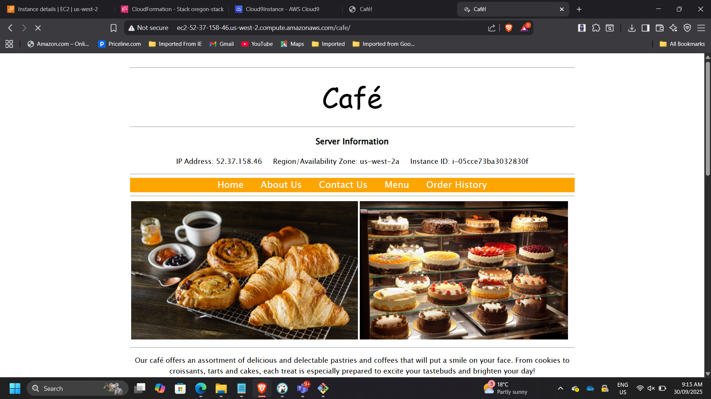

This demonstrates:

- Infrastructure portability
- Regional scalability
- Reproducible environments

---

# Architectural Outcomes

### Git-Based Infrastructure Governance
All infrastructure changes are version-controlled.

### CI/CD-Driven Stack Management
No manual console provisioning required.

### Modular Stack Separation
Network and application layers decoupled.

### Cross-Region Scalability
Infrastructure deployable in multiple AWS Regions.

### Reduced Configuration Drift
Environment state controlled via template definitions.

---

# Enterprise Impact

This project elevates Infrastructure-as-Code from basic template usage to:

- Platform engineering practice
- CI/CD-integrated deployment model
- Governed infrastructure lifecycle
- Multi-region operational readiness

It reflects how modern cloud platforms are built in enterprise environments.

---

## Conclusion

Successfully implemented a CI/CD-driven Infrastructure-as-Code pipeline using AWS CloudFormation, CodeCommit, and CodePipeline.

The solution demonstrates automation maturity, operational governance, and scalable environment replication — core competencies expected of modern cloud architects and platform engineers.

---

[Back to Projects](/projects/)
