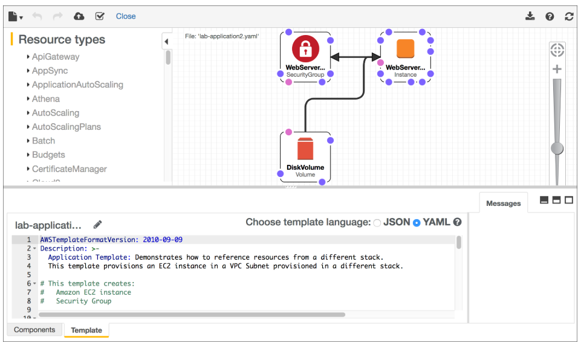
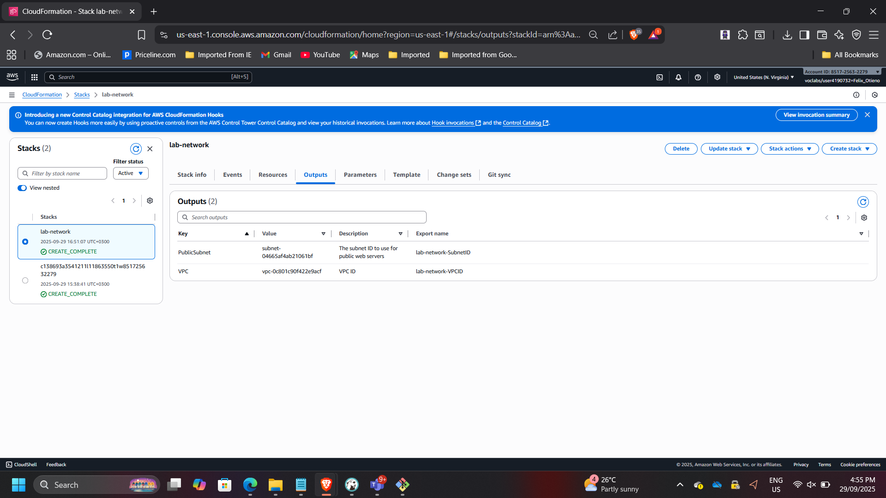
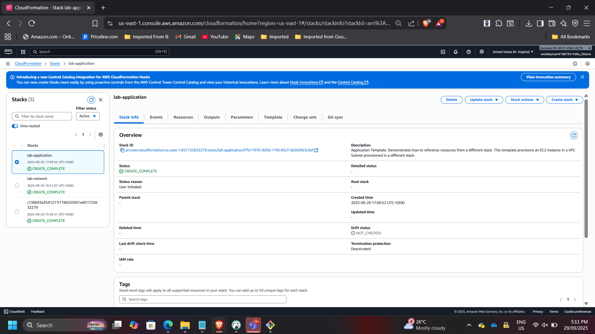
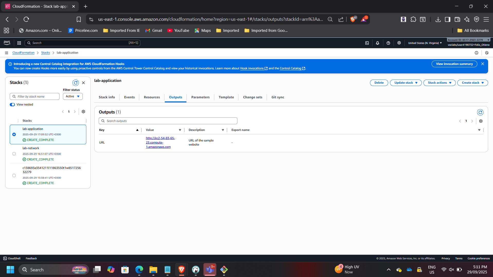
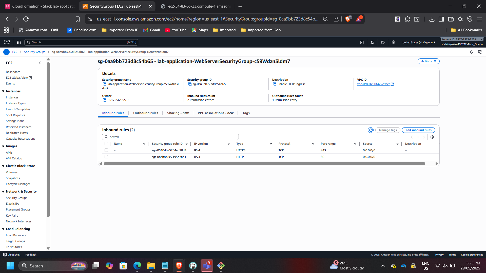
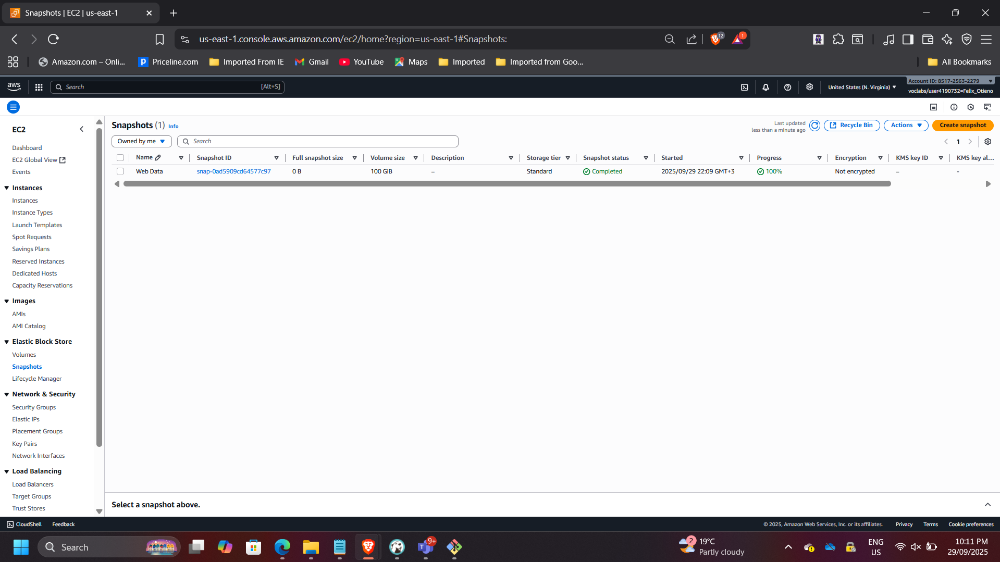

## Project: Enterprise Infrastructure Automation with AWS CloudFormation

**Timeline:** September 2025  
**Role:** Solutions Architect (Infrastructure as Code & Automation)  
**Skills:** AWS CloudFormation, Infrastructure as Code (IaC), VPC Architecture, EC2, Security Groups, Change Sets, Stack Updates, DeletionPolicy, Infrastructure Composer  

---

## Executive Summary

Designed and deployed a modular AWS environment using Infrastructure as Code (IaC) with AWS CloudFormation.

This project demonstrates how enterprise infrastructure can be provisioned using reusable templates, structured into independent networking and application layers, updated safely using Change Sets, and governed through lifecycle policies.

The implementation eliminates manual configuration risk and enables repeatable, production-ready deployments aligned with DevOps and governance best practices.

---

## Business Context

Manual infrastructure deployment introduces configuration drift, inconsistent environments, human error, and poor lifecycle management.

The objective of this initiative was to:

- Separate networking and application layers  
- Enable controlled infrastructure updates  
- Preserve critical resources during deletion  
- Improve consistency through template-driven deployments  

---

## Architecture Overview

The deployment consisted of two independent CloudFormation stacks.

### Networking Stack (`lab-network`)

Provisioned:
- VPC  
- Public Subnet  
- Internet Gateway  
- Route Tables  
- Route Associations  

Exports:
- VPC ID  
- Subnet ID  

### Application Stack (`lab-application`)

Provisioned:
- EC2 instance  
- Security Group  
- Web server configuration  
- Cross-stack reference to VPC and Subnet  

---

## Deploying the Networking Layer

Deployed `lab-network.yaml` template.

Verified:
- Stack status: CREATE_COMPLETE  
- Resources provisioned successfully  
- Outputs exported correctly  

This demonstrates modular stack separation and reusable network foundations.

---

## Deploying the Application Layer

Deployed `lab-application.yaml`, which referenced networking outputs.

Provisioned:
- EC2 instance within VPC  
- Security Group allowing HTTP (port 80)  

Verified:
- Stack status: CREATE_COMPLETE  
- Application accessible via public URL  

This demonstrates cross-stack dependency management using exported values.

---

## Controlled Stack Update Using Change Sets

Updated the application stack using `lab-application2.yaml`.

Modification introduced:
- HTTPS (port 443) added to Security Group inbound rules  

Previewed changes before execution using Change Sets.

Before update:
- Port 80 allowed  

After update:
- Ports 80 and 443 allowed  

This demonstrates safe infrastructure evolution without redeploying unaffected resources.

---

## Infrastructure Visualization

Used AWS Infrastructure Composer to validate:

- VPC associations  
- Subnet routing  
- Internet Gateway connectivity  
- Route table relationships  

Verified that the Public Route Table includes `0.0.0.0/0 → IGW` and is properly associated with the Public Subnet.

---

## Lifecycle-Aware Stack Deletion

Deleted the `lab-application` stack.

Because the template included:

`DeletionPolicy: Snapshot`

CloudFormation created an EBS snapshot before deletion.

Verified:
- Stack status: DELETE_COMPLETE  
- Snapshot retained  
- Networking stack unaffected  

This demonstrates governance-aware infrastructure teardown procedures.

---

## Architectural Impact

This project demonstrates enterprise-grade Infrastructure as Code implementation using AWS CloudFormation to:

- Automate multi-layer infrastructure provisioning  
- Enable controlled infrastructure updates  
- Preserve critical data during teardown  
- Improve deployment consistency and reliability  

The solution aligns with DevOps automation principles and modern cloud governance standards.

---

[Back to Projects](/projects/)
