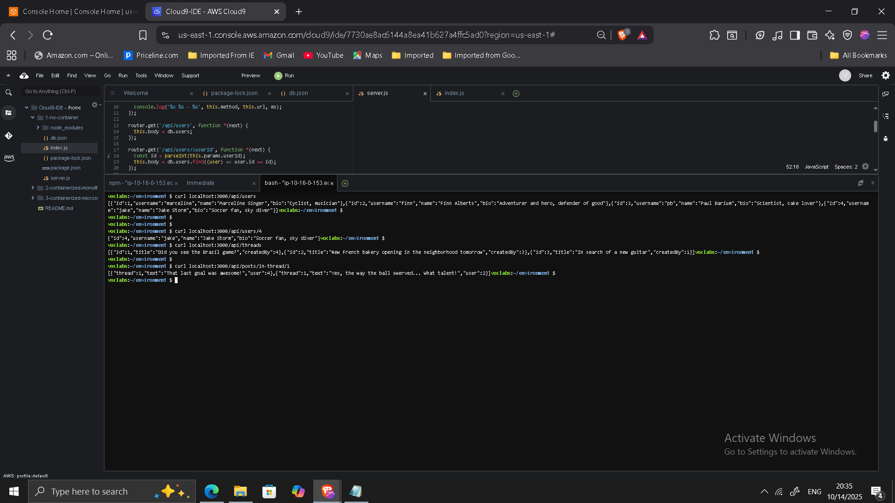
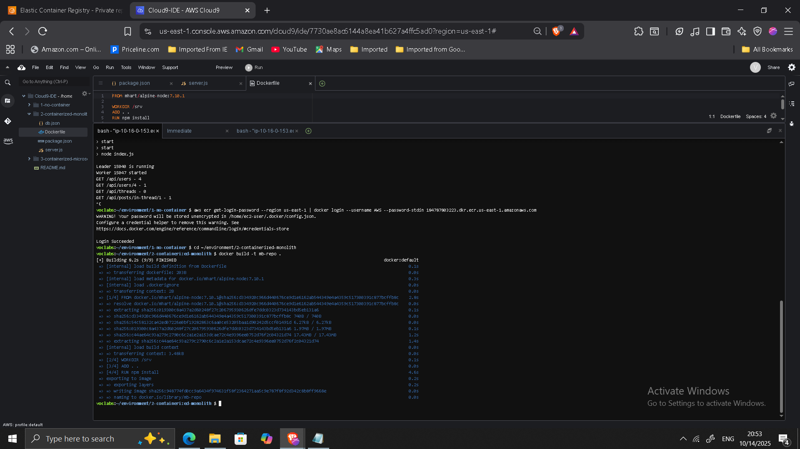
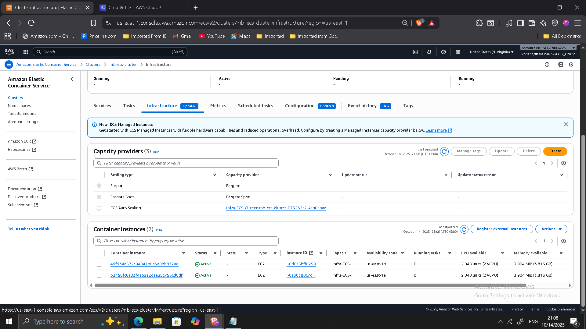
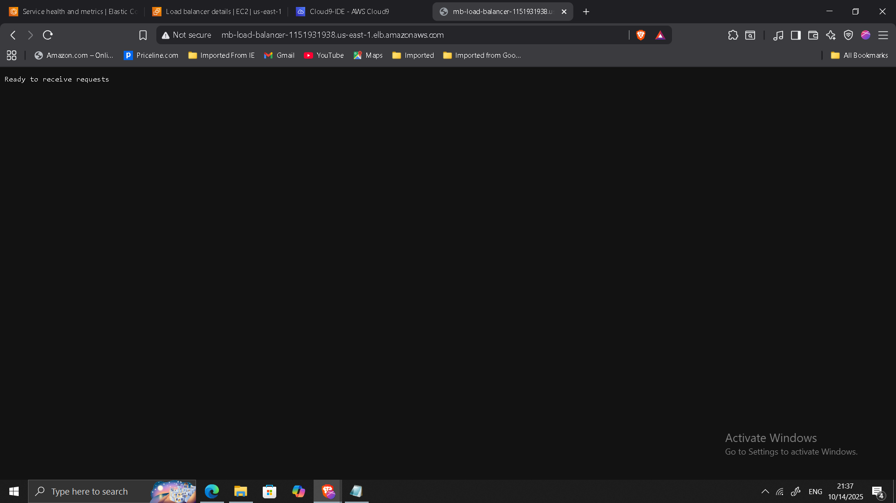
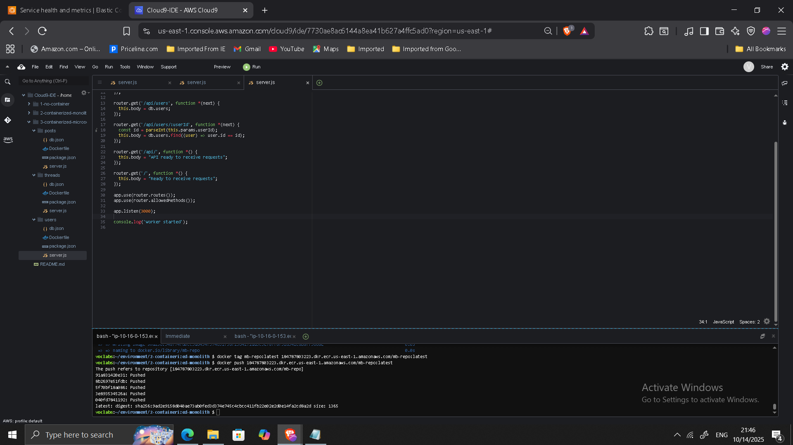
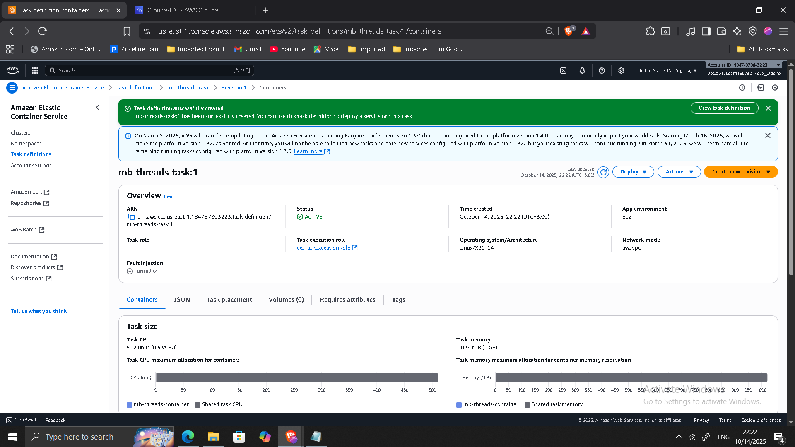
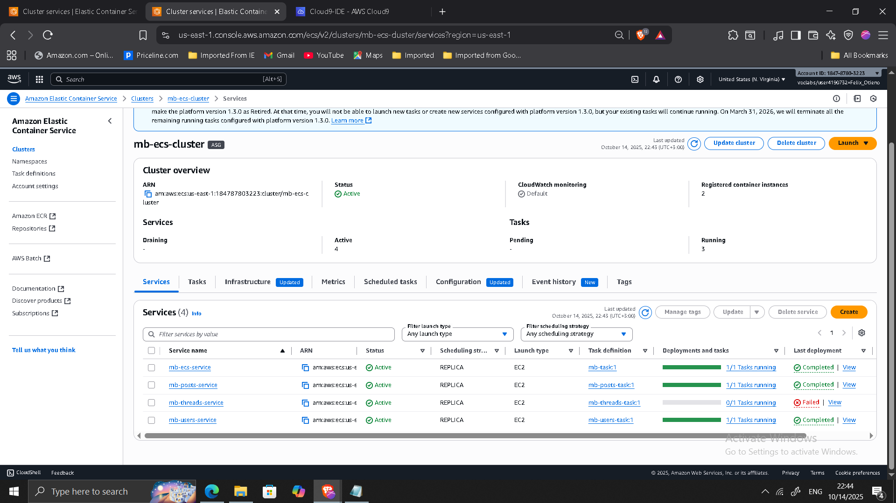
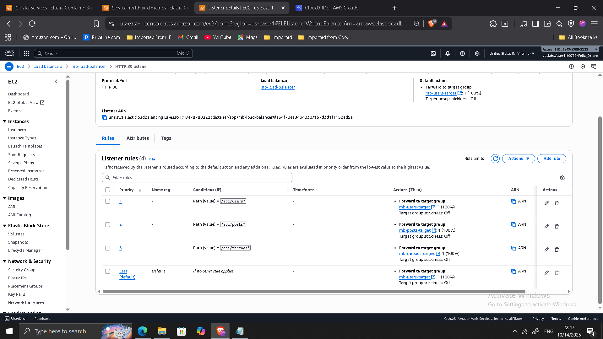

## Project: Microservices Modernization on AWS

**Timeline:** October 2025  
**Role:** Solutions Architect (Cloud-Native Transformation)  
**Skills:** Docker, Amazon ECS (EC2 Launch Type), Amazon ECR, Application Load Balancer, Path-Based Routing, Node.js, Microservices Architecture, Containerization Strategy  

---

### Executive Summary

Led the transformation of a monolithic Node.js message board application into a containerized microservices-based architecture deployed on Amazon ECS.

The modernization initiative introduced:

- Docker-based containerization
- Service decomposition into independent microservices
- Amazon ECR for container image management
- Amazon ECS for orchestration
- Application Load Balancer with path-based routing
- Independent scaling and deployment of services

---

## Business Context

The original application was implemented as a single monolithic Node.js service. While functional, the architecture presented enterprise limitations:

- Tight coupling between components
- Limited deployment flexibility
- Reduced fault isolation
- Scaling entire application instead of individual services

The objective was to redesign the system into independently deployable, containerized microservices orchestrated in a cloud-native environment.

---

## Phase 1: Baseline Monolith Deployment

- Deployed the Node.js monolithic application in AWS Cloud9.
- Installed required dependencies.
- Validated RESTful API endpoints.

---

## Phase 2: Containerizing the Monolith

- Created Dockerfile using `node:alpine`
- Removed cluster logic (ECS manages scaling)
- Built container image locally
- Pushed image to Amazon ECR

Example build:

    docker build -t mb-repo .
    docker tag mb-repo:latest <ECR-URI>/mb-repo:latest
    docker push <ECR-URI>/mb-repo:latest

---

## Phase 3: Deploying the Containerized Monolith to ECS

- Created ECS cluster (`mb-ecs-cluster`)
- Provisioned EC2 instances
- Created task definition
- Deployed ECS service behind Application Load Balancer

This validated container-based deployment before service decomposition.

---

## Phase 4: Service Decomposition

The monolith was refactored into three microservices:

- **Users**
- **Threads**
- **Posts**

Each service included:

- Independent `server.js`
- Independent Dockerfile
- Dedicated ECR repository
- Independent ECS task definition

---

## Phase 5: Deploying Microservices to ECS

Each microservice was deployed as:

- Separate ECS task definition
- Independent ECS service
- Dedicated target group
- Shared Application Load Balancer

---

## Application Load Balancer Configuration

Path-based routing rules:

- `/api/users*` → Users service
- `/api/posts*` → Posts service
- `/api/threads*` → Threads service

After validating microservices functionality, the monolithic service was decommissioned.

---

## Validation & Testing

Verified each endpoint independently:

- `/api/users`
- `/api/threads`
- `/api/posts/in-thread/2`

Invalid routes return validation message.

---

## Architectural Impact

The modernization transitioned the system from:

Monolithic architecture  
to  
Distributed microservices architecture

Key improvements:

- Independent scaling per service
- Fault isolation
- Deployment flexibility
- Cloud-native container orchestration
- Improved operational resilience

This project demonstrates hands-on experience with service decomposition, containerization, ECS orchestration, and ALB routing — core capabilities for modern enterprise cloud platforms.

---

[Back to Projects](/projects/)
