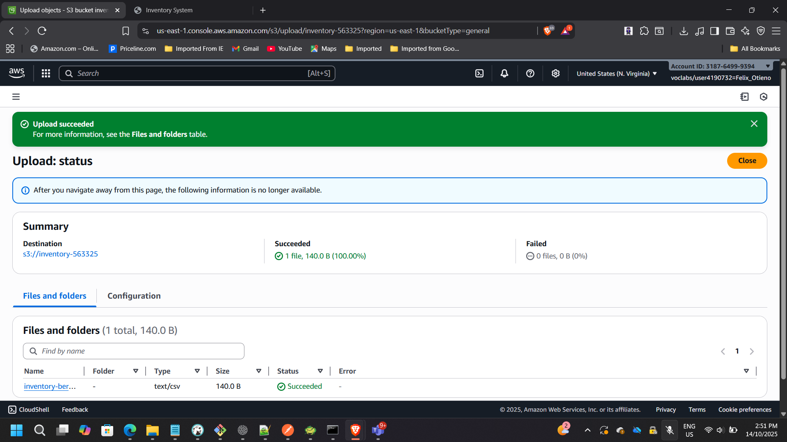
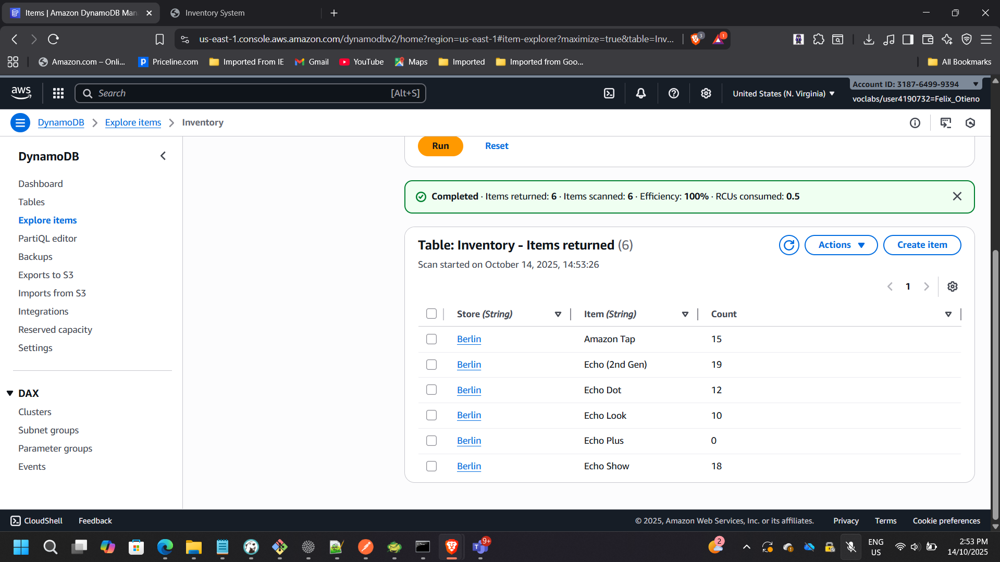
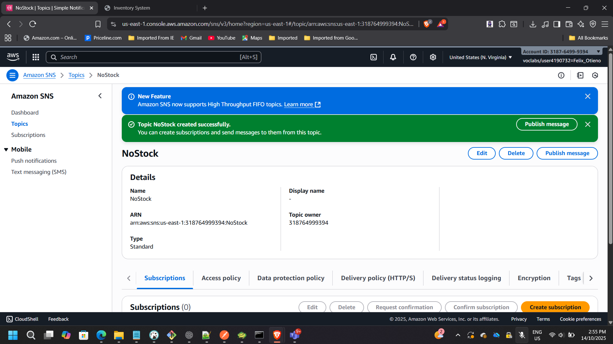
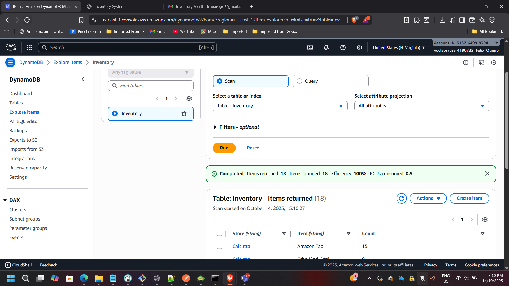

## Project: Serverless Inventory Intelligence on AWS

**Timeline:** September 2025  
**Role:** Solutions Architect (Serverless & Event-Driven Design)  
**Focus:** Event-Driven Automation & Serverless Architecture  
**Services:** AWS Lambda, Amazon S3, Amazon DynamoDB, DynamoDB Streams, Amazon SNS, IAM, CloudWatch  

---

## Executive Summary

Designed and implemented a fully serverless, event-driven inventory management system using AWS managed services.

The architecture eliminates traditional servers and enables:

- Automated data ingestion
- Real-time inventory monitoring
- Event-driven alerting
- Near-zero operational overhead
- Pay-per-use cost efficiency

The system processes uploaded inventory files, updates a DynamoDB table, and automatically sends alerts when stock levels reach zero — demonstrating modern cloud-native design principles.

---

## Architecture Overview

The solution follows an event-driven serverless pattern:

1. Inventory CSV file uploaded to **Amazon S3**
2. S3 triggers **Load-Inventory Lambda**
3. Data inserted into **Amazon DynamoDB**
4. DynamoDB Streams trigger **Check-Stock Lambda**
5. Out-of-stock events published to **Amazon SNS**
6. Email notifications sent to subscribers

---

# Phase 1: Data Ingestion Automation

## Creating the Load-Inventory Lambda Function

A Lambda function named **Load-Inventory** was created to parse CSV files uploaded to S3 and insert inventory data into DynamoDB.

Configuration:
- Runtime: Python 3.x
- Trigger: Amazon S3
- IAM execution role with scoped permissions
- Timeout optimized for CSV parsing workloads

---

## IAM Role Configuration (Least Privilege)

The Lambda execution role was configured following least-privilege principles.

Permissions granted:

**Load-Inventory Lambda**
- S3 Read access
- DynamoDB PutItem access

**Check-Stock Lambda**
- DynamoDB Stream Read access
- SNS Publish permissions

This ensures secure service-to-service communication without over-permissioning.

---

## Configuring Amazon S3 Event Trigger

The S3 bucket was configured to automatically invoke the Load-Inventory Lambda when new objects are created.

Event Type:
- `s3:ObjectCreated:*`

This removes the need for polling or manual processing.

---

## Testing Data Loading

Uploaded a sample inventory CSV file to the S3 bucket.

The Lambda function executed automatically and inserted parsed records into DynamoDB.

Verified that the DynamoDB table populated successfully:

---

# Phase 2: Real-Time Stock Monitoring

## Enabling DynamoDB Streams

To detect inventory changes in real time, DynamoDB Streams were enabled.

Stream View Type:
- `NEW_AND_OLD_IMAGES`

Streams allow change data capture without impacting application performance.

---

## Creating the Check-Stock Lambda Function

A second Lambda function named **Check-Stock** was implemented.

Responsibilities:
- Monitor DynamoDB Stream events
- Detect when item quantity equals zero
- Publish notification message to SNS

---

## Configuring DynamoDB Stream Trigger

The Check-Stock Lambda was attached to DynamoDB Streams using an event source mapping.

This ensures real-time evaluation of inventory changes.

---

# Phase 3: Notification Automation

## Creating the SNS Topic

An Amazon SNS topic named **NoStock** was created to handle alert distribution.

---

## Email Subscription Setup

An email endpoint subscription was configured and confirmed.

This enables automatic alert delivery when inventory reaches zero.

---

# End-to-End Workflow Validation

To validate the full architecture:

1. Uploaded a CSV file containing out-of-stock items
2. Observed Lambda execution via CloudWatch
3. Verified DynamoDB update
4. Confirmed SNS email notification delivery

### Inventory State Transition

### Email Notification Received

---

# Architectural Benefits Achieved

### Event-Driven Automation
No manual intervention required once deployed.

### Scalability
Lambda scales automatically based on file upload volume.

### Fault Isolation
Failures in notification logic do not impact ingestion.

### Cost Optimization
No idle compute resources — pure pay-per-use model.

### Operational Simplicity
Fully managed AWS services reduce maintenance overhead.

---

# Architectural Impact

This project demonstrates:

- Serverless system design
- Event-driven architecture patterns
- IAM least-privilege configuration
- Real-time stream processing
- Cross-service AWS integration
- Observability using CloudWatch
- Secure notification workflows

The solution reflects production-grade serverless design patterns aligned with modern enterprise cloud architecture practices.

---

[Back to Projects](/projects/)
