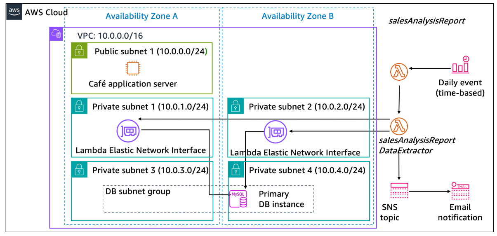
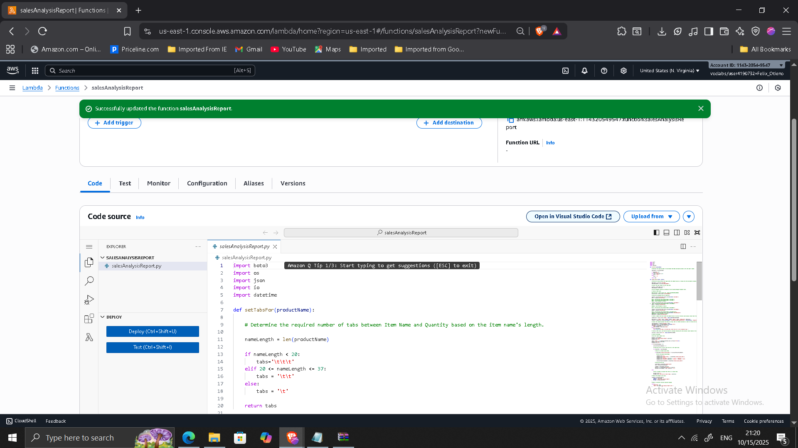
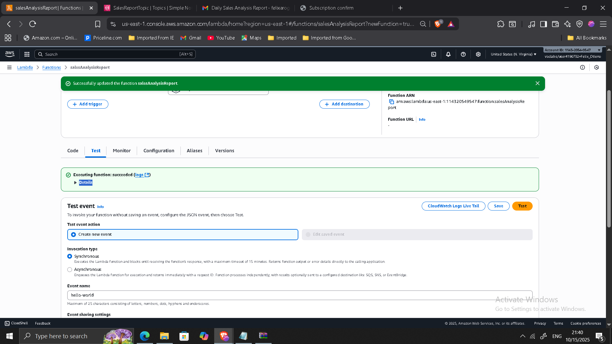
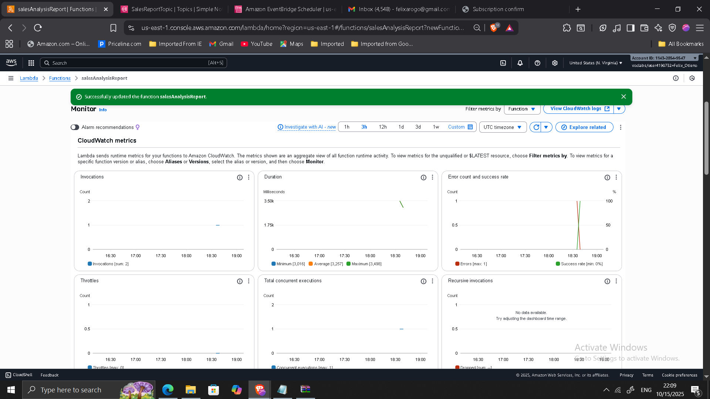

## Project: Serverless Reporting Architecture for Business Automation

**Timeline:** October 2025  
**Role:** Solutions Architect (Serverless & Event-Driven Design)  
**Skills:** AWS Lambda, Amazon SNS, Amazon EventBridge, Amazon RDS, VPC Configuration, IAM Roles, CloudWatch, Serverless Architecture  

---

### Executive Summary

Designed and implemented a fully serverless, event-driven reporting system to replace a performance-heavy cron job running on an EC2 web server.

The modernization introduced:

- AWS Lambda for on-demand execution
- Secure Lambda-to-RDS connectivity within a VPC
- Amazon SNS for report distribution
- Amazon EventBridge for scheduled automation
- CloudWatch for observability

The solution decouples reporting workloads from the production application, reduces operational overhead, and aligns with modern serverless and cost-optimized architecture principles.

---

## Business Context

The café previously relied on a scheduled cron job hosted on an EC2 web server to generate daily sales reports. This approach introduced several challenges:

- Resource contention with production workloads
- Continuous EC2 compute cost regardless of report activity
- Operational maintenance overhead
- Tight coupling between reporting and web tier

The goal of the modernization was to:

- Offload non-critical reporting tasks
- Reduce infrastructure cost through event-driven compute
- Improve scalability and resilience
- Automate report distribution

---

## Architecture Overview

The final architecture consists of:

- **Lambda Function 1: Data Extractor**
  - Runs inside VPC
  - Connects securely to RDS database

- **Lambda Function 2: Sales Report Generator**
  - Processes extracted data
  - Publishes report to SNS

- **Amazon SNS**
  - Distributes daily report via email

- **Amazon EventBridge**
  - Triggers daily report generation

- **Amazon RDS**
  - Source of transactional sales data

---

## Phase 1: VPC-Integrated Lambda for Secure Data Access

Created a security group `LambdaSG` and configured RDS inbound rules to allow MySQL access from Lambda.

Configured Lambda:

- Runtime: Python 3.11
- VPC: Private subnets (Lab VPC)
- Security Group: LambdaSG
- Timeout: 30 seconds
- Memory: 128 MB

This ensured secure private connectivity to the database.

---

## Phase 2: Report Generation Lambda

Created a second Lambda function responsible for:

- Processing sales data
- Generating formatted report
- Publishing results to SNS

Configured environment variable:

    topicARN = <SNS Topic ARN>

---

## Phase 3: SNS Topic for Report Distribution

Created SNS topic:

- Name: SalesReportTopic
- Display name: Sales Report Topic

Configured email subscription and verified endpoint confirmation.

---

## Phase 4: EventBridge Scheduled Automation

Created EventBridge rule with:

- Daily cron expression (UTC)
- Target: salesAnalysisReport Lambda
- IAM Role: mySchedulerRole

Enabled rule to automate daily execution.

---

## Validation & Testing

Tested architecture by:

- Manually invoking Lambda function
- Verifying successful execution in CloudWatch logs
- Confirming receipt of report email
- Validating RDS connectivity from Lambda
- Confirming scheduled rule activation

---

## Architectural Improvements Achieved

### Cost Optimization

- Eliminated persistent EC2 cron job
- Pay-per-invocation compute model
- Reduced idle infrastructure cost

### Decoupled Architecture

- Reporting workload isolated from production environment
- Reduced application server resource contention

### Improved Scalability

- Lambda scales automatically
- No manual infrastructure scaling required

### Enhanced Security

- Private VPC Lambda integration
- IAM role-based access
- No exposed database endpoints

### Operational Simplicity

- Fully managed AWS services
- Built-in logging via CloudWatch
- Automated scheduling with EventBridge

---

## Troubleshooting & Operational Considerations

Resolved common serverless deployment challenges:

- Database connectivity failures due to security group misconfiguration
- Timeout adjustments for database queries
- SNS email subscription verification issues

Monitoring and logs validated correct system behavior.

---

## Architectural Impact

The system transitioned from:

EC2-based cron reporting  
to  
Fully serverless, event-driven automation

Key benefits:

- Lower operational overhead
- Reduced cost
- Improved performance isolation
- Automated reporting workflow
- Cloud-native scalability

This project demonstrates hands-on experience designing serverless architectures, integrating Lambda within VPC environments, and building automated event-driven systems — key capabilities for modern enterprise cloud environments.

---

[Back to Projects](/projects/)
