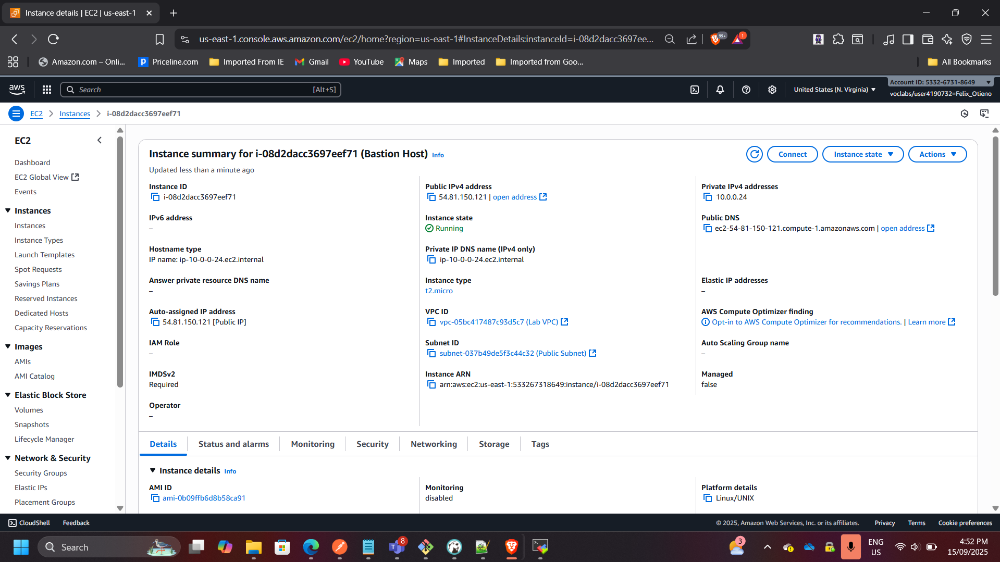
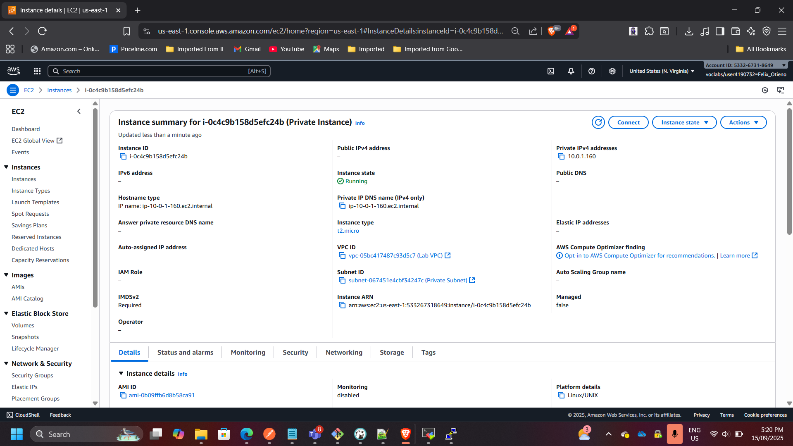
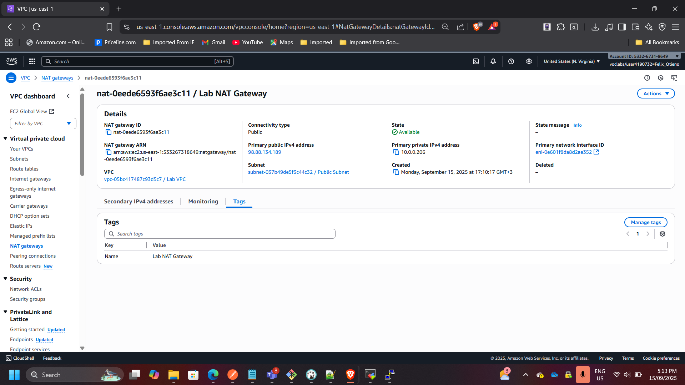
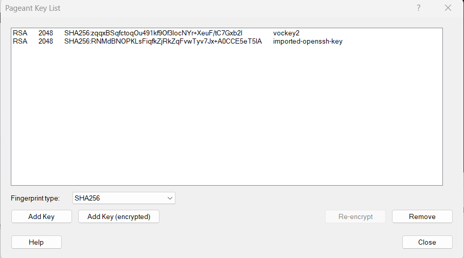
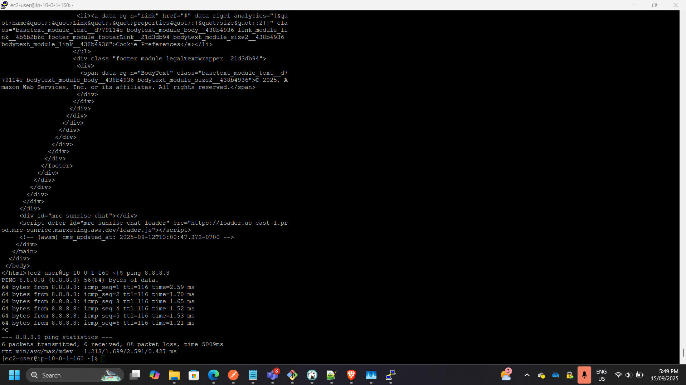
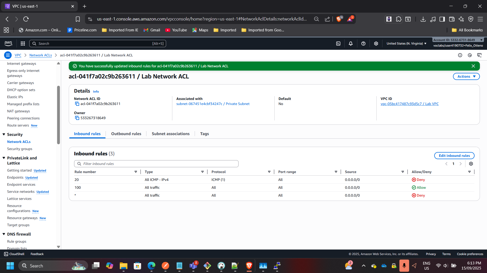
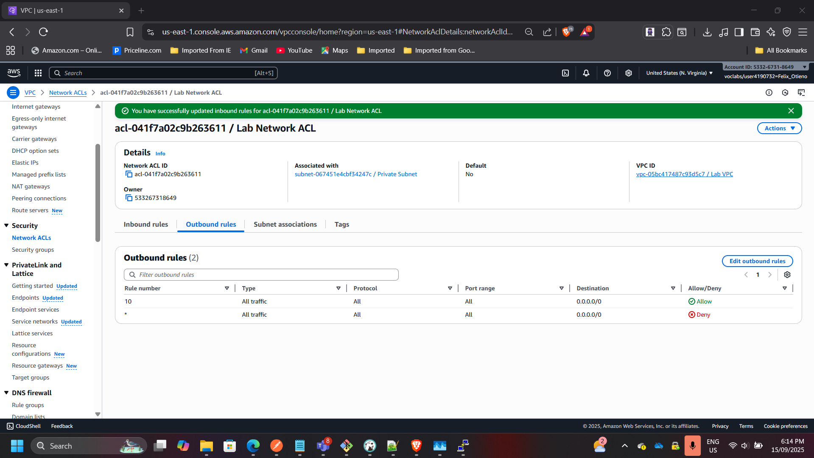

## Project: Secure VPC Networking Environment for Café Application

**Timeline:** September 2025  
**Role:** Cloud Solutions Architect  
**Skills:** AWS VPC, Subnets, Bastion Host, NAT Gateway, EC2, Security Groups, Network ACLs  

### Project Summary
Designed and deployed a secure Amazon VPC architecture for a café’s application. The solution ensured administrative access via a bastion host, placed application workloads in private subnets, and implemented layered security controls with NAT Gateway, security groups, and custom Network ACLs. The project demonstrates hands-on AWS networking, access control, and secure environment design.

---

### Objectives
- Build a VPC with public and private subnets for workload separation.  
- Deploy a bastion host for secure administrative access.  
- Enable outbound internet connectivity for private resources via NAT Gateway.  
- Enforce resource- and subnet-level security with security groups and custom NACLs.  
- Validate connectivity and access restrictions across resources.  

---

### Implementation & Highlights

#### 1. Public Subnet & Bastion Host
- Created a public subnet with route to Internet Gateway.  
- Deployed bastion host EC2 with SSH restricted to admin IP.  

---

#### 2. Private Subnet & Application Server
- Created a private subnet for application workloads.  
- Deployed private EC2 instance, accessible only via bastion host.  

---

#### 3. NAT Gateway for Outbound Connectivity
- Launched a NAT Gateway in the public subnet with Elastic IP.  
- Configured route table to allow private instance outbound access for updates.  

---

#### 4. Secure SSH Passthrough
- Enabled SSH agent forwarding to access private instance via bastion host.  
- Verified successful login and outbound connectivity (ping test).  

---

#### 5. Custom Network ACL
- Created and applied custom NACL to private subnet.  
- Configured rule to block ICMP traffic → verified denial of ping after rule applied.  

---

### Outcome & Impact
- Delivered a secure VPC environment with layered security controls.  
- Achieved isolation of workloads in private subnet while maintaining required internet access.  
- Implemented best practices for administrative access via bastion host.  
- Gained practical skills in designing production-ready AWS VPC architectures.  

---

[Back to Projects](/projects/)
