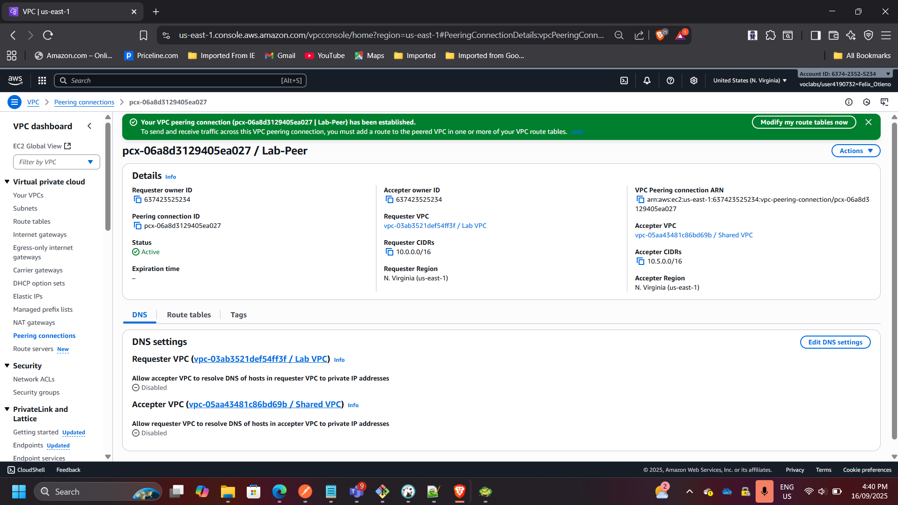
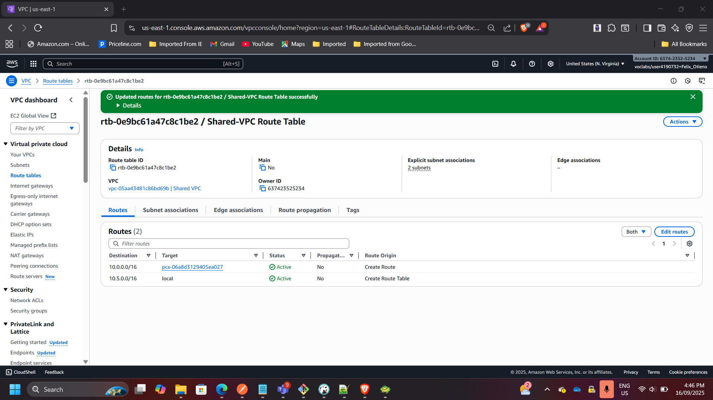
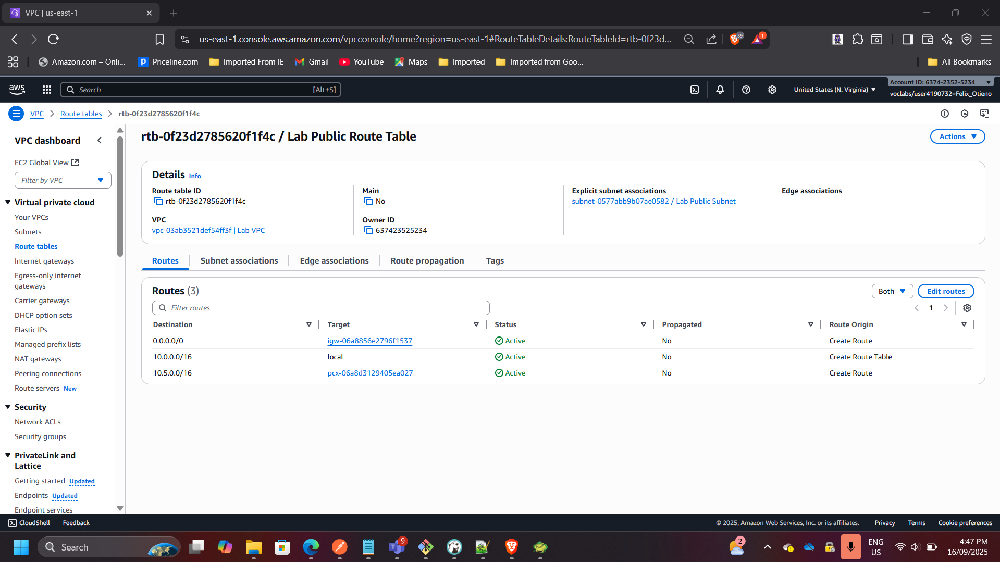
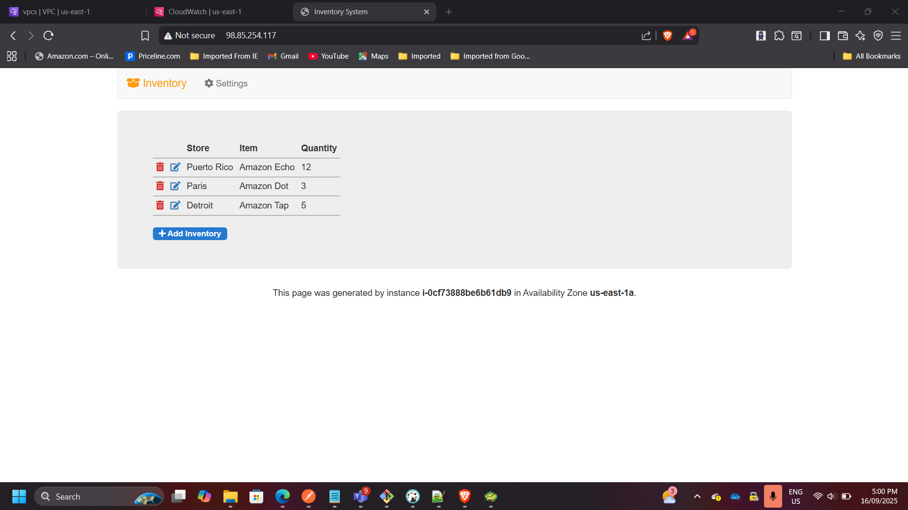
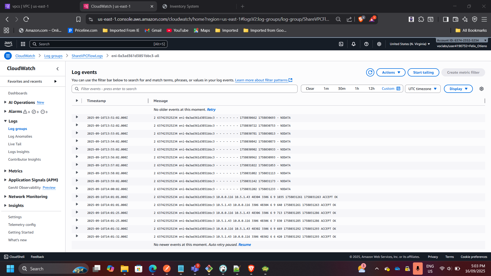

## Project: VPC Peering and Secure Networking in AWS

**Timeline:** September 2025  
**Role:** Solutions Architect & Cloud Engineer  
**Skills:** AWS VPC, Subnets, Route Tables, NAT Gateway, VPC Flow Logs, EC2, RDS, CloudWatch

---

### Project Summary
Designed and implemented secure networking between two Virtual Private Clouds (VPCs) using VPC Peering. The project demonstrates secure traffic routing between application and database tiers across isolated networks. Flow logs were enabled to monitor and validate cross-VPC communication. This solution reflects real-world AWS networking practices for hybrid and multi-tier architectures.

---

### Objectives
- Design and deploy custom VPCs with public and private subnets.  
- Configure Internet Gateway and NAT Gateway for controlled external access.  
- Establish VPC peering to enable cross-VPC communication.  
- Launch and connect EC2 instances to validate connectivity.  
- Use VPC Flow Logs for traffic monitoring and analysis.  

---

### Implementation & Highlights

#### 1. Created Custom VPCs
- Deployed two custom VPCs (`Lab VPC` and `Shared VPC`) with non-overlapping CIDR blocks.  
- Configured routing tables for public and private subnets.

---

#### 2. Configured Subnets & Gateways
- Created public and private subnets in each VPC.  
- Deployed Internet Gateway and NAT Gateway for controlled access.  
- Verified routing for both internal and internet-bound traffic.

---

#### 3. Established VPC Peering
- Configured VPC peering between Lab VPC and Shared VPC.  
- Updated route tables to allow private traffic flow between VPCs.  
- Verified secure database connectivity without using the internet.

---

#### 4. Tested Application Connectivity
- Launched a public EC2 instance hosting an inventory app in the Lab VPC.  
- Connected the app to an RDS database in the Shared VPC using private endpoints.  
- Application successfully retrieved and displayed data.

---

#### 5. Enabled and Analyzed VPC Flow Logs
- Enabled flow logs for the Shared VPC.  
- Sent logs to CloudWatch for monitoring.  
- Observed `ACCEPT` traffic on port **3306 (MySQL)** between app and database instances.

---

### Outcome & Impact
- Built a secure, production-style networking environment in AWS.  
- Demonstrated how to connect application and database tiers across VPCs without exposing data to the internet.  
- Gained practical skills in VPC design, subnet isolation, routing, and traffic monitoring.  
- Produced a reusable reference for secure AWS networking architectures.  

---

[Back to Projects](/projects/)
