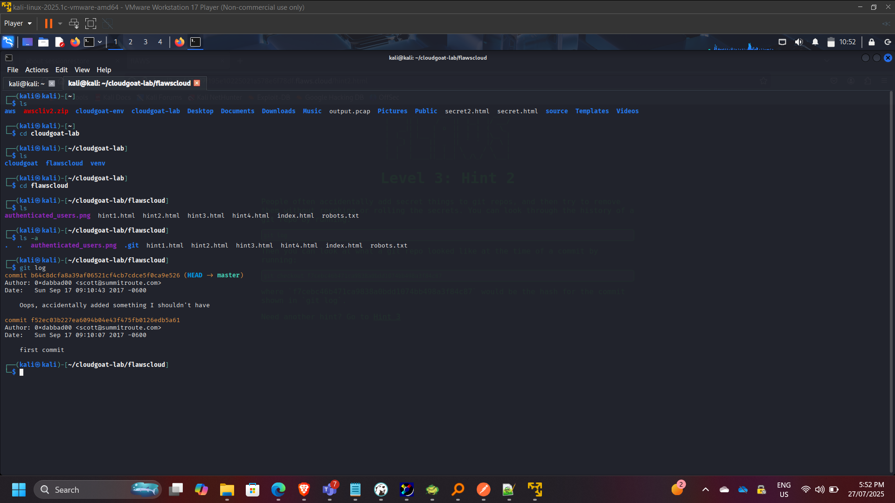
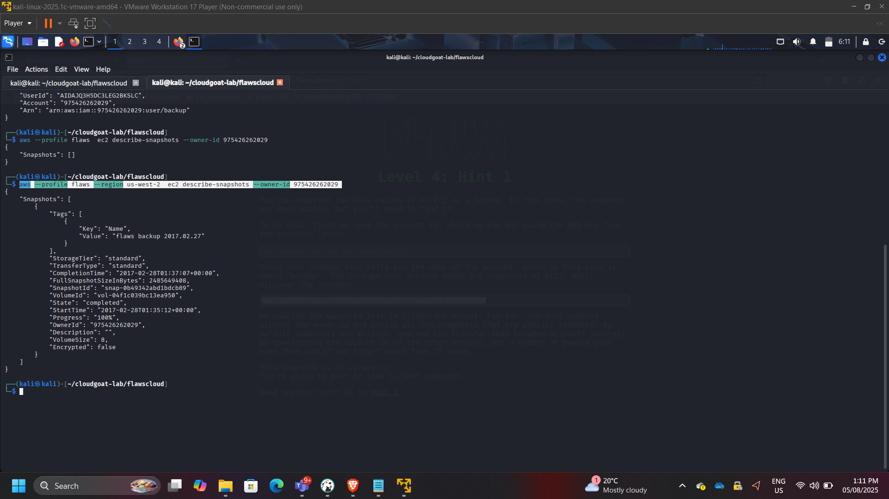
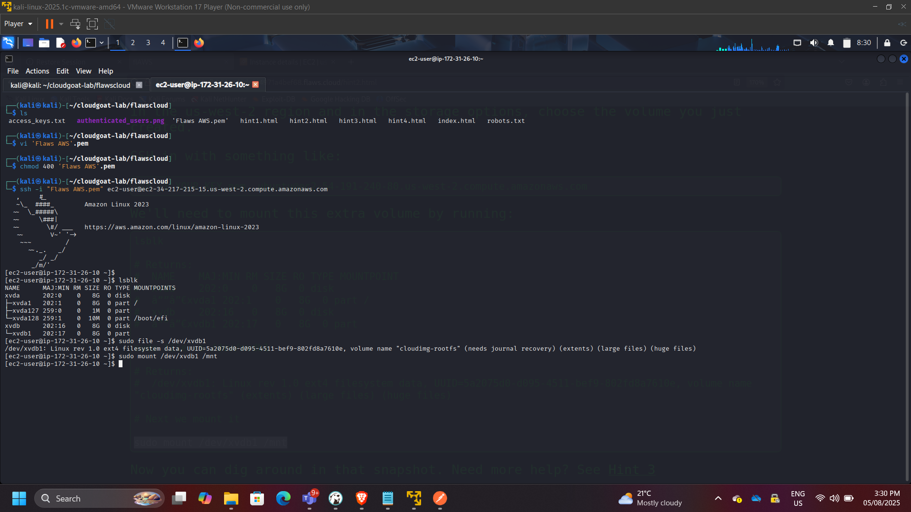
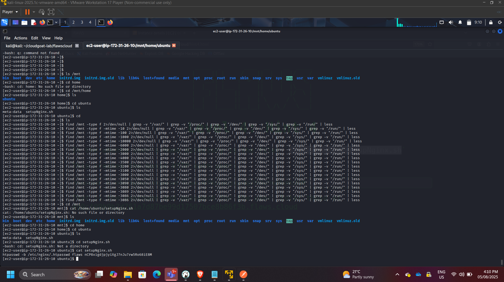
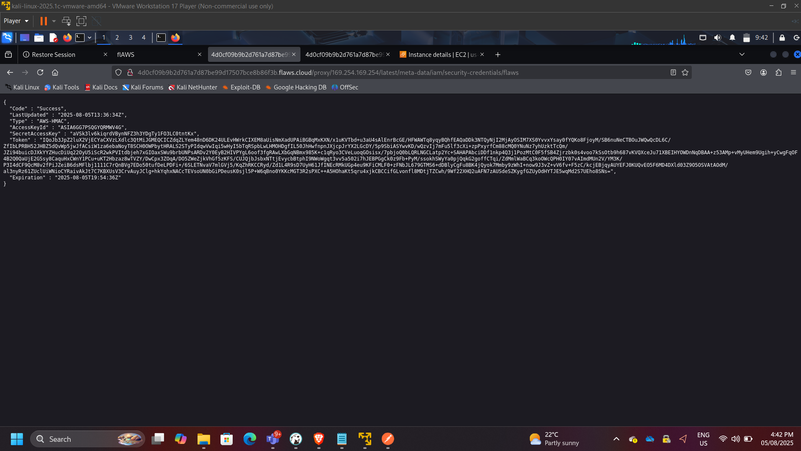
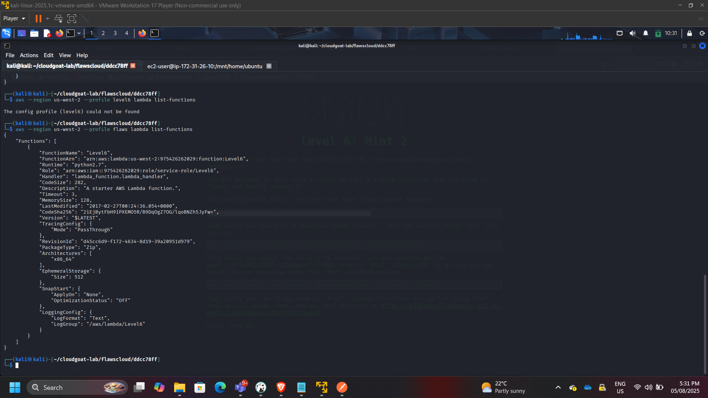

## Project: AWS Cloud Security Posture & Misconfiguration Assessment

**Timeline:** August 2025  
**Role:** Cloud Security Analyst (Offensive Security & Risk Analysis)  
**Focus:** IAM Privilege Escalation, Data Exposure, Metadata Exploitation, Cloud Reconnaissance  
**Tools:** AWS CLI, Git, Linux, EC2, IAM, S3, EBS, Lambda  

---

## Executive Summary

Conducted a structured security assessment of intentionally misconfigured AWS environments to identify and analyze common cloud security weaknesses.

The engagement simulated real-world cloud attack vectors, including:

- Public S3 exposure  
- IAM credential leakage  
- Git history secret discovery  
- Snapshot data recovery  
- Metadata service exploitation (SSRF)  
- Privilege discovery via SecurityAudit permissions  

The objective was to evaluate attack paths, identify privilege escalation vectors, and derive remediation strategies aligned with AWS security best practices.

---

## Assessment Scope

The assessment covered:

- Amazon S3 storage exposure  
- IAM policy misconfiguration  
- EC2 snapshot recovery risks  
- Instance metadata exploitation  
- Lambda enumeration  
- API Gateway discovery  
- Cross-service privilege chaining  

---

# Phase 1: Cloud Reconnaissance & Public Exposure

Performed DNS analysis and AWS ownership verification.

Commands used:

dig flaws.cloud  
nslookup flaws.cloud  
aws s3 ls s3://flaws.cloud/ --no-sign-request  

Identified publicly accessible S3 buckets allowing anonymous listing and download.

### Security Risks Identified

- Unrestricted bucket listing  
- Sensitive file exposure  
- Lack of S3 Block Public Access enforcement  

---

# Phase 2: Unauthorized Authenticated Access

Assessed misuse of IAM credentials and profile-based access.

aws s3 ls s3://level2-c8b217a33fcf1f839f6f1f73a00a9ae7.flaws.cloud --profile bilbo  

Confirmed improperly scoped IAM policies allowed unauthorized data access.

### Security Risks Identified

- Excessive S3 permissions  
- Absence of least-privilege enforcement  
- Weak credential governance  

---

# Phase 3: Credential Leakage via Git History

Downloaded exposed repository content and analyzed commit history.

git log  
git checkout f52ec03b227ea6094b04e43f475fb0126edb5a61  
cat access_keys.txt  

Configured compromised credentials:

aws configure --profile leakkeys  
aws --profile leakkeys s3 ls  

### Security Risks Identified

- Hardcoded credentials in version control  
- No secret scanning controls  
- Lack of key rotation enforcement  
- Over-permissioned IAM users  

---

# Phase 4: EBS Snapshot Data Recovery

Enumerated publicly shared EBS snapshots:

aws ec2 describe-snapshots --owner-id 975426262029 --region us-west-2  

Restored snapshot into a controlled AWS environment and mounted it to an EC2 instance.

Recovered sensitive configuration files and credentials from the mounted filesystem.

### Security Risks Identified

- Public snapshot sharing  
- Absence of encryption enforcement  
- Improper snapshot governance  
- Exposure of sensitive configuration data  

---

# Phase 5: Metadata Service Exploitation (SSRF)

Exploited SSRF vulnerability to access EC2 Instance Metadata Service.

Accessed:

http://169.254.169.254/latest/meta-data/iam/security-credentials/

Extracted temporary IAM credentials.

Used credentials to access restricted S3 resources.

### Security Risks Identified

- IMDSv1 exposure  
- Role over-permissioning  
- Lack of metadata access restrictions  
- Inadequate instance isolation  

---

# Phase 6: Privilege Discovery via SecurityAudit Access

Performed IAM policy inspection and service enumeration.

aws iam get-policy  
aws iam get-policy-version  
aws lambda list-functions --region us-west-2  

Enumerated Lambda functions and additional services.

Mapped potential privilege escalation pathways.

### Security Risks Identified

- Policy version mismanagement  
- Indirect privilege escalation  
- Excessively permissive audit roles  

---

# Attack Chain Summary

The assessment demonstrated chained exploitation:

Public Exposure → Credential Leak → Role Assumption → Snapshot Recovery → Metadata Exploitation → Policy Enumeration → Service Discovery

This highlights how isolated misconfigurations compound into enterprise-scale compromise.

---

# Security Remediation Recommendations

- Enforce S3 Block Public Access globally  
- Implement IAM least-privilege policies  
- Enforce IMDSv2  
- Encrypt EBS volumes & restrict snapshot sharing  
- Use AWS Secrets Manager  
- Enable organization-wide CloudTrail logging  
- Implement AWS Config compliance rules  
- Apply SCP guardrails via AWS Organizations  
- Automate security posture monitoring  

---

# Security Competencies Demonstrated

- Cloud reconnaissance  
- IAM privilege escalation analysis  
- Snapshot data recovery investigation  
- Metadata exploitation awareness  
- Policy evaluation & governance  
- Cross-service attack path mapping  
- Risk mitigation planning  

---

## Conclusion

This assessment demonstrated how common AWS misconfigurations can enable privilege escalation and data exposure when governance controls are absent.

The exercise strengthened expertise in:

- Cloud attack surface analysis  
- Identity and access security  
- Metadata risk modeling  
- Storage exposure mitigation  
- Zero Trust cloud architecture principles  

---

[Back to Projects](/projects/)
