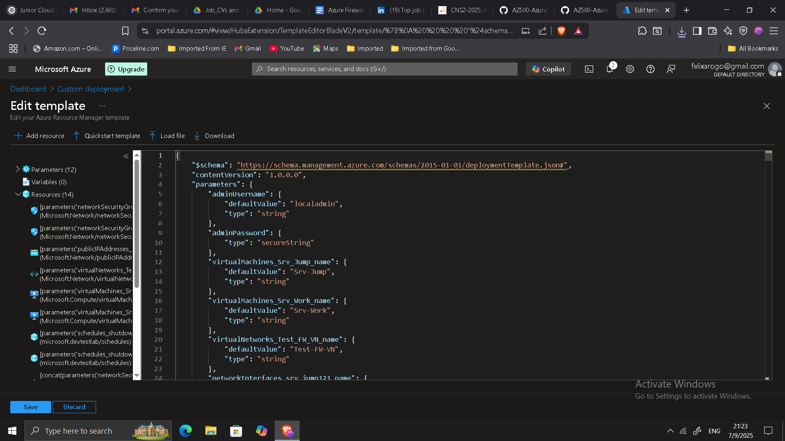
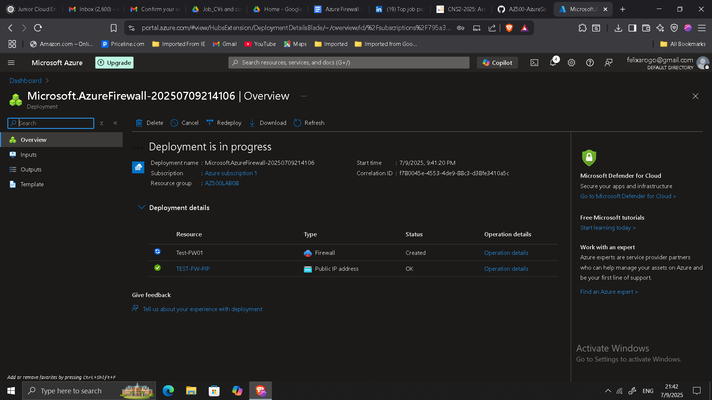
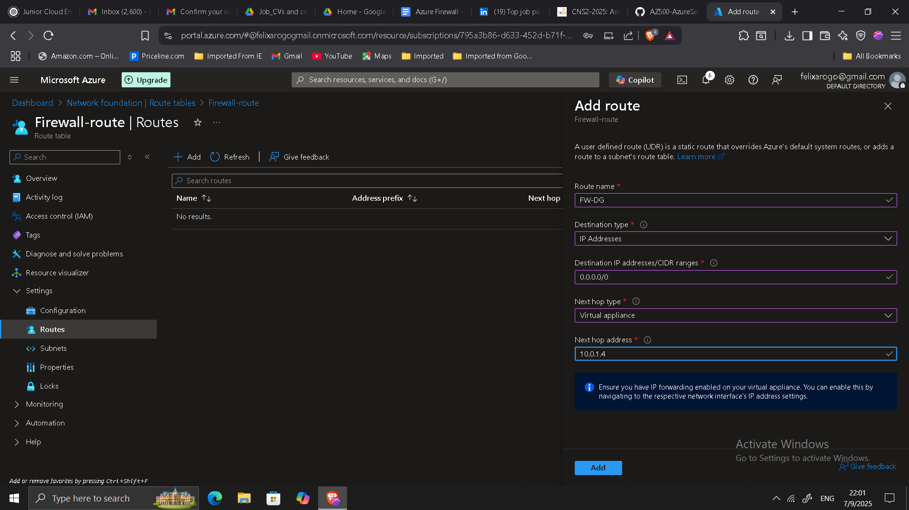
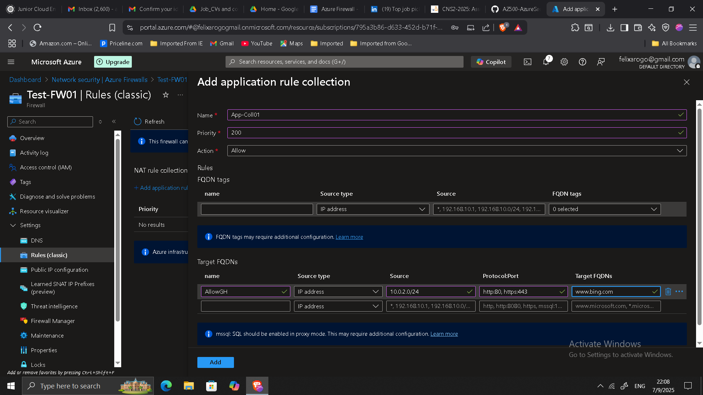
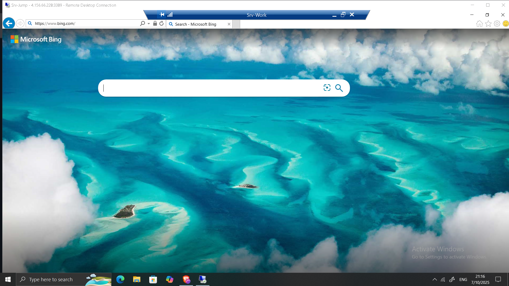
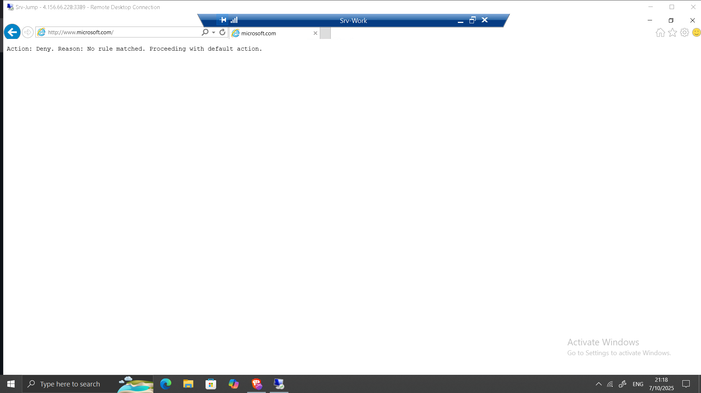

## Implementing Network Security with Azure Firewall

**Timeline:** July 2025  
**Role:** Cloud Security Engineer  
**Skills:** Azure Firewall, Network Rules, Application Rules, DNS Configuration, Route Tables, Azure Virtual Networks

---

### Project Summary

This project involved deploying and testing **Azure Firewall** to enforce network security controls within a virtual network. The goal was to centrally manage and filter both inbound and outbound traffic across Azure subnets using application and network rules.  

The implementation demonstrated how **Azure Firewall** enhances security visibility and control by integrating routing, DNS filtering, and traffic inspection into one managed service.

---

### Objectives

- Deploy an Azure Firewall and connect it to a hub-spoke virtual network topology.  
- Create **route tables** to direct traffic through the firewall.  
- Implement **application rules** to restrict outbound traffic to approved domains.  
- Configure **network rules** to allow specific IP and port-based communication.  
- Set up **custom DNS servers** to enhance name resolution control.  
- Validate that the firewall correctly filters and logs traffic as intended.

---

### Implementation & Highlights

#### 1. Lab Environment Deployment
- Used an **ARM template** to automate setup of the environment, including:
  - Virtual Network with **Hub**, **Jump**, and **Workload** subnets.
  - Two virtual machines: one for administration (`Srv-Jump`) and one for testing (`Srv-Work`).
- Verified connectivity and ensured subnets were properly segmented.

---

#### 2. Azure Firewall Deployment
- Deployed **Azure Firewall** into the `AzureFirewallSubnet`.  
- Configured key parameters such as name, public IP, and virtual network integration.  
- Verified successful deployment and recorded the private IP: **10.0.1.4**.

---

#### 3. Routing Configuration
- Created a **route table** and associated it with the workload subnet.  
- Added a **default route (0.0.0.0/0)** pointing to the firewall’s private IP to enforce traffic inspection.  
- Verified route propagation and connectivity from the workload VM.

---

#### 4. Application and Network Rules
- Created an **Application Rule Collection** allowing access only to specific domains, such as `www.bing.com`.  
- Implemented a **Network Rule Collection** for IP-based traffic (e.g., RDP).  
- Tested both rule sets by accessing allowed and blocked destinations from `Srv-Work`.

---

#### 5. DNS Configuration and Testing
- Configured the workload VM to use **custom DNS servers** to resolve outbound connections.  
- Verified domain resolution behavior and observed traffic logs.  
- Tested access:
  - ✅ `www.bing.com` accessible  
  - ❌ `www.microsoft.com` blocked by application rule.

---

### Results & Impact

- Successfully implemented centralized **traffic filtering** and **application control** using Azure Firewall.  
- Enhanced visibility into allowed and denied traffic across subnets.  
- Strengthened **network segmentation** and reduced exposure to unauthorized outbound access.  
- Demonstrated a practical approach to **zero-trust network architecture** in Azure.

---

### Tools & Services Used

- **Azure Firewall** – Centralized network traffic control and inspection  
- **Azure Virtual Network (VNet)** – Segmentation of workload and management layers  
- **Azure Route Tables** – Custom routing and firewall redirection  
- **Application & Network Rule Collections** – Policy-based filtering  
- **DNS Configuration** – Controlled name resolution and domain-level filtering  

---

### Outcome

The project provided hands-on experience designing and enforcing secure, rule-based network access in Azure. By combining routing, application control, and DNS filtering, the implementation demonstrated the core capabilities of **Azure Firewall** as a managed, scalable security layer for cloud workloads.

---

[Back to Security Projects](/projects/security/)
