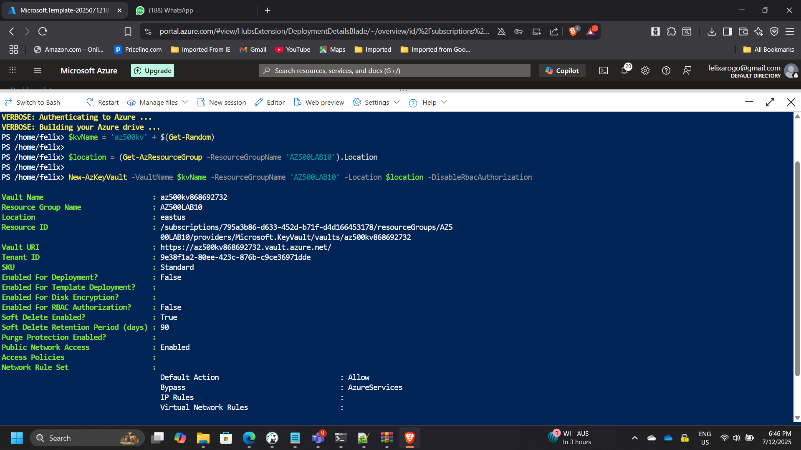
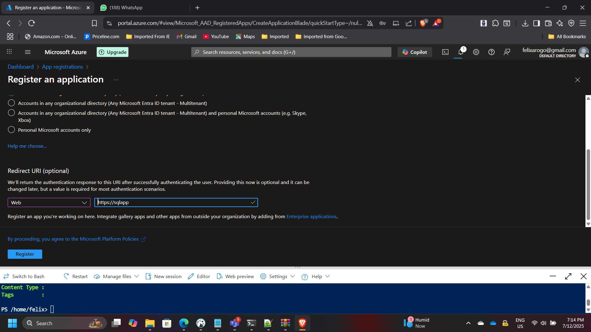
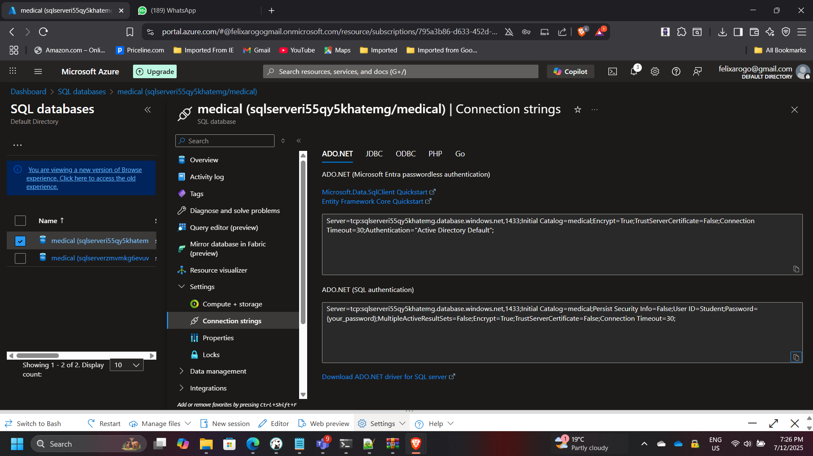

## Implementing Data Encryption with Azure Key Vault and SQL Always Encrypted

**Timeline:** July 2025  
**Role:** Cloud Security Engineer  
**Skills:** Azure Key Vault, Azure SQL Database, Always Encrypted, ARM Templates, Microsoft Entra ID, Data Protection

---

### Project Summary

This project focused on enhancing **data protection and encryption** in Microsoft Azure by integrating **Azure Key Vault** with the **Always Encrypted** feature of Azure SQL Database.  
The goal was to ensure sensitive data remains encrypted both at rest and in use, while securing encryption keys and secrets through centralized key management.

The solution included deploying infrastructure from an ARM template, configuring a Key Vault with encryption keys and secrets, enabling secure application access via **Microsoft Entra ID**, and demonstrating encryption in a live SQL database application.

---

### Objectives

- Deploy a virtual machine and SQL Database using an ARM template.  
- Configure **Azure Key Vault** for secure key and secret management.  
- Implement **Always Encrypted** in Azure SQL Database.  
- Enable secure **application authentication** using Microsoft Entra ID.  
- Demonstrate data encryption in a real-world data-driven application.

---

### Implementation & Highlights

#### 1. Deploying Base Infrastructure

- Deployed the Azure environment using an ARM template.  
- Created an **Azure VM** for management tasks and an **Azure SQL Database** for the encrypted data workload.  
- Configured networking and access permissions to support secure connections.

---

#### 2. Configuring Azure Key Vault

- Created a new Key Vault:  
  - **Name:** `az500kv868692732`  
  - **Vault URI:** `https://az500kv868692732.vault.azure.net/`  
- Configured **access policies** to grant least-privilege permissions to specific users and applications.  
- Added a **software-protected key** (`MyLabKey`) and a **secret** used for application authentication.

---

#### 3. Application Integration and Authentication

- Registered a client application in **Microsoft Entra ID**:  
  - **Client ID:** `9bd05126-1724-4d05-bcd6-dc73c44efea1`  
  - Created client secret: `[REDACTED]`  
- Configured a **Key Vault access policy** allowing the application to retrieve keys and secrets securely.

---

#### 4. Database Configuration and Encryption Setup

- Connected to the SQL Server (`sqlserveri55qy5khatemg.database.windows.net`) via **SQL Management Studio 19** from the Azure VM.  
- Created a new database and **“Patients”** table with sensitive columns like SSN and birth date.  
- Applied **column encryption** using Always Encrypted with Key Vault-managed keys.  

---

#### 5. Demonstrating Key Vault Integration

- Executed the data-driven application from Visual Studio.  
- Verified successful retrieval and use of the encryption key from Key Vault.  
- Observed encrypted data within SQL Management Studio — confirming that sensitive fields remained unreadable to unauthorized users.

---

### Results & Impact

- Ensured **encryption of sensitive data** both at rest and in use.  
- Centralized key and secret management through Azure Key Vault.  
- Implemented **role-based access control** and secure authentication with Entra ID.  
- Strengthened compliance with **data protection and privacy standards**.  
- Demonstrated a secure development pattern for data-driven applications in Azure.

---

### Tools & Services Used

- **Azure Key Vault** – Secure key and secret storage  
- **Azure SQL Database** – Always Encrypted data protection  
- **Microsoft Entra ID** – Application authentication and access control  
- **Visual Studio 2019 / SSMS 19** – Data-driven app and database management  
- **ARM Templates** – Automated deployment of infrastructure

---

### Outcome

This project demonstrated **defense-in-depth** in data protection by integrating Azure Key Vault with SQL Always Encrypted.  
It proved the effectiveness of **application-based key retrieval**, **centralized key management**, and **end-to-end encryption** for sensitive workloads — ensuring compliance and security alignment with **Microsoft’s Zero Trust principles**.

---

[Back to Security Projects](/projects/security/)
