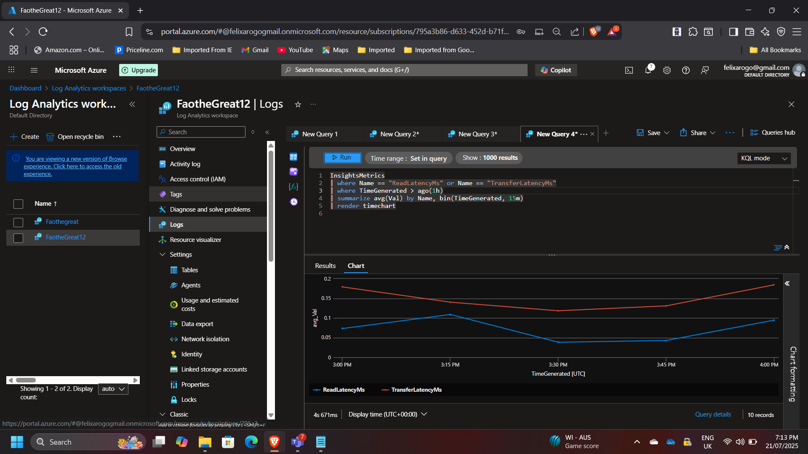
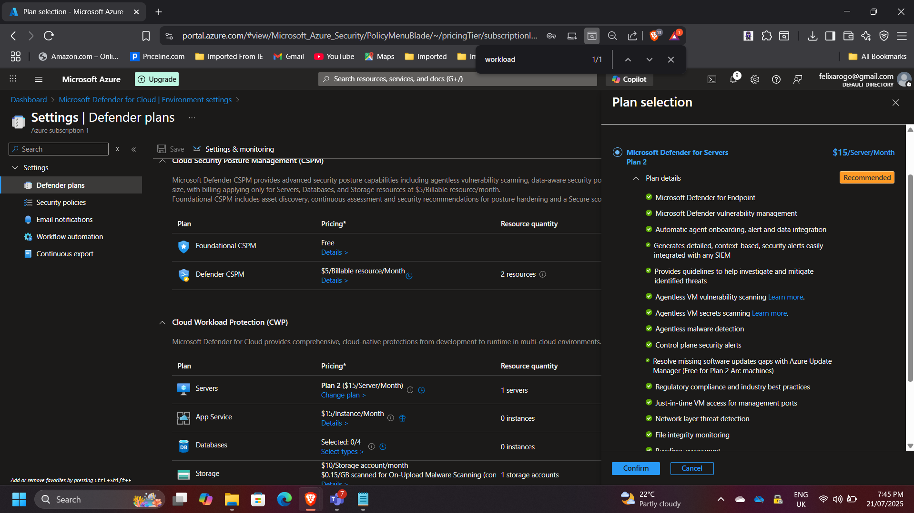
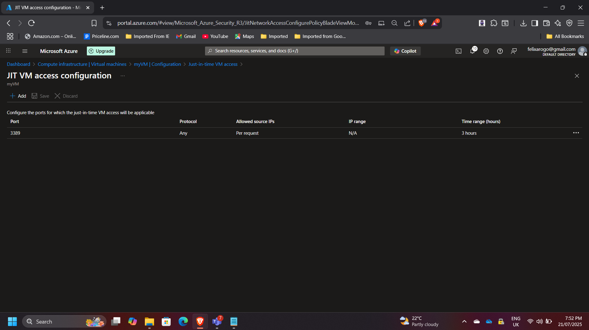
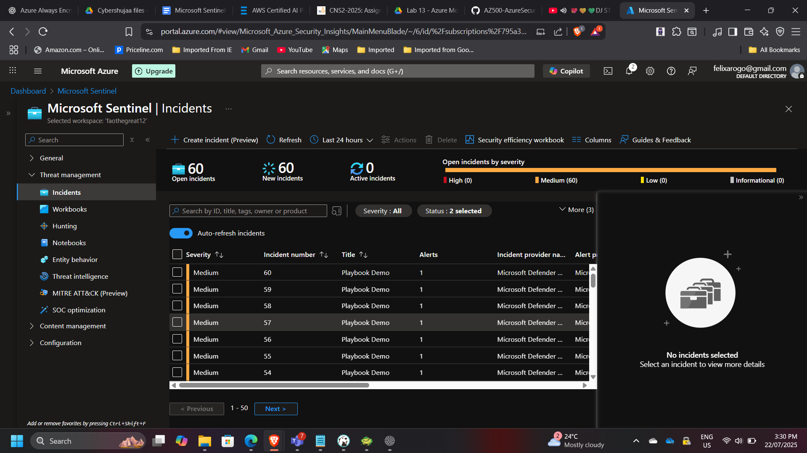

## Unified Security Monitoring and Automation in Azure

**Timeline:** August 2025  
**Role:** Cloud Security Engineer  
**Skills:** Microsoft Sentinel, Azure Monitor, Defender for Cloud, KQL, Logic Apps, JIT VM Access

---

### Project Summary

This project integrates **Azure Monitor**, **Microsoft Defender for Cloud**, and **Microsoft Sentinel** to build a unified, automated security operations framework in Microsoft Azure. The implementation focused on three key pillars:  
1. Collecting and analyzing telemetry data from Azure VMs,  
2. Enabling advanced threat protection through Defender for Servers, and  
3. Automating incident detection and response with Sentinel playbooks.  

The outcome is a resilient and secure Azure environment with centralized visibility, intelligent analytics, and proactive remediation workflows.

---

### Objectives

- Deploy and monitor Azure virtual machines with Azure Monitor and Log Analytics.  
- Enable **Microsoft Defender for Servers Plan 2** for threat detection and secure configuration management.  
- Configure **Just-in-Time (JIT) VM Access** to reduce attack surface on management ports.  
- Implement **Microsoft Sentinel** to collect security data, create analytic rules, and automate incident response with Logic Apps playbooks.  
- Validate integration and end-to-end security visibility across Azure resources.

---

### Implementation & Highlights

#### 1. Azure Monitor and Log Analytics
- Deployed an Azure VM (`myVM`) and created a **Log Analytics Workspace** for centralized data collection.  
- Installed the **Azure Monitor Agent (AMA)** extension on the VM.  
- Configured data collection rules for performance and event logs.  
- Queried collected data using **Kusto Query Language (KQL)** to analyze metrics like disk latency and CPU usage.  

---

#### 2. Microsoft Defender for Cloud
- Enabled **Defender for Servers Plan 2** on the subscription to enhance VM protection.  
- Verified vulnerability assessments and endpoint protection recommendations.  
- Integrated Defender data into Log Analytics for unified visibility.  

---

#### 3. Just-in-Time (JIT) VM Access
- Configured JIT access for the VM to restrict inbound management traffic.  
- Defined approval-based access requests with time-bound validity.  
- Validated the setup by requesting access and confirming controlled RDP/SSH availability.  

---

#### 4. Microsoft Sentinel Integration
- Onboarded **Microsoft Sentinel** to the Log Analytics workspace.  
- Connected **Azure Activity Logs** as a data source to capture operational events.  
- Created custom **analytic rules** for anomaly detection, such as unauthorized VM access attempts.  
- Developed an automated **Logic App playbook** to trigger email notifications when high-severity incidents were detected.  
- Simulated an incident to verify end-to-end response automation.  

---

### Results & Impact

- Achieved **centralized monitoring** and **threat detection** across the Azure environment.  
- Reduced management port exposure using JIT access.  
- Automated alerting and response workflows through Sentinel playbooks.  
- Improved overall **security posture** and operational visibility.  

---

### Tools & Services Used

- **Azure Monitor & Log Analytics** – Data collection and performance insights  
- **Microsoft Defender for Cloud** – Threat protection and secure configuration  
- **Microsoft Sentinel** – SIEM/SOAR analytics and incident automation  
- **Azure Logic Apps** – Playbook-driven automated response  
- **Kusto Query Language (KQL)** – Custom telemetry and security analytics  

---

### Outcome

The project successfully implemented a modern, cloud-native **Security Operations Center (SOC)** model in Azure. It demonstrated practical expertise in **monitoring**, **threat protection**, and **automated remediation**, aligned with best practices from the **Microsoft Cloud Security Benchmark**.

---

[Back to Security Projects](/projects/security/)
