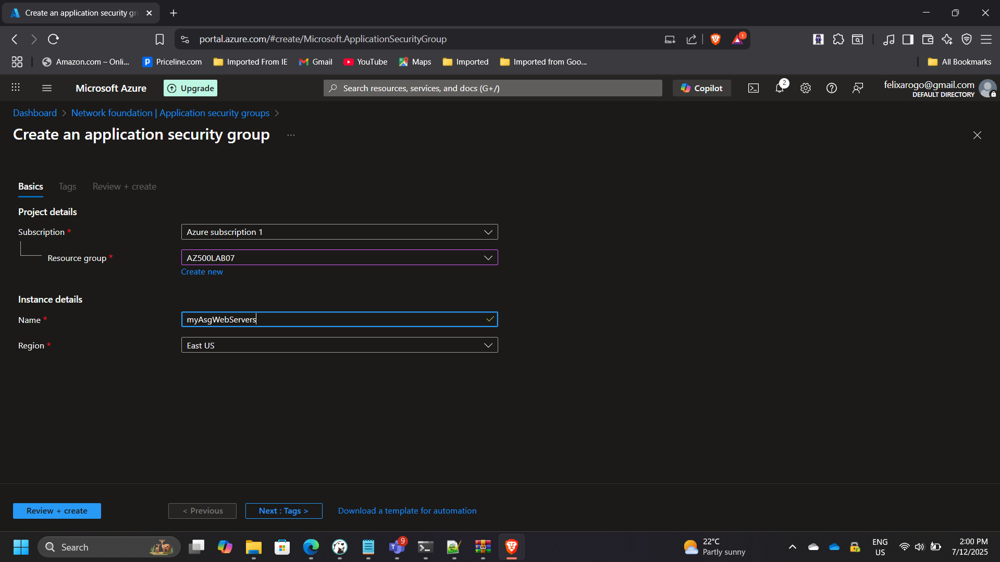
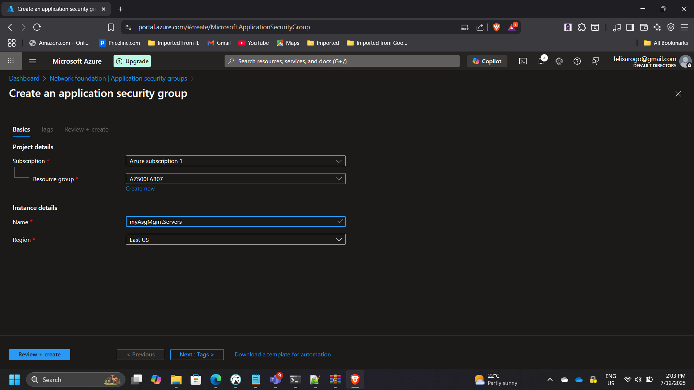
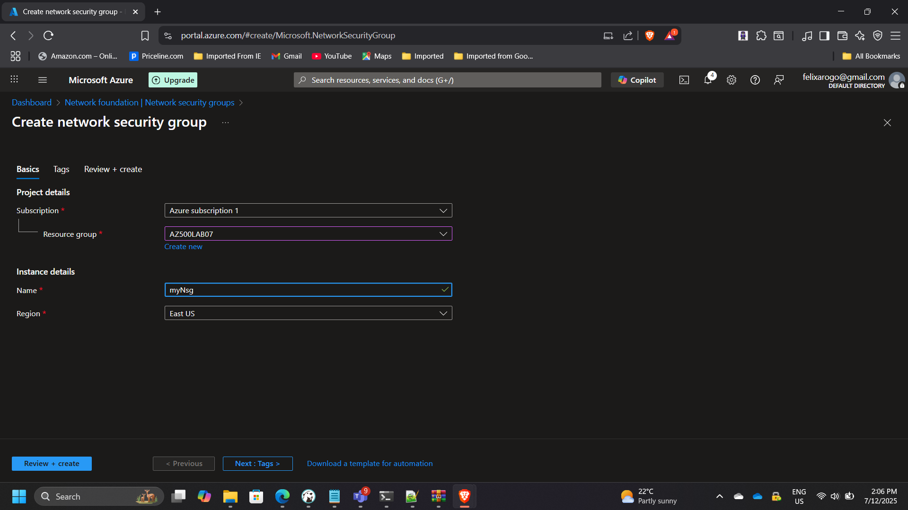
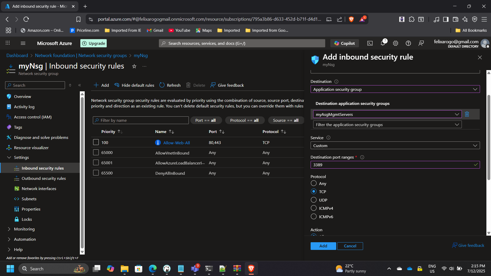
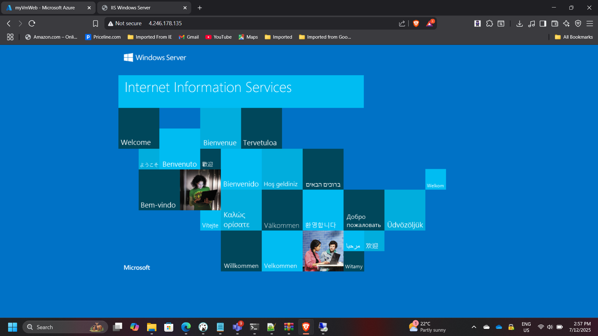

## Implementing Network Security with Azure NSGs and ASGs

**Timeline:** July 2025  
**Role:** Cloud Security Engineer  
**Skills:** Azure Networking, Network Security Groups (NSG), Application Security Groups (ASG), RDP Access Control, Network Segmentation

---

### Project Summary

This project focused on designing and implementing **secure network segmentation** in Microsoft Azure using **Network Security Groups (NSGs)** and **Application Security Groups (ASGs)**.  
The goal was to create a **tiered virtual network** that separates web and management workloads, enforcing **least-privilege access** through layered security rules.  

By leveraging ASGs, security rules could be applied dynamically to VM groups without managing individual IPs — achieving a scalable and easily maintainable network security model.

---

### Objectives

- Design a virtual network with distinct web and management tiers.  
- Configure **ASGs** to logically group VMs based on their roles.  
- Apply **NSGs** for inbound and outbound traffic control.  
- Enforce **RDP access restrictions** from trusted IPs only.  
- Validate communication paths between web and management layers.

---

### Implementation & Highlights

#### 1. Virtual Network Setup
- Created a **single virtual network (VNet)** with subnets for the web and management tiers.  
- Defined address spaces to allow for future scalability and segmentation.

---

#### 2. Application Security Groups (ASGs)
- Configured two ASGs:  
  - `WebServers-ASG` for frontend VMs  
  - `MgmtServers-ASG` for backend administrative VMs  
- ASGs simplified rule management by grouping network interfaces logically.

---

#### 3. Network Security Group (NSG) Rules
- Created an NSG and associated it with the subnets.  
- Defined inbound rules to:
  - Allow **HTTP/HTTPS** traffic to web servers.  
  - Permit **RDP (TCP 3389)** only from trusted IP ranges for management servers.  
- Outbound rules were left open for updates and monitoring agent communications.

---

#### 4. VM Deployment and Association
- Deployed two virtual machines:  
  - `myVMWeb` — attached to *WebServers-ASG*  
  - `myVMMgmt` — attached to *MgmtServers-ASG*  
- Each VM inherited security policies automatically through ASG membership.

---

#### 5. Validation and Testing
- Verified connectivity:
  - Web VM accessible over HTTP/HTTPS.  
  - Management VM accessible only via authorized RDP connections.  
  - Cross-tier communication limited per NSG rules.  
- Confirmed expected traffic flow through **Network Watcher** and **connection troubleshooting**.

---

### Results & Impact

- Implemented **segmented, role-based network control** using NSGs and ASGs.  
- Achieved **fine-grained access management** without manual IP rule updates.  
- Enhanced environment security by restricting management port exposure.  
- Simplified ongoing administration with logical VM grouping.

---

### Tools & Services Used

- **Azure Virtual Network & Subnets** – Foundational network segmentation  
- **Application Security Groups (ASG)** – Logical VM grouping  
- **Network Security Groups (NSG)** – Inbound/outbound traffic filtering  
- **RDP & HTTP/HTTPS Rules** – Controlled access management  
- **Azure Network Watcher** – Validation and traffic monitoring  

---

### Outcome

The project successfully delivered a secure, scalable, and policy-driven network design using Azure-native capabilities.  
It demonstrated expertise in **Azure network security architecture**, **segmentation**, and **access control best practices**, contributing to a defense-in-depth strategy aligned with the **Microsoft Cloud Security Benchmark**.

---

[Back to Security Projects](/projects/security/)
