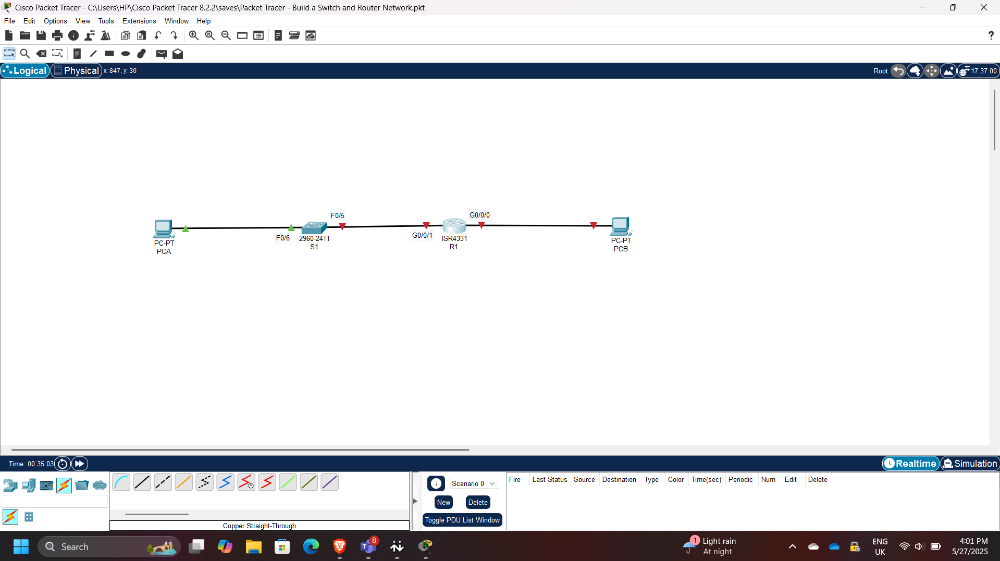
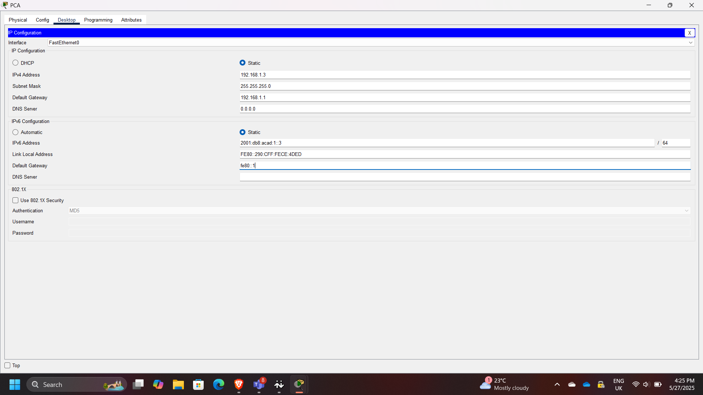
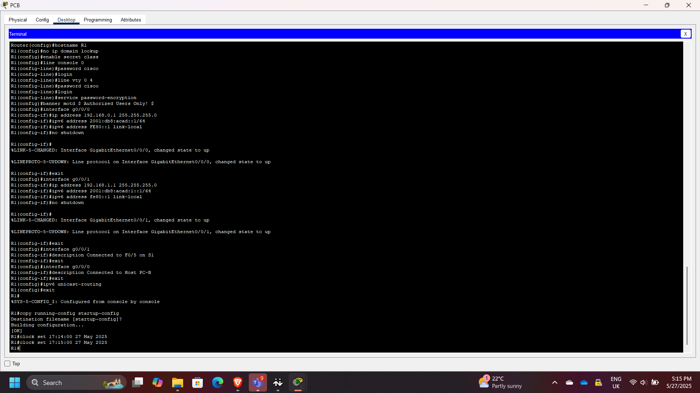
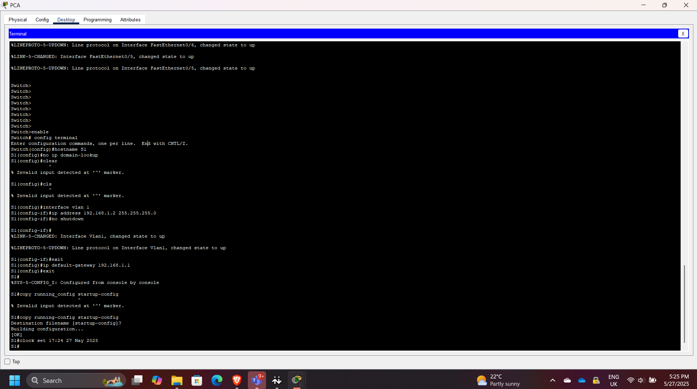
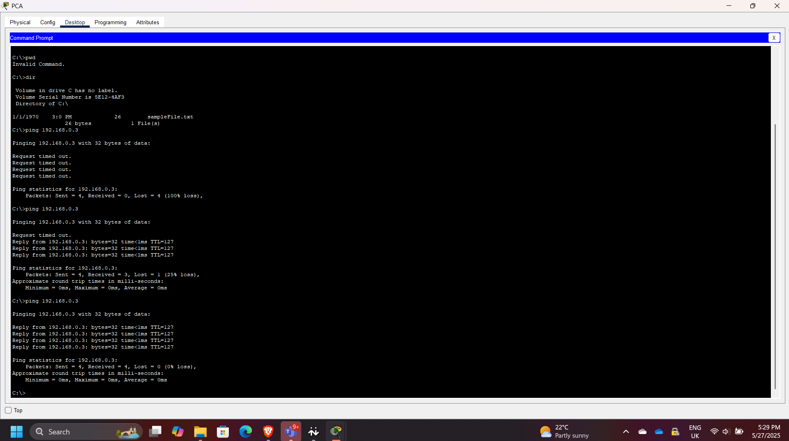
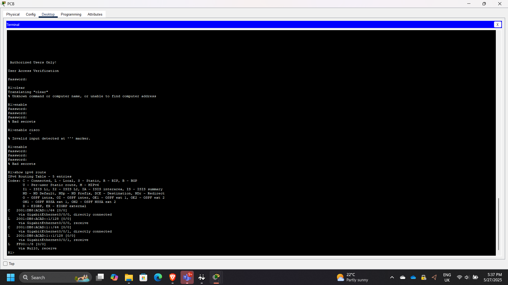

## Building a Routed and Switched Cisco Network in Packet Tracer

**Timeline:** May 2025  
**Role:** Network Security / Infrastructure Engineer  
**Skills:** Cisco IOS, Routing, Switching, IPv4, IPv6, Packet Tracer, Connectivity Testing, Troubleshooting

---

### Project Summary

This project focused on building and configuring a basic routed and switched Cisco network using Cisco Packet Tracer. The goal was to establish end-to-end connectivity between hosts on different subnets by configuring a router, switch, and end devices with both IPv4 and IPv6 addressing.

The setup simulates a small office or branch network where a router enables inter-subnet communication and a switch provides local connectivity.

---

### Objectives

- Build a network topology using one router, one switch, and two PCs  
- Configure static IPv4 and IPv6 addressing on end devices  
- Configure router interfaces for inter-subnet routing  
- Configure the switch for local connectivity  
- Verify end-to-end communication  
- Use Cisco IOS commands to inspect routing and interfaces  

---

### Implementation & Highlights

#### 1. Topology Setup
- Built the topology in Cisco Packet Tracer using:
  - R1 (Router)  
  - S1 (Switch)  
  - PC-A and PC-B (End devices)  

---

#### 2. End Device Configuration
- Assigned static IPv4 and IPv6 addresses to both PCs  
- Configured subnet masks and default gateways  
- Initial ping tests failed since routing was not yet configured  

---

#### 3. Router Configuration
- Accessed router via console  
- Configured interfaces with IP addresses to act as default gateways  
- Enabled interfaces using: no shutdown  
- Verified routing between subnets  

---

#### 4. Switch Configuration
- Accessed switch via console  
- Performed basic configuration to support host connectivity  
- Confirmed interfaces were active  

---

#### 5. Connectivity Validation
- Successfully pinged PC-B from PC-A  
- Verified communication from switch to PC-B  
- Confirmed inter-subnet routing was working  

---

#### 6. Routing and Interface Verification
- Checked routing table and interface details  
- Observed:
  - GigabitEthernet0/0/1 status: up  
  - Line protocol: up  
  - MAC address: 00d0.ff83.7602  
  - IP address: 192.168.1.1/24  

---

### Results & Impact

- Built a functional routed and switched network  
- Enabled communication across different subnets  
- Demonstrated correct use of default gateways and interface activation  
- Strengthened troubleshooting and verification skills using Cisco IOS  

---

### Troubleshooting Insight

If router interface G0/0/1 were configured incorrectly (e.g., 192.168.1.2 instead of 192.168.1.1), hosts would fail to reach other networks due to an invalid default gateway.

If an interface is administratively down, it can be enabled with: R1(config-if)# no shutdown  

---

### Tools & Technologies Used

- Cisco Packet Tracer  
- Cisco IOS CLI  
- IPv4 / IPv6 addressing  
- Ping testing  
- Show commands for verification  

---

### Outcome

This project demonstrates the ability to configure and validate a small Cisco network from scratch. It reinforces key networking concepts required for roles in network engineering, cloud infrastructure, and security operations.

---

[Back to Security Projects](/projects/security/)
