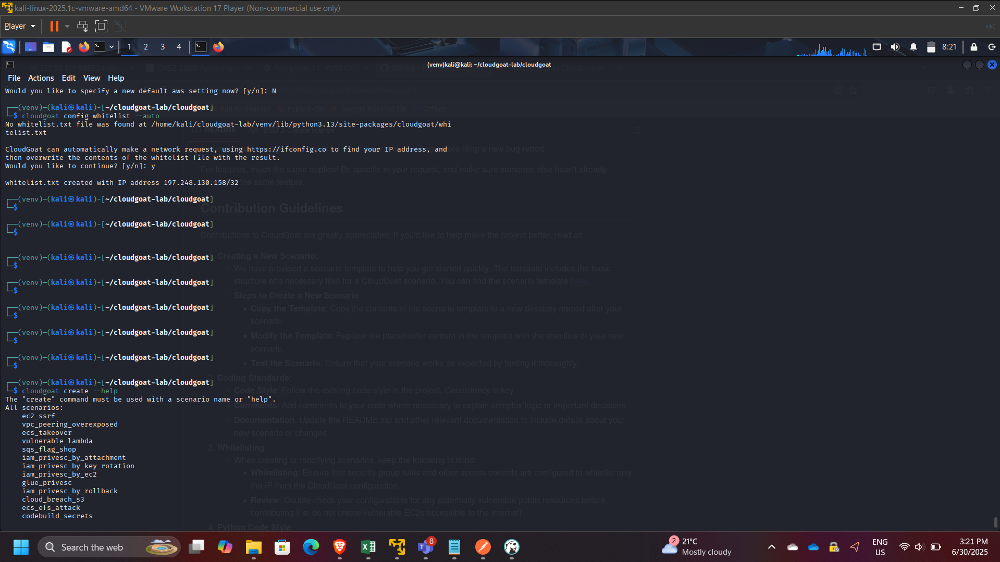
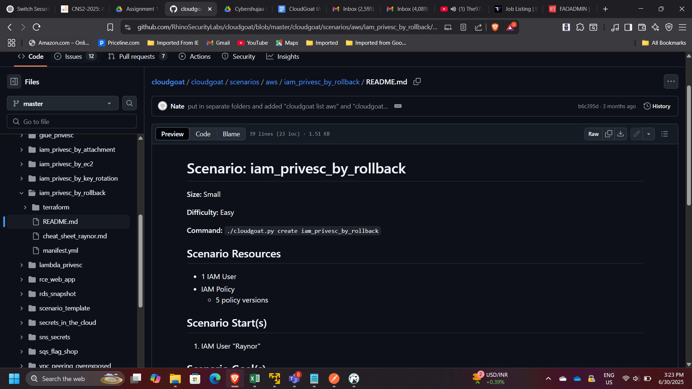
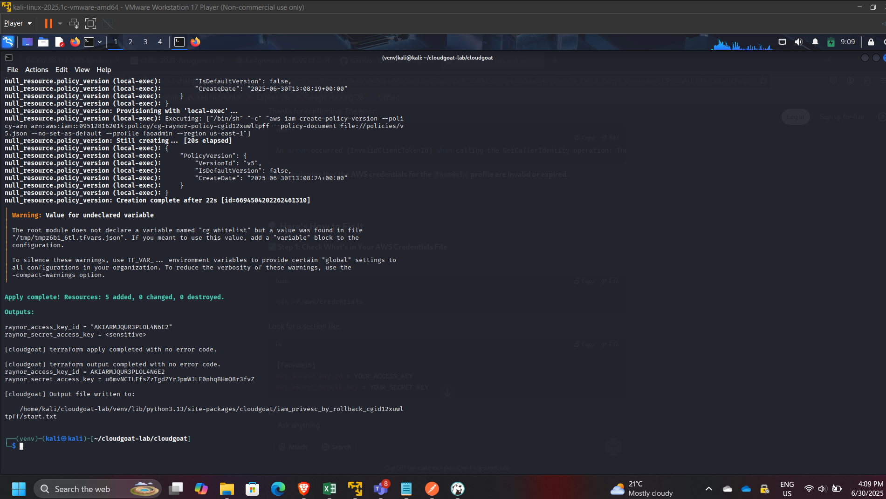
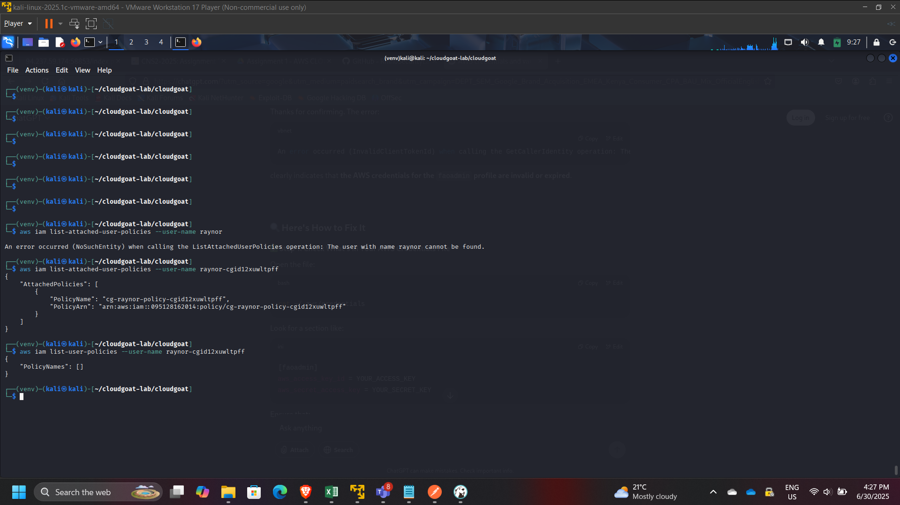
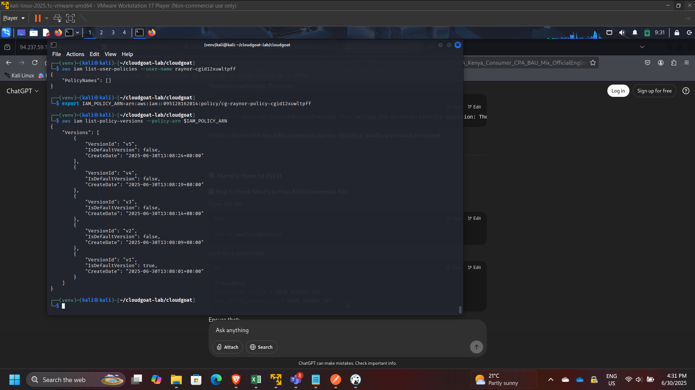
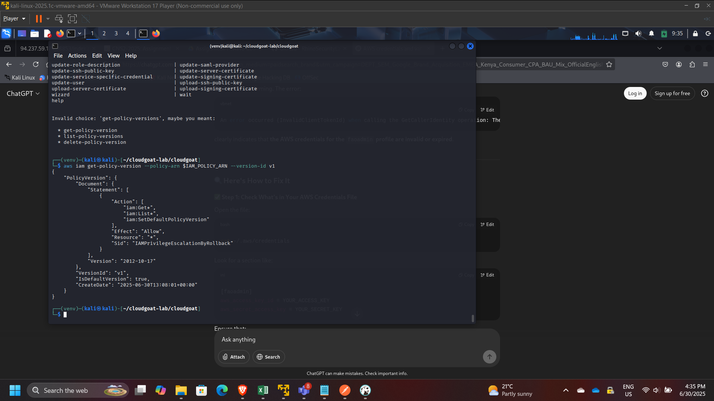
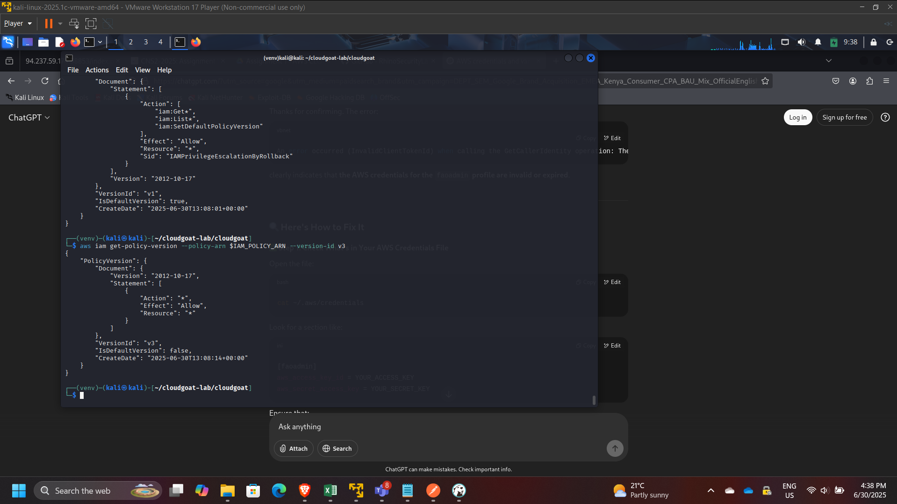
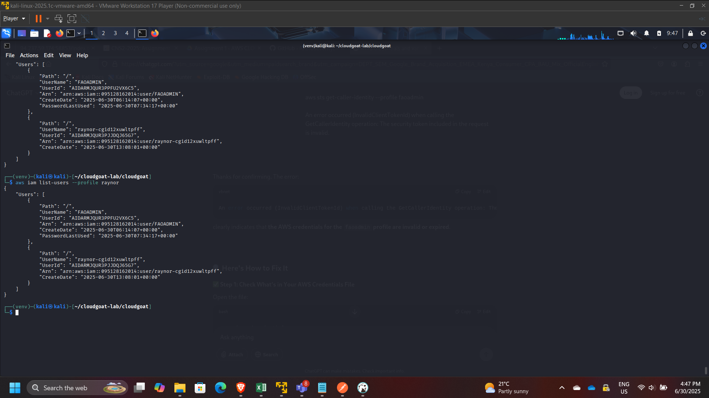

## Project: IAM Privilege Escalation via Policy Version Rollback (CloudGoat)

**Timeline:** June 2025  
**Role:** Cloud Security Analyst (IAM Governance & Privilege Escalation Assessment)  
**Focus:** IAM Policy Versioning Risk, Least Privilege, Privilege Escalation Detection & Mitigation  
**Tools:** AWS CLI, IAM, Kali Linux, CloudGoat (Rhino Security Labs)

---

## Executive Summary

Performed a hands-on cloud security assessment using the CloudGoat scenario **`iam_privesc_by_rollback`** to demonstrate how **IAM policy versioning** can be abused for privilege escalation.

Starting from a low-privileged IAM user (**raynor**), I identified permission to execute **`iam:SetDefaultPolicyVersion`** on a managed policy. By enumerating historical policy versions, I discovered an older version granting broad administrative permissions. Switching the default policy version escalated privileges and enabled administrative actions across the AWS account.

This project demonstrates a real-world governance failure mode: **retaining overly permissive historical policy versions combined with mis-scoped policy-management permissions**.

---

## Lab Objectives

- Deploy and run a vulnerable AWS environment using CloudGoat  
- Enumerate IAM user permissions, attached policies, and policy versions  
- Identify escalation paths through IAM policy version rollback  
- Escalate privileges by changing the default managed policy version  
- Validate impact by performing privileged AWS actions  
- Provide mitigation recommendations aligned with IAM governance best practices  

---

## Environment Setup

- Configured AWS CLI on **Kali Linux VM**
- Ran CloudGoat from Rhino Security Labs repository
- Used dedicated AWS credentials/profile for scenario execution

---

## Scenario Overview

The CloudGoat scenario **`iam_privesc_by_rollback`** demonstrates a privilege escalation pattern where:

1. A user appears low-privileged.
2. The user can call **`iam:SetDefaultPolicyVersion`** on a managed policy.
3. Older versions of that policy still exist.
4. One older version is overly permissive (e.g., `"Action": "*", "Resource": "*"`).
5. The user rolls back to the permissive version to gain administrative access.

This is a practical example of how **IAM policy lifecycle hygiene** impacts security posture.

---

## Step 1: Start the Scenario

Started the vulnerable environment:

cloudgoat create iam_privesc_by_rollback

Validated resources provisioned successfully.

---

## Step 2: Confirm Identity and Initial Permissions

Confirmed the active identity:

aws sts get-caller-identity

Enumerated user policy attachments:

- Attached managed policies:
  - aws iam list-attached-user-policies --user-name raynor

- Inline policies (if any):
  - aws iam list-user-policies --user-name raynor

---

## Step 3: Identify Policy Version Rollback Capability

Inspected effective permissions and located:

- **`iam:SetDefaultPolicyVersion`**

This permission is high-risk because it enables switching active policy versions without changing the policy content.

---

## Step 4: Enumerate Policy Versions

Listed policy versions:

aws iam list-policy-versions --policy-arn $IAM_POLICY_ARN

Observed multiple historical versions (up to 5 versions in AWS managed policy versioning).

Retrieved specific versions for review:

aws iam get-policy-version --policy-arn $IAM_POLICY_ARN --version-id v1  
aws iam get-policy-version --policy-arn $IAM_POLICY_ARN --version-id v3  

Found an older version (example: **v3**) granting broad permissions (administrative wildcard).

---

## Step 5: Privilege Escalation via Rollback

Changed the default policy version to the over-permissive version:

aws iam set-default-policy-version --policy-arn $IAM_POLICY_ARN --version-id v3

---

## Step 6: Verification of Elevated Privileges

Validated elevated access by performing administrative actions such as:

- Listing all IAM users:
  - aws iam list-users

This confirmed that the rollback successfully escalated privileges from low access to administrative scope.

---

## Governance Risk Analysis

This scenario highlights an enterprise IAM risk pattern:

- **Old policy versions** may contain broader permissions than current versions.
- **Policy-management permissions** (like `SetDefaultPolicyVersion`) are frequently overlooked during least-privilege reviews.
- Attackers can revert policies to gain privileges and optionally **restore the original version** to reduce detection.

---

## Remediation Recommendations

- Enforce least privilege on IAM permissions:
  - Restrict `iam:SetDefaultPolicyVersion` to break-glass admin roles only
- Limit and review managed policy versions:
  - Remove overly permissive historical versions
- Adopt policy lifecycle governance:
  - Mandatory review before creating new versions
  - Automated scanning for wildcard permissions
- Enable monitoring and alerting:
  - CloudTrail alerts on policy version changes
  - Detective controls for IAM privilege escalations
- Use AWS Organizations SCPs for guardrails:
  - Block risky IAM actions except in admin accounts

---

## Key Skills Demonstrated

- IAM privilege escalation analysis  
- Policy version inspection and governance evaluation  
- AWS CLI-based enumeration methodology  
- Risk assessment and mitigation planning  
- Security hygiene principles for enterprise AWS environments  

---

## Conclusion

This project demonstrated how **IAM policy versioning**, when combined with mis-scoped permissions like **`SetDefaultPolicyVersion`**, can enable full privilege escalation in AWS. It reinforced the importance of IAM governance, strict least-privilege enforcement, and continuous auditing of policy version history to prevent rollback-based escalation in real cloud environments.

---

[Back to Security Projects](/projects/security/)
