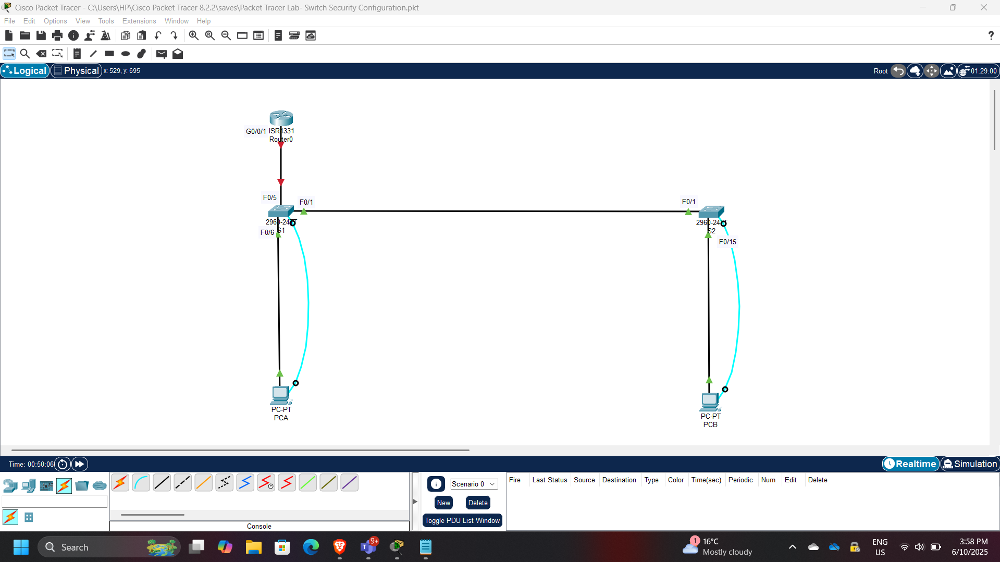
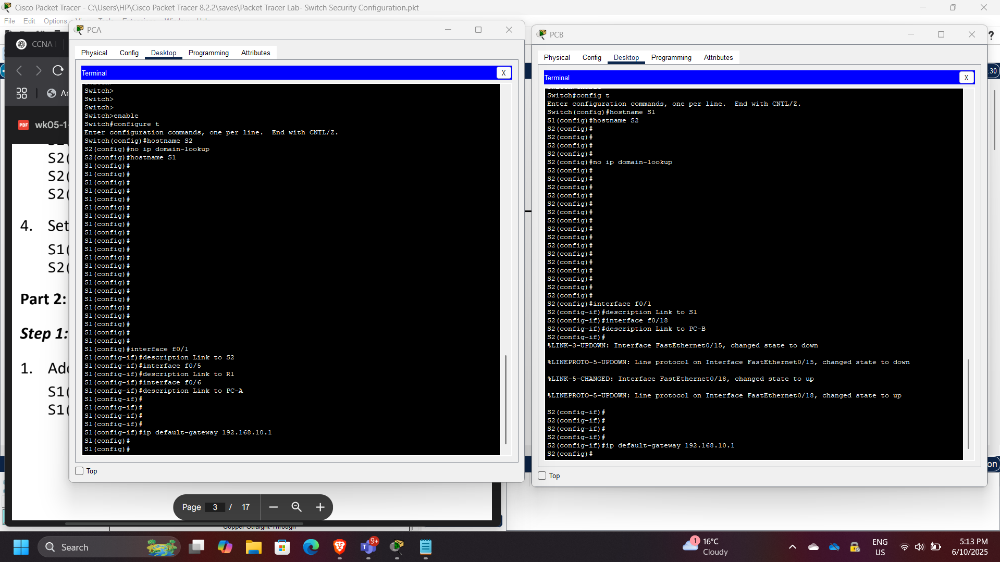
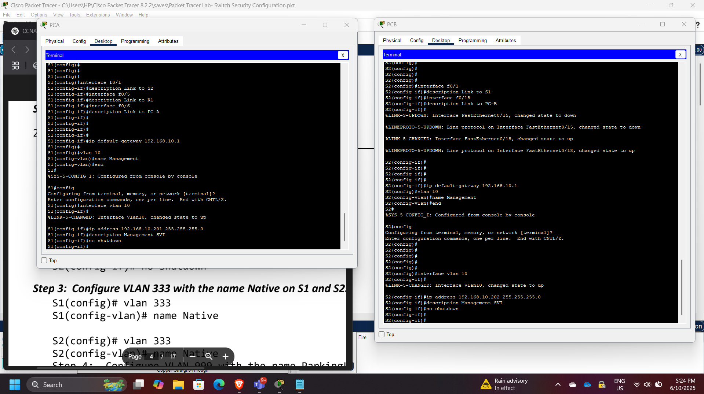
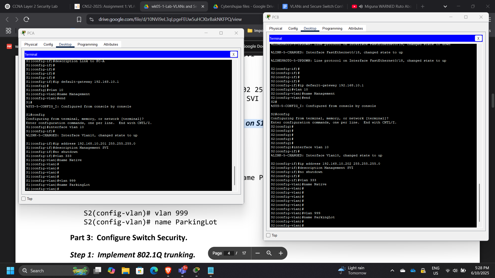
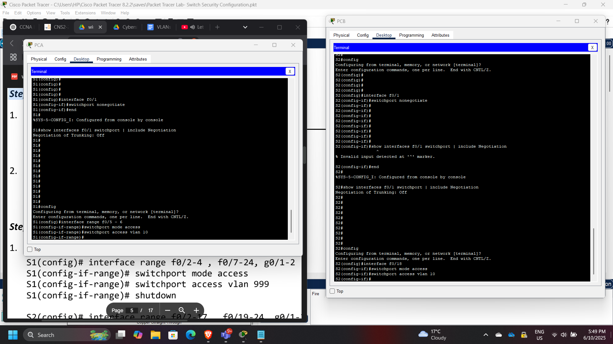
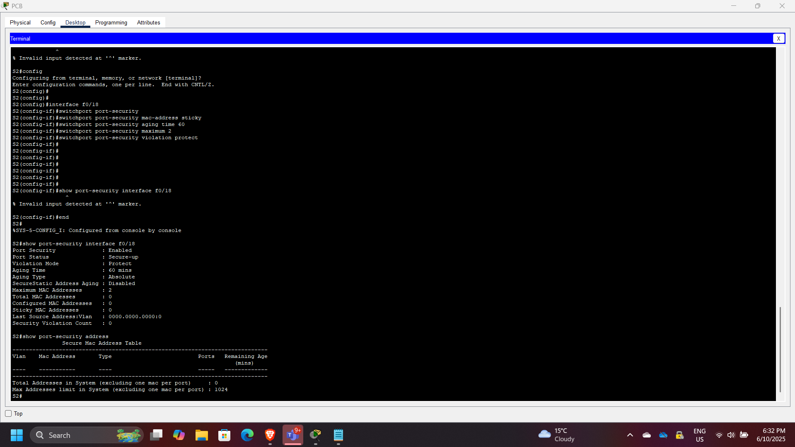
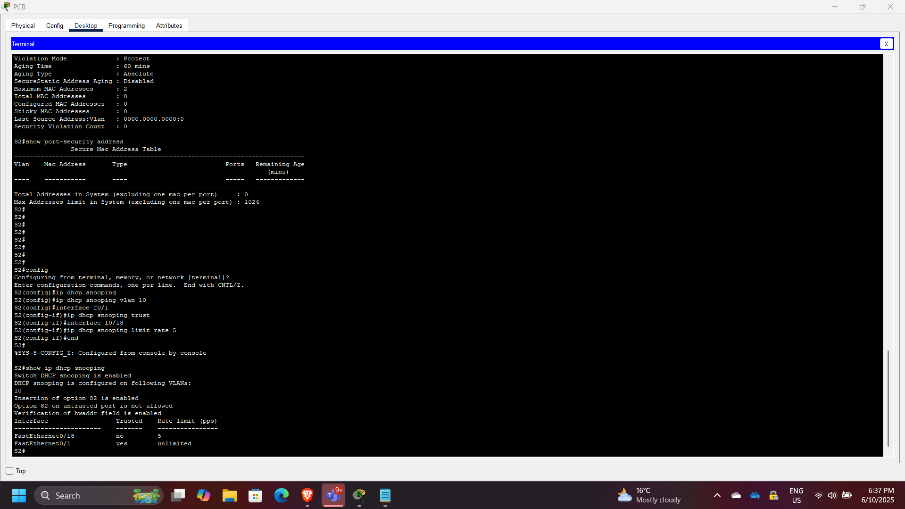
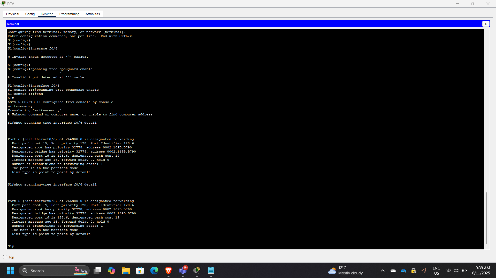
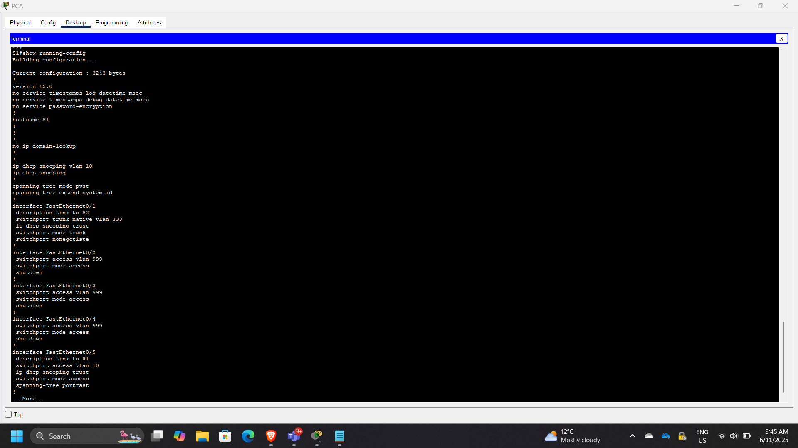

## Project: Layer 2 Network Segmentation & Switch Security Architecture

**Timeline:** June 2025  
**Role:** Network Security Engineer  
**Platform:** Cisco Packet Tracer  
**Focus:** VLAN Segmentation, Switch Hardening, Port Security, DHCP Snooping  

---

## Executive Summary

This project demonstrates the design and implementation of a secure Layer 2 network using Cisco routers and Catalyst switches. The lab focused on network segmentation using VLANs, trunking configuration using IEEE 802.1Q, and the implementation of multiple switch security features to protect against common Layer 2 attacks.

The implementation included:

- VLAN segmentation
- Secure trunk configuration
- Switch port security
- DHCP snooping
- BPDU guard
- PortFast configuration
- Securing unused switch ports

These configurations help mitigate common network threats such as rogue DHCP servers, MAC flooding attacks, VLAN hopping, and spanning-tree manipulation.

---

## Network Architecture

The network topology consisted of:

- Cisco 4221 router
- Cisco Catalyst 2960 switches
- Multiple VLAN segments
- End hosts connected to secured access ports

The switches were configured to enforce segmentation and security policies across the network.

---

## Part 1: Network Device Configuration

Initial configuration included:

- Hostname configuration
- Interface configuration
- Basic switch management settings
- Verification of connectivity

This step ensured the devices could communicate before implementing segmentation and security controls.

---

## Part 2: VLAN Configuration

VLANs were created to logically segment the network and isolate broadcast domains.

### VLAN Design

| VLAN ID | Purpose |
|------|------|
| VLAN 10 | User network |
| VLAN 333 | Native VLAN |

Example VLAN configuration:

    vlan 10
    name Users

    vlan 333
    name Native

---

## 802.1Q Trunk Configuration

Trunk links were configured between switches to allow VLAN traffic to traverse network segments.

Example trunk configuration:

    switchport mode trunk
    switchport trunk native vlan 333

This allows multiple VLANs to pass across a single physical link.

---

## Access Port Configuration

Access ports were assigned to specific VLANs to connect end-user devices.

Example configuration:

    switchport mode access
    switchport access vlan 10

This ensures proper VLAN segmentation for connected hosts.

---

## Port Security Implementation

Port security was implemented to restrict unauthorized devices from connecting to the network.

Example configuration:

    switchport port-security
    switchport port-security maximum 2
    switchport port-security violation protect
    switchport port-security mac-address sticky

Sticky MAC learning dynamically records MAC addresses connected to the port.

---

## DHCP Snooping Configuration

DHCP snooping was implemented to prevent rogue DHCP servers from distributing malicious IP configurations.

Example configuration:

    ip dhcp snooping
    ip dhcp snooping vlan 10

Verification command:

    show ip dhcp snooping binding

---

## BPDU Guard and PortFast

To protect the spanning tree topology from malicious or accidental changes, the following security features were enabled.

### PortFast

Allows immediate transition to forwarding state on edge ports.

### BPDU Guard

Disables ports that receive unexpected BPDUs.

Example configuration:

    spanning-tree portfast
    spanning-tree bpduguard enable

---

## Securing Unused Ports

Unused switch ports were disabled to prevent unauthorized access.

Example configuration:

    interface range f0/10-24
    shutdown

This is a recommended security best practice in enterprise access-layer design.

---

## Security Concepts Demonstrated

This project demonstrates multiple Layer 2 security mechanisms:

- VLAN segmentation
- Switch port security
- Sticky MAC address learning
- Rogue DHCP mitigation
- Spanning tree protection
- Secure trunk configuration
- Access-layer network hardening

These mechanisms are essential for securing enterprise networks at the access layer.

---

## Enterprise Relevance

Layer 2 attacks remain a significant risk in enterprise environments. Misconfigured switches can allow attackers to perform:

- MAC flooding
- DHCP spoofing
- VLAN hopping
- Spanning tree manipulation

Proper switch hardening significantly reduces these risks and strengthens the security posture of campus and branch networks.

---

## Conclusion

This project successfully demonstrated how VLAN segmentation and Layer 2 security controls can be implemented on Cisco switches to protect enterprise networks. By applying port security, DHCP snooping, BPDU guard, and secure trunk configurations, the network infrastructure was hardened against common access-layer attacks. These practices represent essential network security fundamentals used in real-world enterprise environments.

---

[Back to Security Projects](/projects/security/)
