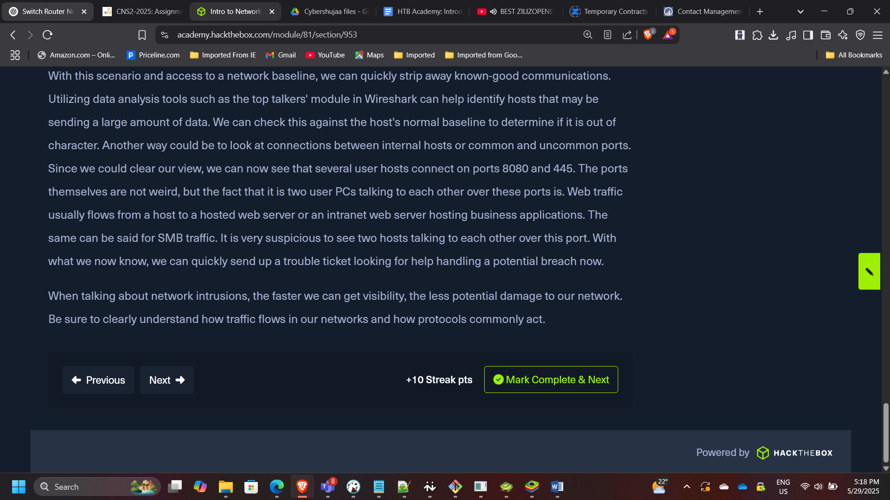
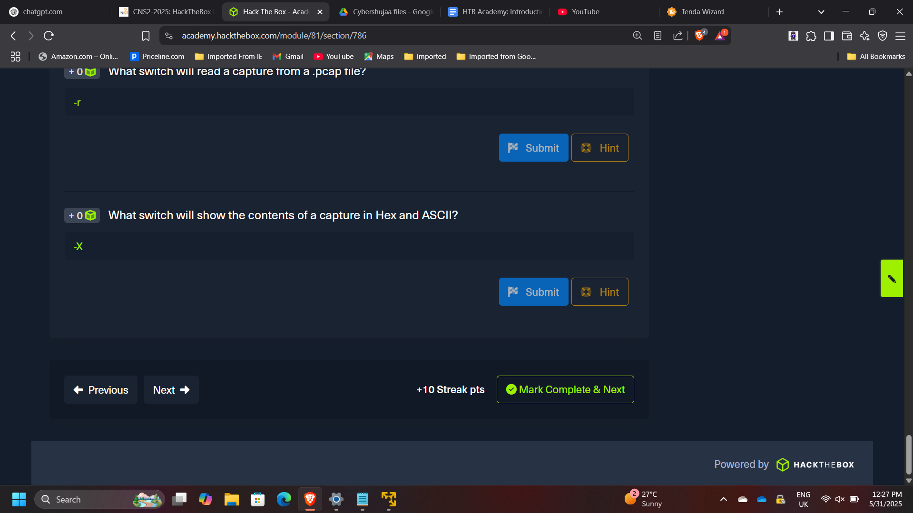
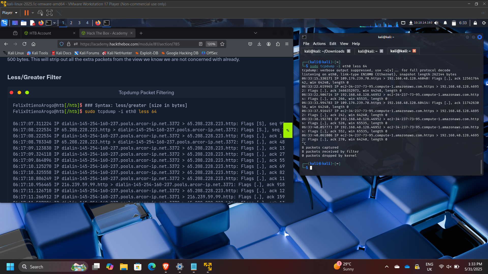
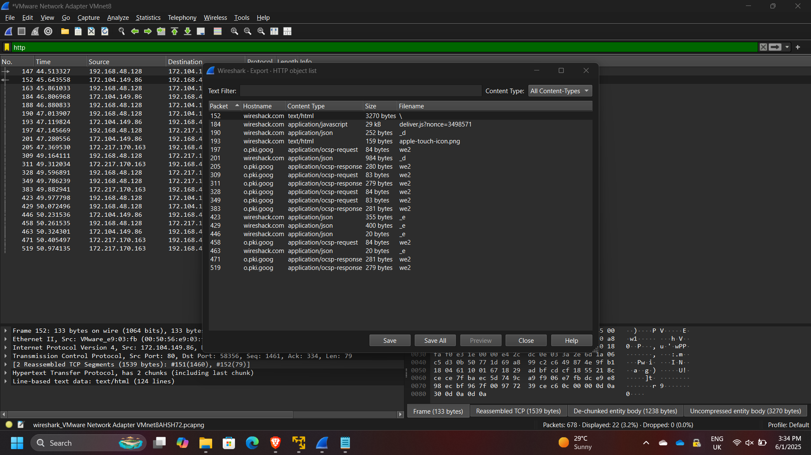
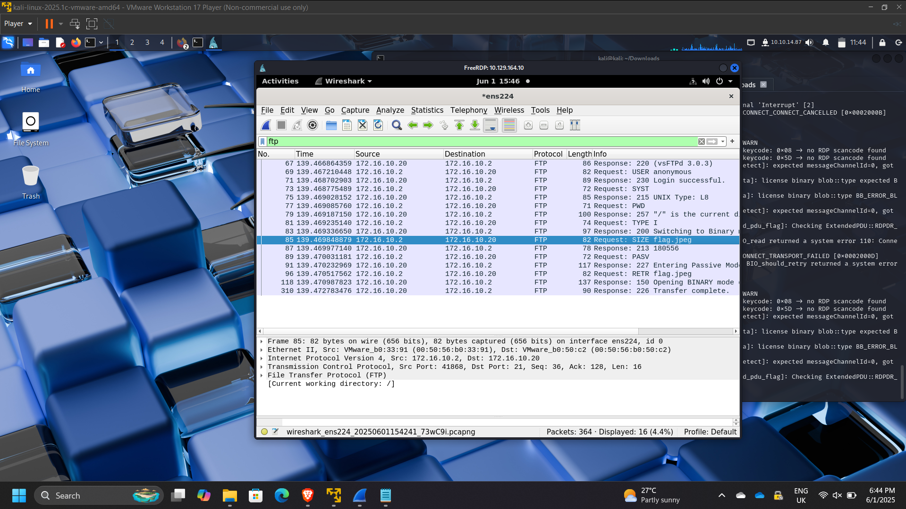
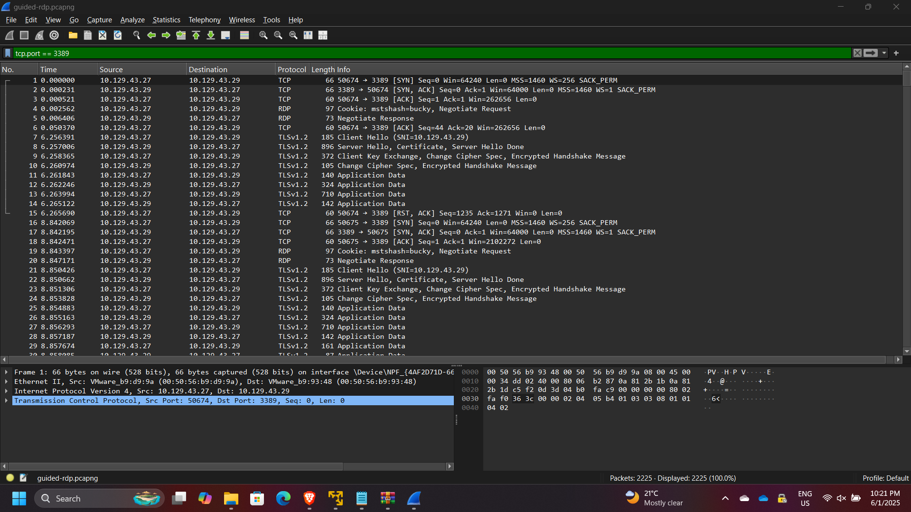

## Network Traffic Analysis & Threat Detection using Wireshark and Tcpdump

**Timeline:** May 2025  
**Role:** Network Security Analyst  
**Skills:** Wireshark, Tcpdump, Packet Analysis, Network Forensics, TCP/IP, DNS, HTTP/HTTPS, Threat Detection

---

### Project Summary

This project focused on performing **network traffic analysis and threat detection** using **Wireshark and Tcpdump** through hands-on labs from Hack The Box Academy.  

The objective was to analyze real and simulated network traffic to identify protocols, detect suspicious behavior, and understand how attackers and defenders interact with network data.

The project covered both **foundational networking concepts** and **practical traffic analysis techniques**, including packet filtering, protocol inspection, and incident investigation.

---

### Objectives

- Understand OSI and TCP/IP networking models  
- Analyze network traffic using **Tcpdump and Wireshark**  
- Apply **packet filtering techniques** for efficient analysis  
- Identify common protocols (DNS, HTTP, HTTPS, FTP, TLS)  
- Investigate suspicious traffic and potential compromise  
- Perform **basic network forensics and incident analysis**  

---

### Implementation & Highlights

#### 1. Networking Fundamentals (OSI & TCP/IP)
- Reviewed OSI model (7 layers) and TCP/IP model (4 layers)  
- Identified key protocols:
  - TCP (connection-oriented)  
  - UDP (connectionless)  
- Understood:
  - MAC addressing (Layer 2)  
  - IPv4 addressing (32-bit)  
  - TCP three-way handshake (SYN → SYN-ACK → ACK)  

---

#### 2. Tcpdump Traffic Analysis
- Captured and analyzed traffic using Tcpdump  
- Used key commands:
  - `tcpdump -nvXc 100`
  - `tcpdump -Xr /tmp/capture.pcap`
- Applied filters to identify:
  - DNS traffic (port 53)  
  - HTTP traffic (port 80)  
  - HTTPS traffic (port 443)  

---

#### 3. Protocol and Traffic Identification
- Identified common protocols in captured traffic:
  - DNS, HTTP, HTTPS  
- Observed:
  - Client-server communication patterns  
  - TCP handshakes  
  - HTTP requests (GET, POST)  
- Example findings:
  - Common HTTP response: **200 OK**  
  - DNS server identified: **172.16.146.1**  

---

#### 4. Packet Filtering and Traffic Interrogation
- Applied filters to isolate specific traffic types  
- Analyzed:
  - DNS queries and responses  
  - TCP conversations  
  - Client/server port relationships  
- Example:
  - Client port: **43806**  
  - Server port: **80**  

---

#### 5. Wireshark Analysis (Advanced)
- Used Wireshark GUI to:
  - Inspect packets in detail  
  - Analyze traffic in ASCII and Hex  
  - Follow TCP streams  
- Identified protocols:
  - TCP, DNS, TLS, QUIC  
- Extracted meaningful insights from packet payloads  

---

#### 6. Threat Detection & Incident Analysis
- Investigated suspicious traffic in a PCAP file  
- Identified:
  - Malicious activity originating from **10.129.43.4**  
  - Suspicious port usage: **4444**  
- Findings:
  - Unauthorized user creation (`hacker`)  
  - Privilege escalation activity  
  - Lateral movement using compromised host  

---

#### 7. FTP and RDP Traffic Analysis
- Detected FTP activity:
  - Server: **172.16.10.20**  
  - Client: **172.16.10.2**  
  - Anonymous authentication observed  
- Analyzed RDP traffic:
  - Source host: **10.129.43.27**  
  - User: **bucky**  

---

### Results & Impact

- Successfully analyzed network traffic across multiple protocols  
- Identified **malicious behavior and compromised hosts**  
- Demonstrated ability to:
  - Filter and interpret packet captures  
  - Detect suspicious patterns and anomalies  
  - Perform structured network traffic investigations  
- Strengthened skills in **network forensics and incident response**

---

### Tools & Technologies Used

- **Wireshark** – Deep packet inspection and analysis  
- **Tcpdump** – Command-line traffic capture and filtering  
- **PCAP Analysis** – Historical traffic investigation  
- **TCP/IP Protocol Suite** – Network communication analysis  
- **Linux CLI** – Traffic capture and inspection  

---

### Outcome

This project demonstrated the ability to perform **real-world network traffic analysis and threat detection** using industry-standard tools.  

It strengthened my capability to analyze packet-level data, identify suspicious behavior, and support incident response efforts — key skills required for **SOC analysts, security engineers, and cloud security roles**.

---

[Back to Security Projects](/projects/security/)
