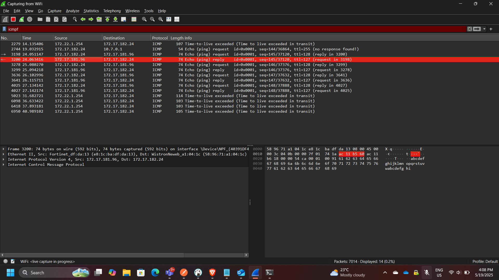
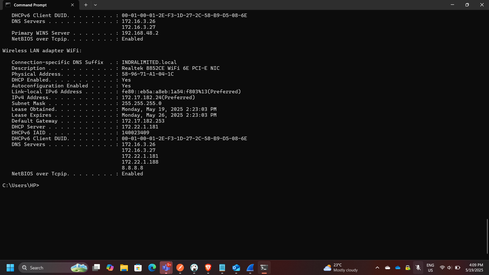
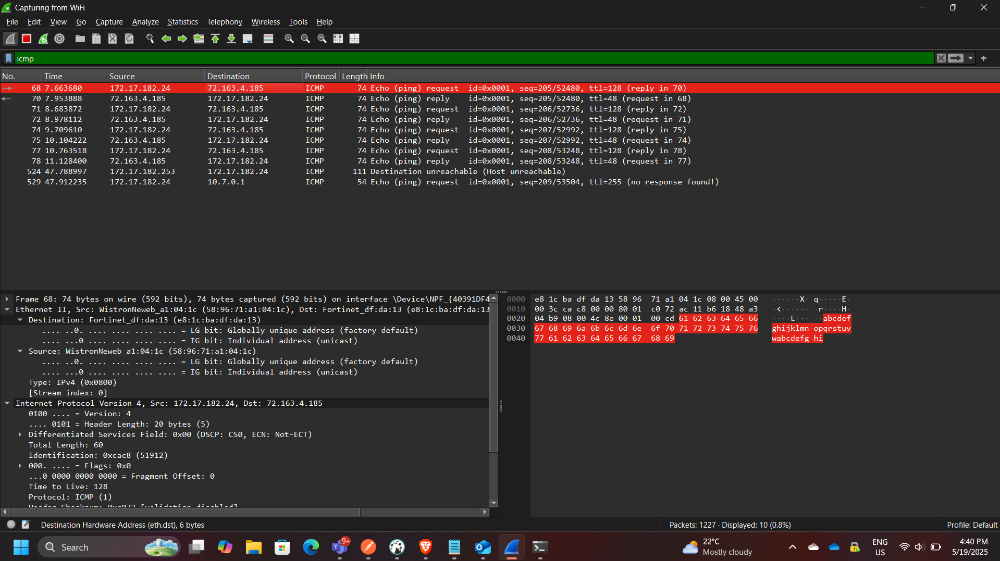

## Project: Network Traffic Analysis using Wireshark

**Course:** Cloud and Network Security  
**Tool:** Wireshark  
**Role:** Network Security Analyst  
**Focus:** Packet Analysis, ICMP Inspection, Layer 2 vs Layer 3 Communication  

---

## Executive Summary

This project focused on capturing and analyzing network traffic using Wireshark to understand how data flows across local and remote networks. By inspecting ICMP (ping) traffic, I examined packet structures, MAC addressing behavior, and how network devices communicate within and beyond a local network.

The analysis highlighted the difference between **local network communication (Layer 2 visibility)** and **remote communication (Layer 3 routing)**, demonstrating how MAC addresses are resolved locally but replaced by gateway addresses when traffic leaves the local network.

This exercise reinforces key cybersecurity concepts such as **network visibility, packet inspection, and traffic analysis**, which are essential for detecting anomalies and troubleshooting network issues.

---

## Network Traffic Analysis Architecture

The analysis involved two main scenarios:

1. Local network ICMP communication (same LAN)
2. Remote ICMP communication (internet-based)

---

## Part 1: Local ICMP Traffic Analysis

In this phase, ICMP traffic was captured between two devices within the same local network.

### Key Observations

- The **source MAC address** matched the local machine’s network interface
- The **destination MAC address** matched the target device on the LAN
- Communication occurred directly at **Layer 2**

### Key Concept

The MAC address of the destination host is obtained using:

👉 **ARP (Address Resolution Protocol)**

This allows the sender to map an IP address to a MAC address before transmitting the packet.

---

## Part 2: Remote ICMP Traffic Analysis

In this phase, ICMP traffic was captured while pinging external servers:

- yahoo.com → 98.137.11.163  
- cisco.com → 72.163.4.185  
- google.com → 172.217.170.174  

### Key Observations

- All remote destinations resolved to the **same MAC address**
- The MAC address observed belonged to the **default gateway (router)**

### Explanation

When traffic leaves the local network:

- The packet is sent to the **default gateway**
- The gateway forwards it to the internet
- The actual destination MAC is **not visible**

### Key Insight

👉 Wireshark only captures **local Layer 2 information**

Therefore:
- Local traffic → shows actual destination MAC
- Remote traffic → shows **gateway MAC**

---

## Key Security Insight

### Why MAC Addresses Differ (Local vs Remote)

| Scenario | MAC Address Observed |
|--------|---------------------|
| Local Network | Actual destination device |
| Remote Network | Default gateway (router) |

This occurs because:

- MAC addresses are only valid within a **local broadcast domain**
- Routers replace Layer 2 headers at each hop

---

## Firewall Consideration

The lab also involved enabling ICMP traffic through a firewall.

### Key Actions

- Created an inbound rule allowing ICMP traffic
- Verified traffic capture in Wireshark
- Disabled the rule after testing

### Security Implication

Allowing ICMP:

- Helps with troubleshooting
- Can expose systems to reconnaissance (ping sweeps)

---

## Security Concepts Demonstrated

This project demonstrates:

- Packet capture and inspection
- ICMP protocol analysis
- ARP resolution
- Layer 2 vs Layer 3 behavior
- Gateway-based routing
- Firewall rule impact on traffic visibility

---

## Enterprise Relevance

Network traffic analysis is critical in enterprise environments for:

- Detecting malicious traffic
- Investigating incidents
- Monitoring network performance
- Identifying misconfigurations
- Supporting threat detection systems (IDS/IPS)

Wireshark is widely used by:

- Network engineers
- SOC analysts
- Incident responders

---

## Conclusion

This project provided hands-on experience analyzing real network traffic using Wireshark. By comparing local and remote ICMP communication, I gained a deeper understanding of how network layers interact and how routing affects packet visibility.

The exercise reinforced fundamental networking and security concepts, including ARP resolution, gateway routing, and packet inspection, all of which are essential skills in network security and troubleshooting.

---

[Back to Security Projects](/projects/security/)
